# Forward Private Verifiable Dynamic Searchable Symmetric Encryption With Efficient Conjunctive Query

Cheng Guo *[,](https://orcid.org/0000-0001-7489-7381) Member, IEEE*, Wenfeng Li [,](https://orcid.org/0009-0006-1669-9671) Xinyu Tang [,](https://orcid.org/0000-0001-9221-154X) Kim-Kwang Raymond Choo *[,](https://orcid.org/0000-0001-9208-5336) Senior Member, IEEE*, and Yining Liu

*Abstract*—Dynamic searchable symmetric encryption (DSSE) allows efficient searches over encrypted databases and also supports clients in their updating of the data, such as those stored in a remote cloud server. However, recent attacks suggest the risk of leakage during such updates, which consequently impacts on the privacy of the queries. In addition, existing DSSE schemes that support forward privacy generally rely on the honest-but-curious server and support only single-keyword retrieval, which limits the application scenarios. In this paper, we present the design of a verifiable DSSE protocol, which supports efficient conjunctive query with forward privacy. In our scheme, the forward index is constructed by a novel form, i.e.,  $t$ -puncturable PRFs, and the authentication tag is designed by symmetric cryptography. During conjunctive queries, we narrow the scope by an inverted index, and then we determine the results of the final query through the forward index. Meanwhile, we can use verification tag to check the correctness and completeness of the result. In addition, we present an extension to support backward privacy, and our experimental evaluations show that our proposed approach achieves better performance on both conjunctive queries and updates than other competing solutions and ensures efficient verification.

*Index Terms***—Conjunctive query, forward privacy, puncturable pseudorandom function, searchable symmetric encryption, verification.**

Manuscript received 27 December 2021; revised 20 February 2023; accepted 21 March 2023. Date of publication 27 March 2023; date of current version 14 March 2024. This work was supported by the National Science Foundation of China under Grants 61871064, 61501080, and 62071320, in part by the Guangxi Key Laboratory of Trusted Software under Grants KX202026, and in part by the CAAI-Huawei MindSpore Open Fund. The work of Kim-Kwang Raymond Choo is supported only by the Cloud Technology Endowed Professorship. *(Corresponding author: Kim-Kwang Raymond Choo.)*

Cheng Guo is with the Key Laboratory for Ubiquitous Network and Service Software of Liaoning Province and School of Software Technology, Dalian University of Technology, Dalian, Liaoning 116620, China, also with the Guangxi Key Laboratory of Trusted Software, Guilin University of Electronic Technology, Guilin, Guangxi 541004, China (e-mail: [guocheng@dlut.edu.cn\)](mailto:guocheng@dlut.edu.cn).

Wenfeng Li and Xinyu Tang are with the Key Laboratory for Ubiquitous Network and Service Software of Liaoning Province and School of Software Technology, Dalian University of Technology, Dalian, Liaoning 116620, China (e-mail: [wenfengli@mail.dlut.edu.cn;](mailto:wenfengli@mail.dlut.edu.cn) [tangxinyu@mail.dlut.edu.cn\)](mailto:tangxinyu@mail.dlut.edu.cn).

Yining Liu is with the Guangxi Key Laboratory of Trusted Software, Guilin University of Electronic Technology, Guilin, Guangxi 541004, China (e-mail: [ynliu@guet.edu.cn\)](mailto:ynliu@guet.edu.cn).

Kim-Kwang Raymond Choo is with the Department of Information Systems and Cyber Security and the Department of Electrical and Computer Engineering, University of Texas at San Antonio, San Antonio, TX 78249-0631 USA (e-mail: [raymond.choo@fulbrightmail.org\)](mailto:raymond.choo@fulbrightmail.org).

Digital Object Identifier 10.1109/TDSC.2023.3262060

### I. INTRODUCTION

## *A. Background and Motivation*

**C**LOUD computing is now deeply entrenched in our society, partly evidenced by the broad range of commercial applications in various sectors (e.g., including in critical infrastructure sectors). Although the need to guarantee the security of data uploaded and processed by a cloud server has been extensively studied, a number of challenges remain. For example, when dealing with encrypted data, the utility of such data is significantly affected. Hence, a number of searchable encryption, such as searchable symmetric encryption (SSE) [\[1\],](#page-16-0) schemes have been developed and proposed. SSE can ensure the security of the data using special encryption, and allows certain operations to be performed over ciphertext data without knowing the corresponding plaintext information.

Earlier SSE schemes only support the retrieval of static data, and incur significant overhead when clients update their stored data. Hence, schemes designed to support dynamic data update were proposed in the literature [\[2\],](#page-16-0) [\[3\],](#page-16-0) [\[4\],](#page-16-0) [\[5\].](#page-16-0) However, the introduction of file update operations has resulted in schemes leaking information during such operations. In order to limit the leakages during the adding and deleting of documents, forward security and backward security techniques were integrated in subsequent SSE designs, including dynamic SSE (DSSE) schemes. Compounding the challenge is the potential for file injection attacks [\[6\],](#page-16-0) which can violate the query's privacy. This reinforces the importance of designing DSSE schemes that support forward security in order to mitigate file injection attacks, and to prevent the server from learning keyword information contained in newly-added documents.

Although SSE schemes can solve the retrieval problem on the encrypted database, the correctness and completeness of the returned result cannot be verified. The cloud may output the incorrect or incomplete result under some circumstances that the machine goes with something wrong or for some economic reasons, or even it is malicious. Therefore, we cannot suppose that the cloud always can honestly implement the search protocol, and we need some methods to check the query result. To handle it, some verifiable SSE (VSSE) schemes [\[7\],](#page-16-0) [\[8\],](#page-16-0) [\[9\],](#page-16-0) [\[10\],](#page-16-0) [\[11\]](#page-16-0) have been proposed.

Existing dynamic searchable encryption schemes that support forward security may support only single-keyword retrieval

(e.g., [\[12\],](#page-16-0) [\[13\],](#page-16-0) [\[14\],](#page-16-0) [\[15\]\)](#page-16-0), and only selected few schemes support multi-keyword joint queries. However, these schemes cannot support the verification simultaneously. To our best knowledge, how to design a verifiable DSSE that can realize the forward privacy and support conjunctive queries remains a challenge. Thus, the objective of this paper is to present an efficient, secure and practicable DSSE scheme that can support the following requirements. Thus, the objective of this paper is to present an efficient, secure and practicable DSSE scheme that can support the following requirements.

1) *Conjunctive query*: DSSE schemes that support forward privacy for only single-keyword retrieval only solve a part of the query needs. Such schemes are also inefficient when there is a need to make additional, more complex queries, such as conjunctive query, “computer”  $\wedge$  “vision”  $\wedge$  “survey”, and a large number of irrelevant files relating to this conjunctive query will be returned in a single-keyword retrieval. Therefore, we need to design schemes that facilitates efficient and timely completion of more complex query requests, such as conjunctive query.

*2) Verifiable results:* Considering that the cloud may return the unsatisfactory result for query requests owing to some unexpected reasons, we need an efficient method to verify the correctness and completeness of the returned result, and make sure that the result is what we want in any case.

*3) Improved index construction:* Existing tools for building indices, such as bloom filter and matrix, often have many invalid positions, which may be reserved to ensure accurate calculation. In addition, their length might be limited by some fixed parameters, and this limits the scalability to a certain extent. From the perspective of resource conservation, we expect that the construction of the index to be more flexible in its extendibility and that it can reduce storage cost as much as possible without affecting efficiency.

*4) Forward privacy:* Forward privacy ensures that newlyadded documents leak no information about keywords in the new content until the next query request is issued. A DSSE scheme without forward security does not guarantee query privacy against attacks, such as file injection attacks. Hence, forward privacy is a necessary requirement in DSSE schemes.

*5) Non-interactive query:* If the query process can be completed in one round trip (i.e., the client issues the query request and also receive the required encrypted documents), such a query process is referred to as a non-interactive process. Clearly, noninteractive queries significantly reduce communication overhead. However, the query process in some solutions must be completed through multiple rounds of interaction, in order to achieve higher security level. This is the limitation we attempt to circumvent in our proposed approach, which will be described later in this paper.

We posit that to support the five properties described above, one should consider the following in DSSE scheme designs.

Considering that the target of the multi-keyword joint query is to obtain the documents that contain all keywords associated with the query request, the DSSE scheme designer can complete the joint enquiry procedure in two stages. The first stage is to retrieve the matched files of the least frequent term in a query request. It is a single-keyword query process, and the aim is to

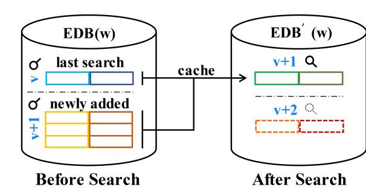

Fig. 1. Version change in inverted index.

minimize the workload for subsequent queries. In the second stage, we must determine whether the files that were found contain other terms associated with the request. In these stages, we construct an inverted index in the form of keyword/document pairs, which can expedite the single-keyword query, and then we build a forward index with *t*-puncturable pseudorandom functions (t-Pun-PRFs), and this index is flexible and can determine efficiently whether a document contains a certain keyword.

Second, to guarantee forward security, the DSSE scheme designer needs to ensure that newly-added indices cannot be retrieved by previously issued search tokens. For the inverted index, we update the encryption key of the newly added index by incrementing the version number after each query. Also, the search token information changes for the newly-added indices. Fig. 1 shows the version change in the process of searching the inverted index. Also, considering that the retrieved inverted indices have been learned by the server, we cache these queried indices information similar to [\[16\],](#page-16-0) which can expedite the retrieval for the previously queried results.

To efficiently verify the result, we design the authentication tag base on symmetric cryptography. And the authentication tags can be aggregated conveniently. We can check the completeness by determining whether the returned result is up-to-date with the total number of the keyword update, and check the correctness by recomputing the accumulative authentication tag of the returned result.

## *B. Key Contributions*

In this work, we design a DSSE scheme that implements conjunctive query and forward security. In our scheme, both an inverted index and a forward index are constructed, which can support efficient non-interactive query and update operations. We will now summarize our proposed approach below:

*1)* First, we apply *t*-Pun-PRFs into the construction of forward index and use it to determine the match between keywords and documents. This provides a novel reference for index construction. If limited keywords are contained in each document, while it is numerous in the entire dataset, building a forward index with *t*-Pun-PRFs is more flexible in length, which often takes up less storage space.

*2)* We give a new design of verification tag based only on symmetric cryptography, which can support efficient accumulation operation simultaneously. And it can be used to efficiently

TABLE I  
SSE SCHEMES: A COMPARATIVE SUMMARY

| Scheme          | Search type | Forward privacy | Backward privacy | Non-interactive | Verification | Index size             | Search cost                   | Update cost | Verification cost |
|-----------------|-------------|-----------------|------------------|-----------------|--------------|------------------------|-------------------------------|-------------|-------------------|
| Dual [14]       | Single      | ✓               | ×                | ✓               | ✓            | O(N)                   | O(r)                          | O(1)        | -                 |
| HXT [17]        | Conj.       | Static          | ×                | ×               | ×            | O(m + n)               | O(x(q d - 1)k)     | -           | -                 |
| VDSSE [11]      | Single      | ×               | ×                | ✓               | ✓            | O(mn)                  | O(n)                          | O(m)        | O(r)              |
| VFSSE [10]      | Single      | ✓               | ×                | ✓               | ✓            | O(N)                   | O(w u )            | O(1)        | O(r)              |
| FOXT [18]       | Conj.       | ✓               | ×                | ✓               | ×            | O(N)                   | O(txq d )          | O(t)        | -                 |
| VBTree [15]     | Conj.       | ✓               | ×                | ✓               | ×            | O(NL)                  | O(xq u (logn + 1)) | O(L)        | -                 |
| ODXT [19]       | Conj.       | ✓               | ✓                | ✓               | ×            | O(2N)                  | O(x(Eq d + 1))     | O(1)        | -                 |
| Ours            | Conj.       | ✓               | ×                | ✓               | ✓            | O(N + n)               | O(xq d )           | O(1)        | O(x)              |
| Ours (extended) | Conj.       | ✓               | ✓                | ✓               | ✓            | O(N + n + ) | O(x(q d + SE))     | O(1)        | O(x)              |

*N* denotes the total number of keyword/document pairs, with *n* and *m* the amount of documents and keywords respectively, with *n*+ the update times of documents, with *t* the time cost of a trapdoor permutation operation based on RSA, with *E* the time cost of modulo exponential operation, with *SE* the time cost of symmetric encryption operation, with *r* the size of search result set, with *k* the amount of hash functions in a Bloom filter, with *L* the height of VBTree. For a conjunctive query  $q$ ,  $w_1 \wedge w_2 \wedge \dots$ , of which  $q_d$  is the dimension,  $x = \min_{w \in q} |DB(w)|$ , and  $q_u = \sum_{w \in q} w_u$ , where  $w_u$  is the amount of update times over keyword  $w$  after the last search process. Index size is the number of index items initially constructed. Search costs of [13] and [14] are evaluated by single-keyword retrieval with keyword  $w$ , while others are evaluated by conjunctive query  $q$ , as mentioned before. Update cost is computed by adding or deleting a keyword/document pair.

verify the correctness and completeness of the returned result of both single-keyword and conjunctive query requests.

3) We design the first forward secure verifiable conjunctive DSSE protocol, and also provide an extension to support backward privacy. The proposed approach achieves sub-linear search time. When issuing conjunctive queries, we can find the least frequent term quickly to expedite the retrieval. Meanwhile, the implementation requires minimal computation and storage costs and also realizes both verification and non-interactive query.

4) We implement our scheme with C++, and evaluate the performance of our scheme as well as those of Kim et al. [14], Wu and [15] and Zhang et al. [10] on Azure Cloud over two datasets. The experiments demonstrate that our protocol achieves improved efficiency for both retrieval and updating with less storage cost in comparison to the first two protocols, and has comparable verification efficiency with the third protocol. A comparative summary of our proposed approach and six other solutions is also presented in Table I.

In the next section, we will describe the extant literature.

## II. RELATED WORK

In 2000, Song et al. [1] presented the first searchable symmetric encryption scheme, and they gave an index structure with a linear search time, which is related to the total number of encrypted documents. Subsequently, Curtmola et al. [5] gave a formal definition of searchable symmetric encryption, and they used the inverted index thereby achieving a sub-linear search time at the first time, which greatly improves the efficiency of the search. Based on their work, numerous SSE schemes with extended functions or optimized performances have been proposed [3], [12], [13], [14], [15], [17], [18], [20], [21].

In terms of conjunctive query, Cash et al. [3] proposed an SSE scheme with ‘Oblivious Cross-Tags’ (OXT) to achieve joint queries. However, attacks presented in [6], [22], [23], [24] demonstrated that some leakages work may be used by attackers to break data security. Lai et al. [17], hence, presented an improved ‘Hidden Cross-Tags’ (HXT) protocol – a safer SSE scheme that supports conjunctive queries. Wang et al. [18] proposed FOXT, designed to support conjunctive queries with forward privacy. In the FOXT scheme, they designed a new XSet and combined it with the Oblivious Cross-Tags protocol [3] to realize conjunctive queries. Also, there are other schemes that

complete the conjunctive queries with a tree index structure. Kamara et al. [25] gave a construction of keyword red-black (KRB) tree structure with fixed index size to support conjunctive queries. Li et al. [26], [27] gave the PBTree structure, which can be extended to achieve the range joint queries. Li et al. [28] advanced the first adaptively secure solution for conducting conjunctive queries with an indistinguishable binary tree (IB-Tree). Wu et al. [15] proposed the virtual binary tree (VBTree) structure with small leakage, which contains the tree structure in encrypted tree entries implicitly. In addition to supporting multi-keyword joint queries, their work also achieved forward security in the dynamic construction.

As discussed earlier, DSSE schemes can support the client in updating the information about the documents in the encrypted database, including both the addition and deletion of files. However, due to the introduction of file update operations, it is now easier to identify some additional information than to use static scenarios. The file injection attack proposed by Zhang et al. [6] showed that less leakage of information in the update process can be used to undermine the privacy of queries. It can infer the information of keywords by injecting the files that contain the specific keywords in the DSSE schemes implemented without forward security. Therefore, their work also emphasized the necessity of forward security for DSSE. Forward security ensures that the server is unable to utilize the previous trapdoors to obtain information about the keywords in newly-added documents, i.e., a new search token that is different from the previous issued tokens is supposed to be applied to the retrieval of newly-added indices. After the implementation of forward security, a DSSE scheme effectively can prevent file injection attacks.

Stefanov et al. [12] first solved the problem of realizing sub-linear search time on the basis of forward security in a DSSE scheme, but their method worked inefficiently in document-deletion operations. Also, their work advanced the concept of forward/backward security for the first time. In general, backward security means that the information of documents added and then deleted can no longer be retrieved in subsequent queries. The Sophos proposed by Bost [13] generates search tokens based on the trapdoor permutation and ensures forward security by updating the relationship between search tokens. However, the trapdoor permutation operation in the scheme required time-consuming calculations. Kim et al. [14] presented a DSSE scheme that achieved forward security by

|                                                       | <b>ExptPRF-1<math>A_f</math>(<math>\lambda</math>):</b> | <b>ExptFRF-0<math>A_f</math>(<math>\lambda</math>):</b> |
|-------------------------------------------------------|-------------------------------------------------------------------------------|-------------------------------------------------------------------------------|
| $k \overset{s}{\sim} \mathcal{K}$                     | $f \overset{s}{\sim} \text{Func}(\mathcal{X}, \mathcal{Y})$                   |                                                                               |
| $b \overset{s}{\sim} \mathcal{A}^{(f(k))}(\lambda^1)$ | $b \overset{s}{\sim} \mathcal{A}^{(f)}(\lambda^1)$                            |                                                                               |
| Return $b$                                            | Return $b$                                                                    |                                                                               |

Fig. 2. Security experiments of PRF.

constantly updating the encryption key, and they used a dual index structure, which achieved efficient update operations for encrypted indices with slight additional storage and computation. Bost et al. [13], [20] presented a formal definition of forward/backward privacy and gave some DSSE schemes that provided forward privacy and backward privacy. These schemes achieved higher security at the expense of lower performance. A number of DSSE schemes that support both forward-privacy and backward-privacy with improved performance had also been developed [16], [21], [29], [30], [31]. Patranabis et al. [19] proposed an SSE scheme (ODXT) that supports both forward privacy and backward privacy, and the scheme is able to complete conjunctive queries simultaneously. In the ODXT scheme, they introduced the design of dynamic cross-tag to build the index that can support dynamic datasets, and realized the conjunctive query within one round of interaction through the dynamic blinding factor.

Notice that all the above works assume that the cloud sever is honest-but-curious, that is while the cloud is curious, it still honestly preforms the protocol. However, sometimes the cloud may go with some errors when executing the protocol or can ever be semi-honest or malicious and eventually presents invalid or incomplete result. To handle these cases, we must have the ability to verify the search result. In 2012, Chai et al. [7] firstly proposed the verifiable SSE scheme. To let the search result can be verified, a proof must be given with the search result by the cloud. Sun et al. [8] advanced a verifiable conjunctive SSE scheme by the accumulator, but their work fails to verify the empty search result. Afterwards, Wang et al. [9] gave a solution to this problem, but it must need additional one round communication to complete the verification. Note that the above verifiable works only support the static encrypted database. Ge et al. [11] proposed a verifiable SSE scheme by accumulative authentication tag (AAT) which is designed with the symmetric cryptography. Their work can support the dynamic encrypted database, but the security can be improved. Zhang et al. [10] presented an efficient verifiable DSSE scheme that also realized the forward privacy. However, their work only can support single-keyword search.

### III. PRELIMINARIES

### *A. Pseudorandom Function (PRF)*

If a function,  $F$ , can be computed in polynomial time and cannot be distinguished in random oracles by any PPT adversary,  $\mathcal{A}$ , we define it as a PRF. Specifically, the security experiments [32] of PRF  $F$  is described in Fig. 2.

| $\text{Expt}_{\mathcal{A}, F_t}^{t-\text{Pun-PRF}}(\lambda)$                 |
|------------------------------------------------------------------------------|
| $b \leftarrow \{0, 1\}; k \leftarrow \mathcal{K}; E \leftarrow \emptyset$    |
| $y \leftarrow \mathcal{A}^{F_t(k, x)}(1^\lambda); E \leftarrow E \cup \{x\}$ |
| $k_S \leftarrow \mathcal{A}^{F_t, \text{Punc}(k, S)}(1^\lambda)$             |
| $y_0 \leftarrow \mathcal{U}; y_1 \leftarrow F_t(k, x^*)$                     |
| $b' \leftarrow \mathcal{A}(y, \{k_S, y_0\})$                                 |
| Return $(b' = b \wedge x^* \notin E \wedge x^* \in t)$                       |

**Fig. 3.** Security experiment of *t*-Pun-PRF.

The PRF-advantage of any PPT adversary,  $\mathcal{A}$ , is defined as:

$$\mathbf{Adv}_{\mathcal{A}, F}^{\text{RF}}(\lambda) = |\Pr[\mathbf{Epxt}_{\mathcal{A}, F}^{\text{RF}-1} = 1] - \Pr[\mathbf{Epxt}_{\mathcal{A}, F}^{\text{RF}-0} = 1]|$$

where  $F: \mathcal{K} \times \mathcal{X} \rightarrow \mathcal{Y}$  is a PRF;  $f: \mathcal{X} \rightarrow \mathcal{Y}$  is a random oracle function, and  $b$  is 0 or 1, meaning the experiment 0 or 1, respectively.

### *B. Puncturable PRF*

In the following, we give a brief description of the standard model of  $t$ -Pun-PRFs presented in [33]. A PRF  $F_t: \mathcal{K} \times \mathcal{X} \rightarrow \mathcal{Y}$  is a  $t$ -puncturable pseudorandom function, where  $t(\cdot)$  is a polynomial, if there is an additional key space  $K_p$  and three polynomial time algorithms, i.e.,  $F_t$ .Setup,  $F_t$ .Punc, and  $F_t$ .Eval satisfying the following properties:

- $F_t.\text{Setup}(1^\lambda) \rightarrow (\mathcal{K}, K_p, F_t)$ : By inputting a security parameter,  $\lambda$ , the algorithm outputs a key space,  $\mathcal{K}$ , a punctured key space,  $K_p$ , and a PRF  $F_t$ .
- •  $F_t \text{Punc}(k, S) \rightarrow (k_S)$ : By inputting a  $k \in \mathcal{K}$  and  $S \subset \mathcal{A}$  where  $|S| \leq t(\lambda)$ , the algorithm outputs a t-punctured key,  $k_S \subset K_p$ .
- $F_t.\text{Eval}(k_S, x') \rightarrow (y)$ : By inputting the  $k_S$  and an element  $x' \in \mathcal{X}$ , the algorithm outputs an element,  $y \in \mathcal{Y}$ .

For correctness, let  $k \in \mathcal{K}$ ,  $S \subset \mathcal{X}$  and  $k_S \leftarrow F_t.\text{Punc}(k, S)$ , and the following property holds:

$$F_t.\text{Eval}(k_S, x') = \begin{cases} F_t(k_S, x'), & x' \notin S \\ \perp, & \text{others} \end{cases}$$

The security experiment of  $t$ -Pun-PRF  $F_t$  is described in Fig. 3.

*Definition 3.1(Security of t-Pun-PRF).* The PRF  $F_t: \mathcal{K} \times \mathcal{X} \rightarrow \mathcal{Y}$  is a secure t-Pun-PRF if, for any PPT adversary  $A$ , the advantage of  $A$  defined as

$$\mathbf{Adv}_{\mathcal{A}, F_t}^{t-\text{Pun-PRF}}(\lambda) = \Pr[\mathbf{Epxt}_{\mathcal{A}, F_t}^{t-\text{Pun-PRF}} = 1]$$

is negligible in  $\lambda$ .

### *C. Verifiable Dynamic Symmetric Searchable Encryption (VDSSE)*

A VDSSE scheme  $\sum$  consists of four polynomial-time algorithms (Setup, Search, Update, Verify) between a client and a server. The definition of DSSE followed in [13], [20] with slight modifications is formalized as follows:

- Setup  $(\lambda, \text{DB}) \rightarrow (K, \sigma, \text{EDB})$ : The algorithm takes an original database, DB, and a security parameter,  $\lambda$ , as input, and

outputs the secret key  $K$ , a local state  $\sigma$  stored in the client, and an encrypted database EDB stored in the server.

- Search( $K, q, \sigma; \text{EDB}$ )  $\rightarrow (\sigma', R; \text{EDB}')$ : The client runs this algorithm by inputting  $(K, q, \sigma)$  and outputs a modified state  $\sigma'$  and a result set  $R$  of matched documents returned from server, where  $q$  is a query request. The server runs this algorithm by inputting EDB and outputs the modified encrypted database EDB'.
- Update  $(K, \sigma, op, in; \text{EDB}) \rightarrow (\sigma'; \text{EDB}')$ : The client runs this algorithm by inputting  $(K, \sigma, op, in)$  and outputs the modified state  $\sigma'$  when adding data to the database, where  $op$  represents the operation of addition or deletion, and  $in$  is the input information of index related with  $op$ . The server runs this algorithm by inputting EDB and outputs the modified encrypted database, EDB'.
- Verify  $(K, \sigma, R, \text{proof}) \rightarrow (\text{accept}/\text{reject})$ : The client executes this algorithm by inputting  $(K, \sigma, R, \text{proof})$ , where the *proof* is the information that used to verify the search result  $R$ , and both are provided by the cloud. The client outputs *accept*, if the result  $R$  satisfies the correctness and completeness, and outputs *reject* if not.

Informally, we consider that a DSSE scheme,  $\Sigma$ , is correct if, for any search request, the correct result can be given excluding negligible probability. The formal formalization of correctness can be found in [13], [20].

The security of DSSE is formalized by the model that makes use of the real-world versus ideal-world [5], [20], [34], [35]. Briefly, it conveys the conception that an adversary is unable to learn anything more than some defined leakage functions. Formally, we define the leakage function collection as  $\mathcal{L} = (\mathcal{L}^{Stp}, \mathcal{L}^{Srch}, \mathcal{L}^{Updt}, \mathcal{L}^{Vrfy})$ , served as the record of information that the adversary has learned from the leakage of the Setup, Search, Update, and Verify operations, respectively.

If an adversary cannot distinguish a Real experiment from an Ideal experiment, the security of DSSE, which is formalized in Definition 3.2, holds. Informally, the definition guarantees that the adversary  $\mathcal{A}$  can learn nothing from a DSSE protocol apart from the information available from the leakage function.

*Definition 3.2 (Adaptive Security of DSSE).* A DSSE scheme, i.e.,  $\Sigma = (\text{Setup, Search, Update, Verify})$ , is  $\mathcal{A}$ -adaptively-secure with respect to a leakage function  $\mathcal{L}$ , if, for all PPT adversary,  $\mathcal{A}$ , making a polynomial number of query requests, there exists an efficient PPT simulator,  $\mathcal{S}$ , such that:

$$|\Pr[\text{Real} \sum_A (\lambda) = 1] - \Pr[\text{Ideal} \sum_{A, \mathcal{S}, \mathcal{L}} (\lambda) = 1]| \leq \text{negl}(\lambda)$$

In the above equation,  $\text{Real}_{\mathcal{A}}^{\sum}(\lambda)$  and  $\text{Ideal}_{\mathcal{A},S,\mathcal{L}}^{\sum}(\lambda)$  satisfy the following definitions:

- Real
- Real $_A^{\geq}(\lambda)$ : Initially, the adversary,  $\mathcal{A}$ , is provided with EDB constructed through Setup  $(\lambda, \text{DB})$  with database DB as in the real case. Then, the adversary,  $\mathcal{A}$ , repeatedly issues query requests through input  $q$  and update requests through input  $(op, in)$ , respectively, and obtains the transcripts produced from Search $(q)$ , Update $(op, in)$ , and Verify $(R, proof)$  respectively, same as the running in the real world. Finally, the adversary,  $\mathcal{A}$ , observes the total transcripts created in the real world and outputs

a bit,  $b$ , where 0 represents  $\text{Real}\sum_A(\lambda)$  and 1 represents  $\text{Ideal}\sum_{A,S,\mathcal{L}}(\lambda)$ .

- Ideal
- Ideal  $\sum_{\mathcal{A},\mathcal{L}}^2(\lambda)$ : The adversary,  $\mathcal{A}$ , primitively obtains the EDB generated by the PPT efficient simulator  $\mathcal{L}^{Stp}(\text{DB})$ . Then, the adversary,  $\mathcal{A}$ , repeatedly issues query requests though input  $q$  and update requests though input  $(op, in)$ , respectively, and acquires the transcripts produced from  $\mathcal{L}^{Srch}(q)$ ,  $\mathcal{L}^{Updt}(op, in)$ , and  $\mathcal{L}^{Vrfy}(R, proof)$  respectively, both given back by the simulator. Ultimately,  $\mathcal{A}$  observes the total transcripts created by the simulator in the ideal world and outputs a bit  $b$ , where 0 represents  $\text{Real} \sum_{\mathcal{A}}^2(\lambda)$  and 1 represents  $\text{Ideal} \sum_{\mathcal{A},\mathcal{L}}^2(\lambda)$ .
- $$\sum_{A,S,\mathcal{L}} (\lambda).$$

Here, the leakage function  $L$  keeps a list  $Q$  of all requests issued up to present as a state. Each entry of the list  $Q$  is either in form of  $(t, w)$ , the query requests on keyword  $w$ , or the form of  $(t, op, in)$ , the update requests with operation type  $op$  (*add* or *del*) and input  $in$ . In the above entries,  $t$  is an integer timestamp initially set to 0, and it will be incremented at each request. The search pattern  $sp(w)$  recording the query requests on keyword  $w$  is defined as:

$$\text{sp}(w) = \{t | (t, w) \in Q\}$$
 (only matches query requests).

Furthermore, we used the notion  $\text{Hist}(w)$  introduced in [13] with minor modifications to capture the modified history of matched documents on keyword  $w$ .  $\text{Hist}(w)$  consists of tuples  $(t, op, f)$ , where integer  $t$  is a timestamp as before, and we regard the setup as the first addition operation here;  $op$  is the type of update, and  $f$  represents the document identifier. For example, suppose that documents  $f_1$  and  $f_2$  contain the keyword  $w$ , and then  $\text{Hist}(w) = \{(1, \text{add}, f_1), (6, \text{add}, f_2), (9, \text{del}, f_2)\}$  means that the document  $f_1$  was added during the  $1^{\text{st}}$  update, also the setup phase, and the document  $f_2$  was added at the  $6^{\text{th}}$  update and deleted during the  $9^{\text{th}}$  update, respectively.

In addition, our scheme has an extra leakage information during the update protocol, which is the proof history. We can depict it as  $\text{ph}(w) = \{(t, \text{proof}) \mid (t, \text{op}, f) \in \text{Hist}(w)\}$ .

***Forward Privacy.*** As mentioned before, forward privacy means that the updated operation ought to reveal nothing about the keywords in the files that have been added most recently. Following the formalization in [13], [20], we give the definition of forward privacy.

*Definition 3.3 (Forward Privacy).* An  $\mathcal{L}$ -adaptively-secure DSSE scheme is forward-secure if the update leakage function,  $\mathcal{L}^{Updt}$ , can be written as:

$$\mathcal{L}^{Updt}(op, in) = \mathcal{L}'(op, \{ind^{id}, \mu^{id}\})$$

where  $\mathcal{L}'$  is a stateless function, and the set  $\{ind^{id}, \mu^{id}\}$  is used to capture the information of each updated file,  $ind^{id}$ , and the number of modified keywords,  $\mu^{id}$ , in the file.

And here we give the definition of Type-II backward privacy following the work in [20], which is called backward privacy with update pattern. For more details, please refer [20].

**Definition 3.4** (*Type-II Backward Privacy*). An  $\mathcal{L}$ -adaptively-secure DSSE scheme is backward-secure if the update and search

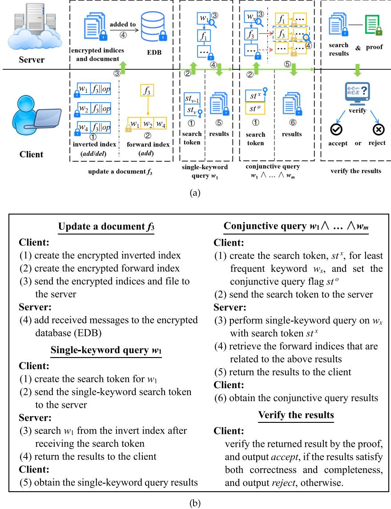

Fig. 4. Major functions of our scheme.

leakage function,  $\mathcal{L}^{Updt}$  and  $\mathcal{L}^{Srch}$ , can be written as:

$$\begin{aligned}\mathcal{L}^{Updt} &= \mathcal{L}'(op, w) \\ \mathcal{L}^{Srch}(op, in) &= \mathcal{L}''(\text{TimeDB}(w), \text{Updates}(w))\end{aligned}$$

where  $\mathcal{L}'$  and  $\mathcal{L}''$  are stateless functions, and  $\text{TimeDB}(w) = \{(t, f) | (t, \text{add}, f) \in \text{Hist}(w) \text{ and } (t, \text{del}, f) \notin \text{Hist}(w)\}$ , and  $\text{Updates}(w) = \{t | (t, op, f) \in \text{Hist}(w)\}$ .

#### IV. THE PROPOSED FORWARD PRIVATE VDSSE SCHEME

##### A. Building Blocks

Before introducing the scheme in detail, first we review the construction in high level. In the scheme, we construct the inverted index to ensure the sub-linear search time of the query process, and we build the forward index by t-Pun-PRF to achieve conjunctive queries and efficient deletion operations. The major

functions of our scheme are shown in Fig. 4(a) with a brief introduction given in Fig. 4(b). To facilitate understanding, we divided the search process into two parts, i.e., a single-keyword query and a multi-keyword conjunctive query.

##### B. Index Construction and Update

The associated notations are described in Table II and the scheme will be described following Fig. 4.

**Setup Phase:** The client is supposed to keep a dictionary, Dict, for all keywords, and for a keyword  $w$ , Dict[ $w$ ] ought to keep the information  $(v^w, lcnt^w, valcnt^w)$ . Here  $v^w$  is the version number used to generate the encryption key for inverted indices related to keyword  $w$ , which is initially set to 1 and increases after the single-keyword retrieval on keyword  $w$ . And  $lcnt^w$  records the total number of updates of the keyword  $w$ , which is used to encrypt the next keyword/document pair, and  $valcnt^w$  records

**TABLE II**  
**SUMMARY OF NOTATIONS**

| Notation             | Meaning                                                                          |
|----------------------|----------------------------------------------------------------------------------|
| $\lambda$            | the security parameter                                                           |
| $w$                  | a keyword                                                                        |
| $f$                  | a file                                                                           |
| $id$                 | the identifier of a file                                                         |
| $W^{id}$             | the set of all keywords contained in the file id                                 |
| $ran^{id}$           | a random number uniformly selected for file id                                   |
| $A$                  | the addition set of encrypted indexes                                            |
| Dict                 | the dictionary created for all keywords                                          |
| $v^w$                | the version number of encryption key for keyword $w$                             |
| $k_w^v$              | the encryption key with version $v$ for keyword $w$                              |
| $lcnt^w$             | the last counter of the encrypted document for keyword $w$                       |
| $valcnt^w$           | the vaild counter of encrypted documents (added and not deleted) for keyword $w$ |
| SK                   | the set of secret keys                                                           |
| $\sigma$             | the state information stored in local                                            |
| $st$                 | the search token                                                                 |
| $dt$                 | the delete token                                                                 |
| $q$                  | a conjunctive query $w_1 \wedge w_2 \wedge \dots \wedge w_m$                     |
| $T_i$                | the hash table of encrypted inverted index                                       |
| $T_f$                | the hash table of encrypted forward index                                        |
| $H_i(\cdot)$         | a hash function: $\{0, 1\}^* \times \{0, 1\}^* \rightarrow \{0, 1\}^{1, 5, 8}$   |
| $F_i(\cdot)$         | a PRF: $\{0, 1\}^\lambda \times \{0, 1\}^* \rightarrow \{0, 1\}^\lambda$         |
| $F_i(\cdot)(\cdot)$  | the t-Pun-PRF: $\{F_t, \text{Punc}(\cdot), F_t, \text{Eval}(\cdot)\}$            |
| $s \xleftarrow{S} S$ | uniformly sample a random value $s$ from set $S$                                 |

**Algorithm 1:** Setup( $\lambda$ , DB) $\rightarrow$   $(\sigma, \text{EDB})$ .

*Client:*

### 1: Dict $\leftarrow$ Dict.init( $\emptyset$ )

$$2: sk_{1,2,3} \overset{$s$}{\leftarrow} \{0,1\}^\lambda; \text{SK} \leftarrow \{sk_1, sk_2, sk_3\}$$
3:  $\sigma \leftarrow (\text{SK}, \text{Dict})$ 

$$4: \{T_i, T_f\} \leftarrow \text{EDB.init}(\sigma, \text{DB}); \text{EDB} \leftarrow \{T_i, T_f\}$$

### 5: send EDB to the server

the number of valid documents, i.e. the documents added but not deleted, which can serve as the reference standard of sorting when making a conjunctive query.

In addition, the client also keeps secret keys for PRFs used to encrypt the indices. Specifically, we use three PRFs  $F_1$ ,  $F_2$ , and  $F_3$  in the scheme, which take as secret key  $sk_1$ ,  $sk_2$ , and  $sk_3$ , respectively. For convenience, we let the state  $\sigma$  stored in local contain the information (SK, Dict), where SK is set  $\{sk_1, sk_2, sk_3\}$  adopted in the scheme.

During this phase, the client initializes the state  $\sigma$  and the encrypted database EDB with security parameter  $\lambda$  and database DB, which is showed in Algorithm 1. The encrypted database EDB is initialized with two empty hash tables,  $T_i$ , which is used to store the inverted index and  $T_f$ , which is used to store the forward index. The process of adding data to EDB can be referred to the steps in the update phase.

*Update Phase:* The update phase consists of two subparts, addition of documents and deletion of documents. The details are as follows:

1) *Addition phase:* When adding a document with identifier *id* and keywords set *Wid* contained in it to the encrypted database EDB, the client should create both an inverted index in the form of keyword/document pair and a forward index with *t*-Pun-PRF following the steps below.

*Step 1. Generate an encryption key:* The client retrieves the  $\text{Dict}[w] = (v^w, \text{lent}^w, valcnt^w)$  from the state  $\sigma$  for each keyword  $w \in W^{id}$ , which will be initialized as  $(1, 0, 0)$  if not found, and then computes the  $k_w^i = F_1(w||v^w)$ . In addition, the client uniformly selects a random number  $ran^{id}$  from  $\{0, 1\}^\lambda$  as the secret key for the forward index of document  $id$ .

*Step 2. Create an inverted index:* The client computes  $H_1(k_v^w || lcnt^w)$  and  $H_2(k_v^w || lcnt^w) \oplus (id||add)$  with  $lcnt^w = lcnt^w + 1$  for each  $w \in W^{id}$ , which serves as encrypted key-word/document pairs. Then the verification tag is computed as  $vt = F_3(w||(lcnt^w - 1)) \oplus F_3(w||lcnt^w) \oplus F_3(id)$ . And we mark them as  $(tag, (data, vt))$  for convenience.

*Step 3. Create forward index:* The client first computes  $k_{Sid} = F_t \cdot \text{Punc}(\text{ran}^{\text{id}}, S^{\text{id}})$  where  $S^{\text{id}}$  is the set  $\{F_2(w) | w \in W^{\text{id}}\}$ . And then, similarly, we create the forward index as  $(\text{tag}', (\text{data}', \text{vt}'))$ , where  $\text{tag}' = \text{id}, \text{data}' = F_2(\text{id}) \oplus k_{Sid}, \text{vt}' = F_3(\text{id} || \text{data}')$ .

*Step 4. Send the indices:* Eventually, the client sends all of the encrypted indices created above as addition set  $A$  to the cloud.

*Step 5. Update EDB:* The server adds receiving encrypted indices to EDB.

2) *Deletion phase*: When deleting a document, the client only needs to create the inverted index which is same as the above step, but in deletion operation, the client must replace *add* with *del* in *data*. And then the client sends the encrypted indices to the server.

The update phase is shown in Algorithm 2, where  $op$  is divided into *add* and *del*.

In the construction of the encrypted inverted index, the version  $v^w$  of  $w$  has not been issued before, and it is utilized to generate a fresh encryption key for newly added keyword/document pairs, which can cut off the relationship between previous search tokens and the newly added inverted indices until the next query request is issued.

## *C. Search and Verification Process*

Before presenting the search process of the multi-keyword conjunctive query, we introduce the single-keyword retrieval because it is a component of the conjunctive query.

*Single-Keyword Query Phase:* When performing a query request on keyword  $w$ , the whole search process consists of the following steps.

*Step 1. Generate a search token:* The client looks up the state information,  $\sigma$ , and obtains  $(v^w, lcnt^w)$  from the Dict[ $w$ ]. Thereafter, the client computes  $k_{v-1}^w = F_1(w||(v^w - 1))$  and  $k_v^w = F_1(w||v^w)$ . The client sends the search token,  $(k_{v-1}^w, k_v^w, lcnt^w)$ , to the cloud.

*Step 2. Retrieve the indices:* After obtaining the search token, first, the server retrieves the previous query results with  $k_v^{wu}$  from the cache of EDB. Then the server utilizes  $(k_v^w, lcnt^w)$  to retrieve the newly-added inverted indices ( $tag, (data, vt)$ ) by computing the entry  $H_1(k_v^w || lcnt^w)$ , where  $lcnt^w$  is decreased subsequently until the entry cannot be found. Meanwhile, the server can obtain  $(id, op)$  by calculating  $data \oplus H_2(k_v^w || lcnt^w)$ , and remove the invalid files, and accumulate the verification tag  $vt$  with XOR operation as the proof. Afterwards,

### **Algorithm 2:** Update(σ, op, in = {id, W*id*}; EDB)→ (σ ; EDB ).

*Client:*

 Current.  
 1:  $ran^{id} \leftarrow \{0, 1\}^\lambda$ ;  $A_1 \leftarrow \emptyset$ ;  $A_2 \leftarrow \emptyset$ ;  $S^{id} \leftarrow \emptyset$   
 2: **for**  $w : W^{id}$  **do**  
 3:   **if** Dict.find( $w$ ) =  $\perp$  **then**  
 4:      $v^w \leftarrow 1$ ;  $lcnt^w \leftarrow 0$ ;  $valcnt^w \leftarrow 0$   
 5:   **else**  
 6:      $(v^w, lcnt^w, valcnt^w) \leftarrow \text{Dict.find}(w)$   
 7:   **end if**  
 8:      $k_v^w \leftarrow F_1(w || v^w)$ ;  $lcnt^w \leftarrow lcnt^w + 1$   
 9:      $valcnt^w \leftarrow valcnt^w + 1$  **if**  $op = \text{add}, \text{else}$   
        $valcnt^w \leftarrow valcnt^w - 1$   
 10:      $tag \leftarrow H_1(k_v^w || lcnt^w)$   
 11:      $data \leftarrow H_2(k_v^w || lcnt^w) \oplus (id)||op$   
 12:      $vt \leftarrow F_3(w || (lcnt^w - 1)) \oplus F_3(w || lcnt^w) \oplus F_3(id)$   
 13:      $A_1 \leftarrow A_1 \cup \{(tag, (data, vt))\}$   
 14:      $\text{Dict}[w] \leftarrow (v^w, lcnt^w, valcnt^w)$   
 15:      $S^{id} \leftarrow S^{id} \cup \{F_2(w)\}$  **if**  $op = \text{add}$   
 16: **end for**  
 17: **if**  $op = \text{add}$  **then**  
 18:    $k_{S^{id}} = F_t.Punc(ran^{id}, S^{id})$   
 19:    $tag' = id$ ;  $data' = F_2(id) \oplus k_{S^{id}}$ ;  $vt' =$   
        $F_3(id || data')$   
 20:    $A_2 \leftarrow (tag', (data', vt'))$   
 21: **end if**  
 22:  $A \leftarrow (A_1, A_2)$   
 23: send  $A$  to the server  
       *Server:*  
 24: **for**  $(tag, (data, vt)) : A_1$  **do**  
 25:    $T_i[tag] \leftarrow (data, vt)$   
 26: **end for**  
 27:  $T_f[tag'] \leftarrow (data', vt')$  **if**  $A_2 \neq \emptyset$ 

the server stores the valid indices and the proof in the cache of EDB.

*Step 3. Return the results:* The server returns  $(R, \text{proof})$  to the client, where  $R$  is the result set that consists of valid documents, and  $\text{proof}$  is the accumulative verification tag of the result  $R$ .

*Step 4. Update the state:* After receiving the single-keyword query result, the client updates the state of  $w$  by modifying the  $v^w$  with  $v^w + 1$ .

In particular, if there was a failure to gain  $\text{Dict}[w]$  or the value of  $\text{lent}^w$  is 0, which means the keyword  $w$  so far has not been included or there is no matched document stored in the server at present, then the query can be terminated. Moreover,  $k_{v-1}^w$  is generated only if  $v^w > 1$ . And an example of single-keyword retrieval on keyword  $w$  is given in Fig. 5. It demonstrates the procedure *Step 2* above, which is performed in the server. And from Fig. 5(b), we can observe that the *proof* has both the latest update timestamp and valid files, which can be used to verify the completeness and correctness of the returned result respectively.

*Multi-Keyword Conjunctive Query Phase:* When making a conjunctive query,  $q, w_1 \wedge w_1 \wedge \dots \wedge w_m$ , the following steps are performed.

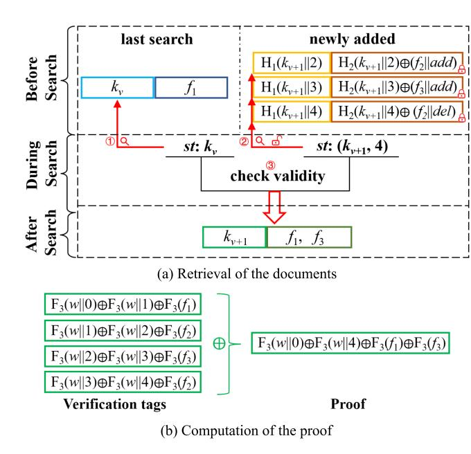

Fig. 5. Single-keyword query procedure.

*Step 1. Find the least frequent term:* The client finds the state information  $Q = \{(v^w, \text{lcnt}^w, \text{valcnt}^w) | w \in q\}$ , and then finds the least frequent term marked as  $x$  which has the minimum  $\text{valcnt}^w$ .

*Step 2. Generate search token, st:* The search token for conjunctive query consists of two parts. The first part  $st_1 = (k_{v-1}^x, k_v^x, lcnt^x)$  is created for keyword  $x$ , which is identical with *Step 1* of the single-keyword query phase. And the other part  $st_2$  is set to 1, which is the flag of the conjunctive query. Finally, the client sends  $st = (st_1, st_2)$  to the server.

*Step 3. First query stage:* After getting trapdoor *st*, the server preforms the single-keyword retrieval on *x* by *st*1, and then gets the valid set of files, *R'*, and the related proof, which is the same as *Step 2* of the single-keyword query phase.

*Step 4. Second query stage:* Owing to  $st_2$  is not null, the server traverses set  $R''$  and gets the corresponding forward index. Meanwhile, the server computes the new result  $R'$  with the tuple  $(id, data')$ , and accumulates the verification tag  $vt'$  with XOR operation as the *proof'*.

*Step 5. Return the result:* The server returns  $(R', \text{proof}, \text{proof}')$  to the client.

*Step 6. Update the state and filter the results:* After receiving the conjunctive query result, the client updates the state of keyword  $x$  by modifying the  $v^x$  with  $v^x + 1$ . And then, the client computes the output of  $F_t$ . Eval with  $k_S$  in  $data'$  and the remaining keywords in the query request to get the final query result of the query request.

Fig. 6 shows the main idea of conjunctive query  $w_1 \wedge w_2 \wedge w_3$ . And the index framed by solid red lines must be retrieved in the query phase. The details of search process are described in Algorithm 3.

**Verification Process:** After receiving the search result  $(R', \text{proof}, \text{proof}')$ , the client can recompute the accumulative

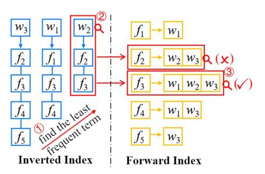

Fig. 6. Single-keyword query procedure.

verification tag with the state  $\sigma$ . And if the recomputed verification values are equal to the returned proof values respectively, then the client will output *accept*. Otherwise, the client outputs *reject*. And the details are depicted in Algorithm 4.

### *D. Efficiency Analysis*

Assumed that the plain database has  $N$  document/keyword pairs, and  $n$  documents and  $m$  keywords, the size of encrypted inverted index is  $O(N\lambda)$  and the size of forward index is  $O(n\lambda)$ . The single-keyword search cost of inverted index is  $O(x)$ , where  $x$  the number of documents matching the queried keyword (note that  $x \leq n$  always hold). When performing the conjunctive query  $q$ , the search process can be divided into two parts. In the first search stage, we perform the single-keyword retrieval by the inverted index, which is linear with the number of documents matching the queried keyword. And assumed the number is  $x$ , then the cost of the first search stage is  $O(x)$ . And in the second search stage, the documents that found in first stage should be further checked whether have the remaining quired keywords, and the cost of the second search stage is  $O(x|q|)$ , where  $|q|$  is the dimension of the conjunctive query  $q$ . Therefore, the total cost of conjunctive search process is  $O(x|q|)$ . As  $x \leq n$  is always true, the search performance of our work realizes the sub-linear efficiency.

Note that the query token in our scheme does not introduce other variables other than the specific keyword when it is generated. Hence, the communication cost of the conjunctive query token in our scheme is  $O(1)$ .

### V. SECURITY ANALYSIS

**Theorem 1.** If  $F_1, F_2$ , and  $F_3$  are secure PRFs, and  $H_1$  and  $H_2$  are random oracles; then, our protocol realizes  $\mathcal{L}$ -adaptively-secure, where  $\mathcal{L} = (\mathcal{L}^{Stp}, \mathcal{L}^{Srch}, \mathcal{L}^{Updt}, \mathcal{L}^{Vrfy})$  possesses the following properties:

- $\mathcal{L}^{Stp}(\lambda) = \emptyset$
- $\mathcal{L}^{Srch}(q) = \{ \text{sp}(w), \text{Hist}(w) \}_{w \in q}$
- $\mathcal{L}^{Updt}(op, in) = \mathcal{L}'(op, \{id, |W^{id}|\}, \text{ph}(w))$
- •  $\mathcal{L}^{vrfy}(R, proof) = \{ \text{sp}(w), \text{ph}(w) \}$

*Proof.* Here, we utilize the simulator,  $\mathcal{S}$ , to simulate the perspective of adversary simply availing of the leakage  $\mathcal{L} = (\mathcal{L}^{Stp}, \mathcal{L}^{Srch}, \mathcal{L}^{Updt}, \mathcal{L}^{Vrfy})$ , which can be constructed as the following steps:

### **Algorithm 3:** Search(q, σ; EDB)→ (σ ,R; EDB

## ').

## *Client:*

| 1: $Q \leftarrow \emptyset$                                                                                        |  |
|--------------------------------------------------------------------------------------------------------------------|--|
| 2: <b>for</b> each $w$ in $q$ <b>do</b>                                                                            |  |
| 3: <b>if</b> Dict.find( $w$ ) = $\perp$ <b>then</b>                                                                |  |
| 4:     retrun $\emptyset$                                                                                          |  |
| 5: <b>end if</b>                                                                                                   |  |
| 6: $(v^w, \text{lcnt}^w, \text{valcnt}^w) \leftarrow \text{Dict.find}(w)$                                          |  |
| 7: $Q \leftarrow Q \cup \{(w, (v^w, \text{lcnt}^w, \text{valcnt}^w))\}$                                            |  |
| 8: <b>end for</b>                                                                                                  |  |
| 9: find the minimum $\text{valcnt}^w$ , and mark the corresponding keyword as $x$                                  |  |
| 10: $k_{v-1}^x \leftarrow F_1(x  (v^x - 1))$ <b>if</b> $v^x > 0$ , <b>else</b> $k_{v-1}^x \leftarrow \emptyset$    |  |
| 11: $k_v^x \leftarrow F_1(x  v^x)$                                                                                 |  |
| 12: $st_1 \leftarrow (k_{v-1}^x, k_v^x, \text{lcnt}^x); st \leftarrow (st_1, st_2 = 1)$                            |  |
| 13: send $st$ to the server                                                                                        |  |
| <i>Server:</i>                                                                                                     |  |
| 14: $R_{add} \leftarrow \emptyset; R_{del} \leftarrow \emptyset; R' \leftarrow \emptyset; \text{proof} \leftarrow$ |  |
| $0; \text{proof}' \leftarrow 0$                                                                                    |  |
| 15: $tag \leftarrow H_1(k_v^x  \text{lcnt}^x)$                                                                     |  |
| 16: <b>while</b> $T_i.\text{find}(tag) \neq \perp$ <b>do</b>                                                       |  |
| 17: $(data, vt) \leftarrow T_i.\text{find}(tag)$                                                                   |  |
| 18: $(id  op) \leftarrow H_2(k_v^x  \text{lcnt}^x) \oplus data; \text{proof} \leftarrow$                           |  |
| $\text{proof} \oplus vt$                                                                                           |  |
| 19: $R_{add} \leftarrow R_{add} \cup \{id\}$ <b>if</b> $op = add$                                                  |  |
| 20: $R_{del} \leftarrow R_{del} \cup \{id\}$ <b>if</b> $op = del$                                                  |  |
| 21: $\text{lcnt}^x \leftarrow \text{lcnt}^x - 1$                                                                   |  |
| 22: $tag \leftarrow H_1(k_v^x  \text{lcnt}^x)$                                                                     |  |
| 23: <b>end while</b>                                                                                               |  |
| 24: <b>if</b> $k_{v-1}^x \neq \emptyset$ <b>then</b>                                                               |  |
| 25: $(R''_{v-1}, \text{proof}_{v-1}) \leftarrow EDB_{\text{cache}}[k_{v-1}^x]$                                     |  |
| 26: $R_{add} \leftarrow R_{add} \cup R''_{v-1}; \text{proof} \leftarrow \text{proof} \oplus \text{proof}_{v-1}$    |  |
| 27: <b>end if</b>                                                                                                  |  |
| 28: $R'' \leftarrow R_{add} - R_{del}; EDB_{\text{cache}}[k_v^x] \leftarrow (R'', \text{proof})$                   |  |
| 29: <b>if</b> $st_2 = \perp$ <b>then</b> $R' \leftarrow R''$                                                       |  |
| 30: <b>else</b>                                                                                                    |  |
| 31: <b>for</b> $id : R''$ <b>do</b>                                                                                |  |
| 32: $(data', vt') \leftarrow T_f[id]$                                                                              |  |
| 33: $R' \leftarrow R' \cup \{(id, data')\}; \text{proof}' \leftarrow \text{proof}' \oplus vt'$                     |  |
| 34: <b>end for</b>                                                                                                 |  |
| 35: <b>end if</b>                                                                                                  |  |
| 36: send $(R', \text{proof}, \text{proof}')$ to the client                                                         |  |
| <i>Client:</i>                                                                                                     |  |
| 37: Dict[ $x$ ]. $v^x \leftarrow \text{Dict}[x].v^x + 1$                                                           |  |
| 38: $R \leftarrow \emptyset$                                                                                       |  |
| 39: <b>for</b> $(id, data') : R'$ <b>do</b>                                                                        |  |
| 40: $k_{S^{id}} = F_2(id) \oplus data'$                                                                            |  |
| 41: $R \leftarrow R \cup \{id\}$ <b>if</b>                                                                         |  |
| $F_t.\text{Eval}(k_{S^{id}}, F_2(w)) = \perp$ ( $\forall w \in q/x$ )                                              |  |
| 42: <b>end for</b>                                                                                                 |  |
| 43: return $R$                                                                                                     |  |

*Program of Random Oracles:* For programming the random oracles  $H_1$  and  $H_2$ , the simulator,  $\mathcal{S}$ , conserves hash tables  $T_{H_1}$  and  $T_{H_2}$ , respectively, both of which contain a tuple  $(id, in, out)$ , where they represent the file identifier, input, and output, respectively. For any input in of  $T_{H_1}$  (or  $T_{H_2}$ ), if there is a tuple  $(t_1, t_2, t_3)$  where  $t_2 = in$  is stored in  $T_{H_1}$  (or  $T_{H_2}$ ), then the program takes as output  $t_3$ . Otherwise, the program uniformly

**Algorithm 4:** Verify  $(w, \sigma, R', \text{proof}, \text{proof}') \rightarrow (\text{acc}, \text{rej})$ .

### Client:

| 1: <i>lcntw</i> ← Dict.find(w)                                                                               |
|-------------------------------------------------------------------------------------------------------------------------|
| 2: <i>proof1</i> ← <i>F3(w)  0</i> ) ⊕ <i>F3(w)  <i>lcntw</i> ); <i>proof2</i> ← 0</i> |
| 3: <b>for</b> ( <i>id</i> , <i>data'</i> ) : <i>R'</i> <b>do</b>                                                        |
| 4: <i>proof1</i> ← <i>proof1</i> ⊕ <i>F3(id)</i>                                                             |
| 5: <i>proof2</i> ← <i>proof2</i> ⊕ <i>F3(id)  <i>data'</i></i>                                               |
| 6: <b>end for</b>                                                                                                       |
| 7: <b>if</b> <i>proof</i> = <i>proof1</i> and <i>proof'</i> = <i>proof2</i> <b>then</b>                                 |
| 8:  return <i>accept</i>                                                                                                |
| 9: <b>else</b>                                                                                                          |
| 10:  return <i>reject</i>                                                                                               |
| 11: <b>end if</b>                                                                                                       |

### Algorithm 5: Simulation of Addition Token (id, $|W^{id}|$ )

| 1: $A_1 \leftarrow \emptyset$                                                                                                               |  |
|---------------------------------------------------------------------------------------------------------------------------------------------|--|
| 2: $ran^{id} \xleftarrow{\mathbb{S}} \{0, 1\}^\lambda$                                                                                      |  |
| 3: <b>for</b> $j = 1$ to $ W^{id} $ <b>do</b>                                                                                               |  |
| 4: $tag \xleftarrow{\mathbb{S}} \{0, 1\}^\mu$ ; $mask \xleftarrow{\mathbb{S}} \{0, 1\}^\mu$ ; $vt \xleftarrow{\mathbb{S}} \{0, 1\}^\lambda$ |  |
| 5: $T_{H_1} \leftarrow T_{H_1} \cup \{(id, \emptyset, tag)\}$                                                                               |  |
| 6: $T_{H_2} \leftarrow T_{H_2} \cup \{(id, \emptyset, mask)\}$                                                                              |  |
| 7: $A_1 \leftarrow A_1 \cup \{tag, (mask \oplus (id  add), vt)\}$                                                                           |  |
| 8: <b>end for</b>                                                                                                                           |  |
| 9: $data' \xleftarrow{\mathbb{S}} \{0, 1\}^\lambda$ ; $vt' \xleftarrow{\mathbb{S}} \{0, 1\}^\lambda$                                        |  |
| 10: $A_2 \leftarrow (id, (data', vt(')))$                                                                                                   |  |
| 11: $A \leftarrow (A_1, A_2)$                                                                                                               |  |
| 12: return $A$                                                                                                                              |  |

---

selects a random value, out, as output, and then adds the tuple  $(\emptyset, in, out)$  to  $T_{H_1}$  (or  $T_{H_2}$ ).

---

*Simulation of Setup* This step runs like Algorithm 1, but, here, the set of secret keys, SK, is not created, and  $\text{Dict}[w]$  is modified to preserve  $key_i^w$ , which is the token applied to retrieve the previous query results of single-keyword queries.

*Simulation of the Update Token:* Considering that the deletion token can be created as same as the addition token, so, we focus on how to simulate the addition token  $A$  as described in Algorithm 2 by the simulator  $\mathcal{S}$  when adding a file *id* with its keywords set  $W^{id}$ . In the simulation of addition token, at first, the values, tag, mask, and verification tags are initialized randomly and then emplaced to the corresponding hash table, as depicted in Algorithm 5. Finally, the simulated addition token is given by simulator  $\mathcal{S}$ .

Notice here that  $\mathcal{S}$  creates *tag* by random values rather than calling the PRF  $F_1$ . If an adversary  $\mathcal{B}$  can tell the differences between the real and simulated values *tag*, he or she is capable of distinguishing the outputs of  $F_1$  and a random oracle. As a consequence, the probability of distinguishing the simulated values tag from the outputs of the PRF  $F_1$  is limited to  $\mathbf{Adv}_{\mathcal{B}, F_1}^{\text{PRF}(\lambda)}$ . Similarly, the probability of distinguishing the simulated value, *data'*, from the real value is  $\mathbf{Adv}_{\mathcal{C}, F_2}^{\text{PRF}(\lambda)}$ , and the probability

of distinguishing the simulated values,  $vt$  and  $vt'$ , from the real values is  $\mathbf{Adv}_{D, F_3}^{\text{PRF}(\lambda)}$ .

As previously explained, for a  $t$ -Pun-PRF,  $Ft$ , we can use the output of the  $F_t(k_S, x)$  to determine whether the element  $x$  belongs to the set  $S$ . And in our scheme, we use this feature to determine whether a keyword is included in the keyword set of a document. If an adversary  $\mathcal{E}$  can learn whether an element  $x$  belongs to the set  $S$  according to  $k_S$  and the output of the  $t$ -Pun-PRF simulator, then he or she is able to build a reduction that can identify the difference between the output of  $t$ -Pun-PRF and the random number, and the probability of such an event is no more than  $\mathbf{Adv}_{\mathcal{E}, F_t}^{t-\text{Pun}-\text{PRF}(\lambda)}$ .

*Simulation of Search Token* For any conjunctive query, the search token,  $st$ , includes two parts, i.e.,  $st_1$  and  $st_2$ . As the latter is just a flag of the conjunctive query, in the next description of how to simulate the search token  $st = (st_1, st_2)$ , like Algorithm 3, we pay more attention to the generation of the first part of the search token.

Initially, in order to distinguish different keywords, the simulator  $\mathcal{S}$  uses  $\hat{w} = \min(\text{sp}(w))$  to mark the unknown keyword,  $w$ . For constructing the search token of a conjunctive query  $q$ , first  $\mathcal{S}$  randomly selects a keyword,  $\hat{w}'$ , from  $q$ , which is utilized to create trapdoor,  $st_1$ , and uses the remaining keywords in  $q$  to generate trapdoor  $st_2$ . When simulating  $st_1$ ,  $\mathcal{S}$  first generates a new random key,  $key_n^{\hat{w}'}$ , and computes  $scnt^{\hat{w}'}$  with the total number of updates in  $\text{Hist}(\hat{w}')$ . Notice that, in the process of simulating addition token,  $\mathcal{S}$  only stores  $(id, \emptyset, tag)$  in  $T_{H_1}$  and  $(id, \emptyset, mask)$  in  $T_{H_2}$ , both of which are without specific input since simulator  $\mathcal{S}$  has no information about the specific keywords contained in document  $id$ . To express the reality that the unknown keyword  $w$  is included in document  $id$ ,  $\mathcal{S}$  preserves  $(id, (key_n^{\hat{w}'}, scnt^{\hat{w}'}), tag)$  in  $T_{H_1}$  and  $(id, (key_n^{\hat{w}'}, scnt^{\hat{w}'}), mask)$  in  $T_{H_2}$ . Nevertheless, it is possible that adversary  $\mathcal{A}$  has made the request  $(key_n^{\hat{w}'}, scnt^{\hat{w}'})$  as input on random oracles  $H_1$  (or  $H_2$ ), and obtained responses  $out_1 = H_1(key_n^{\hat{w}'}, scnt^{\hat{w}'})$  or  $out_2 = H_2(key_n^{\hat{w}'}, scnt^{\hat{w}'})$ . In this case, if  $out_1 \neq tag$  or  $out_2 \neq mask$ , the simulation fails. Notice that the probability of such case is  $\text{poly}(\lambda)/2^\lambda$ , because the times of simulation ought to be restricted toIf  $\mathcal{S}$  fails to find the value of  $key_l^{w'}$  in Dict, then  $st_1$  is created as  $(\emptyset, key_l^{w'}, scnt^{w'})$ . Otherwise,  $st_1$  is created as  $(key_l^{w'}, key_n^{w'}, scnt^{w'})$  where  $key_l^{w'}$  is the value stored in Dict. Thereafter,  $\mathcal{S}$  updates Dict with  $key_n^{w'}$ . Eventually,  $\mathcal{S}$  outputs the simulated search token  $st = (st_1, st_2 = 1)$  for the conjunctive query  $q$ . The details of the simulation process are presented in Algorithm 6.

*Simulation of Other Parts in the Protocol:* In this step, we briefly introduce how to simulate the rest process of the scheme. The query results of request  $q$  and the related proof can be derived from  $\text{Hist}(w)$  and  $\text{ph}(w)$ . Moreover, the update process of EDB also is easy to be simulated, since  $\mathcal{S}$  has learned all essential parameters of the input.

*Conclusion.* Integrating all simulation results, it is apparent that, for a PPT adversary  $\mathcal{A}$ , there are three independent PRF adversaries, i.e.,  $\mathcal{B}$ ,  $\mathcal{C}$  and  $\mathcal{D}$  and a  $t$ -Pun-PRF adversary  $\mathcal{E}$  holding the properties:

## **Algorithm 6:** Simulation of Search Token (q, sp, Hist).

| 1: $\hat{w} \leftarrow \text{min}(\text{sp}(w))$                                                                            |
|-----------------------------------------------------------------------------------------------------------------------------|
| 2: choose a keyword $\hat{w}'$ randomly from $q$                                                                            |
| 3: $key_n^{\hat{w}'} \leftarrow \{0, 1\}^\lambda$                                                                           |
| 4: $scnt^{\hat{w}'} \leftarrow  \text{Hist}(\hat{w}') $                                                                     |
| 5: <b>if</b> ( $key_n^{\hat{w}'}, scnt^{\hat{w}'}$ ) has been requested to $H_1$ or $H_2$ <b>then</b>                       |
| 6:   abort                                                                                                                  |
| 7: <b>else</b>                                                                                                              |
| 8: <b>for</b> each valid $id$ in $\text{Hist}(\hat{w}')$ <b>do</b>                                                          |
| 9:     choose a tuple $(id, t_2^{H_1} = \emptyset, *)$ randomly from $T_{H_1}$                                              |
| 10:     choose a tuple $(id, t_2^{H_2} = \emptyset, *)$ randomly from $T_{H_2}$                                             |
| 11: $t_2^{H_1} \leftarrow (key_n^{\hat{w}'}, scnt^{\hat{w}'})$ ; $t_2^{H_2} \leftarrow (key_n^{\hat{w}'}, scnt^{\hat{w}'})$ |
| 12: <b>end for</b>                                                                                                          |
| 13: <b>end if</b>                                                                                                           |
| 14: <b>if</b> Dict.find( $\hat{w}'$ ) = $\perp$ <b>then</b>                                                                 |
| 15: $key_l^{\hat{w}'} \leftarrow \emptyset$                                                                                 |
| 16: <b>else</b>                                                                                                             |
| 17: $key_l^{\hat{w}'} \leftarrow \text{Dict.find}(\hat{w}')$                                                                |
| 18: <b>end if</b>                                                                                                           |
| 19: Dict[ $\hat{w}'$ ] $\leftarrow key_n^{\hat{w}'}$                                                                        |
| 20: $st_1 \leftarrow (key_l^{\hat{w}'}, key_n^{\hat{w}'}, scnt^{\hat{w}'})$ ; $st_2 \leftarrow 1$                           |
| 21: $st \leftarrow (st_1, st_2)$                                                                                            |
| 22: return $st$                                                                                                             |

$$\begin{aligned} |\text{Pr}[\text{Real}_{\mathcal{A}}(\lambda) = 1] - \text{Pr}[\text{Ideal}_{\mathcal{A}, \mathcal{S}}(\lambda) = 1]| &\leq \mathbf{Adv}_{\mathcal{B}, \mathcal{F}_1}^{\text{PRF}(\lambda)} \\ + \mathbf{Adv}_{\mathcal{C}, \mathcal{F}_2}^{\text{PRF}(\lambda)} + \mathbf{Adv}_{\mathcal{D}, \mathcal{F}_3}^{\text{PRF}(\lambda)} + \mathbf{Adv}_{\mathcal{E}, \mathcal{F}_t}^{t\text{-Pun} - \text{PRF}(\lambda)} + \text{poly}(\lambda)/2^{\lambda} \end{aligned}$$

Therefore, it is concluded that the probability for the adversary,  $A$ , can distinguish the real view from the simulated view is negligible in  $\lambda$  by assuming that the  $t$ -Pun-PRF  $F_t$  and PRFs  $F_1, F_2$  are secure. In addition, according to Definition 3.3, our scheme also achieves forward privacy since the leakage function  $\mathcal{L}^{Updt}(op, in)$  only leaks the information  $(op, \{id, |W^{id}|\}, ph(w))$  where  $id$  is the file identifier and  $|W^{id}|$  is the number of modified keywords contained in it, and  $ph(w)$  is the proof history.

### VI. EXTENDED BACKWARD PRIVATE DSSE SCHEME

In this part, we introduce how to extend our forward private scheme to a backward private scheme. Considering that the key point of backward privacy is to protect the deleted files, we can realize it by encrypting the file identifiers and their update types during the update. And meanwhile, let the client perform the final decryption at the end of search process, which can keep the server from learning the deleted files in search process.

Here we give the specific modification operation and then simply discuss its security.

### *A. Modifications for Backward Privacy*

In setup phase, the client needs to store an additional secret key,  $s_k$  as the key for symmetric encryption SE, which is instantiated by AES in this work.

### **Algorithm 7:** Update-Ex(σ, op, in = {id, W*id*}; EDB)→ (σ ; EDB ).

### *Client:*

| 1: $ran^{id} \xleftarrow{S} \{0, 1\}^\lambda$ ; $A_1 \leftarrow \emptyset$ ; $A_2 \leftarrow \emptyset$ ; $S^{id} \leftarrow \emptyset$ |
|-----------------------------------------------------------------------------------------------------------------------------------------|
| 2: <b>for</b> $w : W^{id}$ <b>do</b>                                                                                                    |
| 3: <b>if</b> Dict.find( $w$ ) = $\perp$ <b>then</b>                                                                                     |
| 4: $v^w \leftarrow 1$ ; $lcnt^w \leftarrow 0$ ; $valcnt^w \leftarrow 0$                                                                 |
| 5: <b>else</b>                                                                                                                          |
| 6: $(v^w, lcnt^w, valcnt^w) \leftarrow \text{Dict.find}(w)$                                                                             |
| 7: <b>end if</b>                                                                                                                        |
| 8: $k_v^w \leftarrow F_1(w  v^w)$ ; $lcnt^w \leftarrow lcnt^w + 1$                                                                      |
| 9: $valcnt^w \leftarrow valcnt^w + 1$ <b>if</b> $op = \text{add}$ , <b>else</b>                                                         |
| $valcnt^w \leftarrow valcnt^w - 1$                                                                                                      |
| 10: $tag \leftarrow H_1(k_v^w    lcnt^w)$ ; $e = \text{SE.Enc}(id  op)$                                                                 |
| 11: $data \leftarrow H_2(k_v^w    lcnt^w) \oplus e$                                                                                     |
| 12: $vt \leftarrow F_3(w  (lcnt^w - 1)) \oplus F_3(w  lcnt^w) \oplus F_3(e)$                                                            |
| 13: $A_1 \leftarrow A_1 \cup \{(tag, (data, vt))\}$                                                                                     |
| 14: $\text{Dict}[w] \leftarrow (v^w, lcnt^w, valcnt^w)$                                                                                 |
| 15: $S^{id} \leftarrow S^{id} \cup \{F_2(w)\}$ <b>if</b> $op = \text{add}$                                                              |
| 16: <b>end for</b>                                                                                                                      |
| 17: $tag' = e$                                                                                                                          |
| 18: $k_{S^{id}} = F_t.Punc(ran^{id}, S^{id})$ <b>if</b> $op = \text{add}$                                                               |
| 19: $data' = F_2(e) \oplus k_{S^{id}}$ <b>if</b> $op = \text{add}$ , <b>else</b> pad $data'$ with random numbers                        |
| 20: $vt' = F_3(e  data')$                                                                                                               |
| 21: $A_2 \leftarrow (tag', (data', vt'))$                                                                                               |
| 22: $A \leftarrow (A_1, A_2)$                                                                                                           |
| 23: send $A$ to the server                                                                                                              |
| Server:                                                                                                                                 |
| 24: <b>for</b> $(tag, (data, vt)) : A_1$ <b>do</b>                                                                                      |
| 25: $T_i[tag] \leftarrow (data, vt)$                                                                                                    |
| 26: <b>end for</b>                                                                                                                      |
| 27: $T_f[tag'] \leftarrow (data', vt')$                                                                                                 |

In update phase, it is necessary to add inverted indices and forward indices in both file addition and deletion, i.e., cancel ing the judgment condition in the  $17^{\text{th}}$  line of Algorithm 2. And the client should use SE to encrypt the files and their update types when constructing the index. Specifically, for the update index  $(w, id, op)$ , where the  $w$  is the keyword, and  $id$  is the file identifier, and  $op$  is the update type. the client first calculates the ciphertext  $e = \text{SE.Enc}(id||op)$ . And then for an encrypted inverted index  $(tag, data, vt)$ ,  $data$  and  $vt$  need to be modified as  $data = H_2(k_v^w || lcnt^w) \oplus e$ ,  $vt = F_3(w || lcnt^w - 1) \oplus F_3(w || lcnt^w) \oplus F_3(e)$  in the  $11^{\text{th}}$  and  $12^{\text{th}}$  lines of Algorithm 2. For the forward index  $(tag', data', vt')$ , the  $19^{\text{th}}$  line of Algorithm 2 should be replaced with  $tag' = e$ ,  $data' = F_2(e) \oplus k_{Sid}$ , and  $vt' = F_3(e||data')$ . In addition, when deleting a document, the client can generate the element  $data'$  in the forward index by padding with random numbers. The details of modified update phase are given in Algorithm 7.

In search phase, the query operations do not require many modifications. The difference from the original is that the server cannot directly learn the files and update type in the search process, and it is replaced with *e*, and the returned results by

the server also use  $e$  instead of the original plain documents. Finally, the client decrypts the encrypted data  $e$ , i.e.,  $(id||op) = \text{SE.Dec}(e)$ , to obtain the final results of the query.

In the verification phase, with the above modifications, the client can directly verify the returned result with the ciphertext *e* without decrypting it, which can more efficiently verify the correctness and integrity of the result.

## *B. Efficiency Discussion*

The differences of efficiency between the extended scheme and the original scheme are mainly in the following two points:

- 1) To prevent the server from learning the update type of documents in the extended scheme, the client also needs to generate forward indices when deleting documents. Let  $n^+$  represent the number of updates of the document, and the overhead of the forward index in the extended scheme is  $O(n^+\lambda)$ .
- 21) Compared with the original scheme, the extended scheme requires an additional symmetric decryption operation when obtaining the file and its update type in search process. Let  $x$  represent the minimum update frequency in the query keyword,  $|q|$  depict the dimension of the conjunctive query  $q$ , and  $SE$  indicate the time-consuming of symmetric encryption, then the query overhead of the extended scheme is  $O(x|q| + xSE)$

## *C. Leakage Discussion*

**Theorem 2.** If  $F_1$ ,  $F_2$ , and  $F_3$  are secure PRFs, and  $H_1$  and  $H_2$  are random oracles, and the symmetric encryption SE is secure; then, our extended scheme realizes  $\mathcal{L}$ -adaptively-secure, where  $\mathcal{L} = (\mathcal{L}^{Stp}, \mathcal{L}^{Srch}, \mathcal{L}^{Updt}, \mathcal{L}^{Vrfy})$  possesses the following properties:

- $\mathcal{L}^{Stp}(\lambda) = \emptyset$
- $\mathcal{L}^{Srch}(q) = \{\text{TimeDB }(w), \text{Updates}(w)\}_{w \in q}$
- $\mathcal{L}^{Updt}(op, in) = \emptyset$
- $\mathcal{L}^{Vrfy}(R, proof) = \{ \text{ph}(w) \}$

*Proof.* Here, we still use the simulator,  $\mathcal{S}$ , to simulate the perspective of adversary, which is almost the same as before. Considering that our extended scheme just further encrypts the documents and updated types with symmetric encryption on the basis of the original, to make sure that some deleted documents cannot be learned by the server. Combined with the security analysis of the original scheme, we can draw the following conclusion for the extended scheme:

For a PPT adversary  $\mathcal{A}$ , there is a PRF adversary,  $\mathcal{B}$ , a  $t$ -Pun-PRF adversary  $\mathcal{C}$ , and a symmetric encryption adversary  $\mathcal{D}$  holding the properties:

$$\begin{aligned} |\Pr[\text{Real}_{\mathcal{A}}^{-}(\lambda) = 1] - \Pr[\text{Ideal}_{\mathcal{A}, \mathcal{S}, \mathcal{L}}^{-}(\lambda) = 1]| & \leq \mathbf{Adv}_{\mathcal{B}, F_1, F_2, S}^{\text{PRF}(\lambda)} \\ & + \mathbf{Adv}_{\mathcal{C}, F_t}^{t-\text{Pun}-\text{PRF}(\lambda)} + \mathbf{Adv}_{\mathcal{D}}^{\text{SE}(\lambda)} + \text{poly}(\lambda)/2^{\lambda} \end{aligned}$$

where  $\mathbf{Adv}_{\mathcal{D}}^{\text{SE}(\lambda)}$  is the advantage that the adversary  $\mathcal{D}$  break the symmetric encryption SE, and when the SE is secure, it is is negligible in  $\lambda$ .

Thus, it can be concluded that the probability for the adversary  $\mathcal{A}$ , can distinguish the real view from the simulated view

---

is negligible in  $\lambda$  by assuming that the encryption tools used in the scheme are secure. And meanwhile, it also realizes the backward privacy according to Definition 3.4.

---

## VII. EXPERIMENTAL EVALUATIONS

The target of the experiments in this paper is to evaluate the performance of the search and update operation in the protocol, where no communication test has been designed yet. Moreover, for comparison, we rebuild the scheme in [14], which has efficient update operations, and the schemes in [15] and [18], which can support conjunctive query in DSSE with forward privacy, and the scheme in [10], which is a verifiable DSSE with forward privacy. Moreover, to test the performance of our extended scheme, we use the work [19] as the compared scheme, which can support conjunctive query in DSSE with forward and backward privacy.

The experiments were tested on Azure Cloud with Intel(R) Xeon(R) E5-2667 v3 3.20-GHz CPU, 8 cores, and 112 GB of memory, running Windows 10 Pro (64-bit). We implemented the hash functions and PRFs with SHA256 and HMAC based on SHA256, respectively, for all schemes. In particular, the t-Pun-PRF was constructed by two HMACs based on SHA256 and Blake2b [33], respectively. And we used base64 encoding to make the ciphertext readable. All of the cryptographic tools mentioned above were from CRYPTO++.1 In addition, security parameter  $\lambda$  is configured with 128; the output of the hash function is 192 bits, and the height,  $L$ , of the VBTree was assigned as 32. All of the schemes were implemented in C++ with all data stored in hash tables.

## *A. Dataset*

Two datasets were applied in our experiments, i.e., the Enron email dataset2 and Wikimedia.3 We wrote Python scripts to filter out redundant information, and then we extracted the top-k valid keywords from the text files with a TF-IDF algorithm. After the pretreatment process, we obtained 517,399 valid files with 69,175 keywords and 1,989,805 keyword/document pairs from the Enron email dataset. Similarly, first, we pretreated the Wikipedia with Wikipedia Extractor4 and then the TF-IDF algorithm. Thereafter, we obtained 6,183,286 valid files with 1,687,925 keywords and 24,922,853 keyword/document pairs. Fig. 7 shows the statistics of the datasets applied to the experiments in the inverted index view.

## *B. Index Construction and Update Evaluations*

The comparison of storage in the client and server is shown in Table III, through which we can learn that our scheme just needs less storage both in the client and server to achieve conjunctive query. And the time costs of index construction for two datasets are described in Fig. 8, where Dual depicts the scheme in [14],

1Crypto++ Library 8.5, 2020: <https://www.cryptopp.com>2Enron Email Dataset, 2015: <https://www.cs.cmu.edu/enron>3enwiki-20201101-pages-articles.xml.bz2: <https://dumps.wikimedia.org>.4Wikipedia Extractor, 2020: <http://medialab.di.unipi.it/wiki/Wikipedia> Extractor

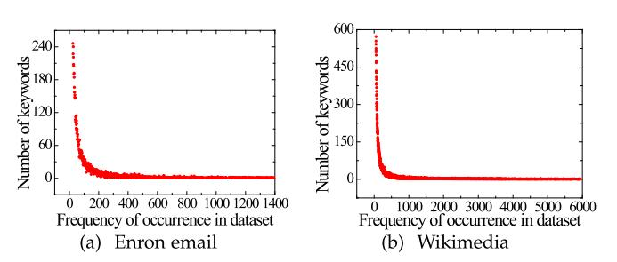

Fig. 7. Statistics of dataset.

TABLE III COMPARISON OF STORAGE (MIB)

|             | Scheme | Enron email | Wikimedia |        |
|-------------|--------|-------------|-----------|--------|
|             |        | Client      | Server    |        |
|             |        |             |           |        |
| Dual [14]   | 2.19   | 89          | 56.3      | 1187.8 |
| VBTree [15] | 1.22   | 547.3       | 34.1      | 1192.3 |
| Ours        | 0.79   | 120.5       | 21.9      | 1607.7 |

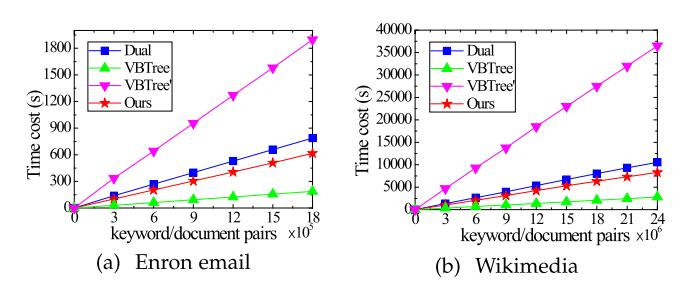

Fig. 8. Time cost of index construction.

and VBTree and VBTree represent the construction of total tree nodes and leaf nodes, respectively. In the following figures, we used VBTree to represent the scheme in [\[15\].](#page-16-0)

It is apparent in Fig. 8 that the construction of the tree node in [15] was the fastest, because it only had to compute the hash function once to generate a keyword/document pair, while there are about three computations in [14] while there were only two computations in our scheme. However, the speed of the VBTree's construction for leaf nodes, which also are practical keyword/document pairs, was the slowest since the data structure in [15] is a binary tree, and it needs to add about L nodes when inserting a leaf node for the tree with height L. Therefore, for the same data, the number of pairs in [15] is much more than in [14] and in our scheme. And it makes [15] the last one to complete the construction of the whole index. In the experiment of Wikimedia, we tested  $2.4 \times 10^7$  pairs, and the number of nodes constructed in [15] was 337,774,922 because there were too many non-leaf nodes in it for an auxiliary query. As a result, the final time costs of index construction in [14], [15], and our work were 10,546.1 s, 36,493.9 s, and 14,409.6 s, respectively. And we used  $1.8 \times 10^6$  pairs in the experiment of the Enron email dataset, and the number of pairs constructed in [15] was 177,861,258; the total time costs of index construction in [14], [15], and our work were 787.5 s, 1896.7 s, and 1071.3 s, respectively.

TABLE IV TIME COST OF THE FORWARD INDEX

|         | Test | G-1  | G-2  | G-3  | G-4  | G-5  |
|---------|------|------|------|------|------|------|
| Time(s) |      | 0.51 | 0.97 | 1.49 | 1.96 | 2.45 |

TABLE V COMPARISON OF UPDATE TIME COST (DOCUMENTS/S)

|             | Scheme | Enron email | Wikimedia |              |
|-------------|--------|-------------|-----------|--------------|
|             |        | Addition    | Addition  | Deletion     |
| Data [14]   |        | 593.5       | 5625.2    | 1052.6       |
| VBTree [15] |        | 246.4       | 246.5     | 162.5        |
| Ours        |        | 436.3       | 411.5     | <b>962.1</b> |

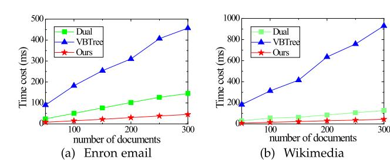

Fig. 9. Evaluations on the single-keyword search process.

Note that the total time over index construction in our protocol contains both the inverted and forward index, and we tested the construction of the forward index individually because it is associated with the size of the keyword set in a document. To test it, we used a special dataset selected from existing data that had 5 groups, and each group had 2,000 documents containing 1, 2, 3, 4 and 5 keywords for every document, respectively. The results are shown in Table IV, from which we can learn that the construction time on a forward index is about 0.25x milliseconds, where x is the number of keywords contained in the document.

Table V shows the efficiency of the updating of documents, where the data is the average rate of completing the update of the entire test dataset. It can be observed that our scheme is slightly slower than the [\[14\]](#page-16-0) in document update efficiency. Because the work [\[14\]](#page-16-0) is a single-keyword retrieval scheme, and has more simple index structures. As for conjunctive query scheme, our scheme performs better than [15] in document update. Because the huge number of indexes that need to be constructed in [\[15\]](#page-16-0) leads to low update efficiency.

## *C. Search Process Evaluations*

The evaluation of the search process was based on the total index construction in which we used  $1.8 \times 10^6$  pairs for the test in Enron email and  $2.4 \times 10^7$  pairs for the test in Wikimedia. First, we tested the single-keyword search process, and then we tested the 2-dimension and 3-dimension queries. In addition, we tested the effect of the cache in our scheme and the performance with multiple processes. All of the results presented here are the averages of the results of 10 tests.

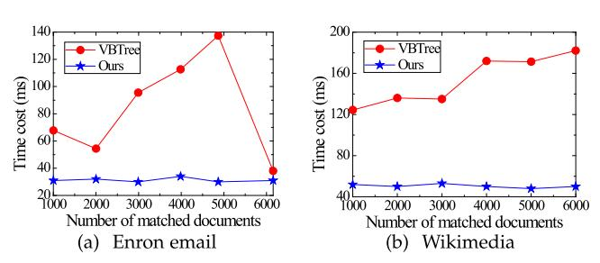

Fig. 10. Two-dimensional queries on special keywords.

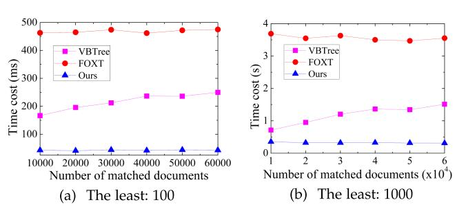

Fig. 11. Three-dimension queries on special keywords in Wikimedia.

Fig. 9 shows the evaluations on the single keyword search process. Although all searches in [15] started from the tree height  $L - \lceil \log_2 n \rceil - 1$ , where  $n$  depicts the total amount of test files, its search efficiency for a single keyword was still lower than [14] and ours. This was because, in [15], the search must be conducted about  $\lceil \log_2 n \rceil$  times to find a document. Also, due to the existence of the cache, our scheme was faster than the scheme in [14] because we improved the processing for the previous search results. In addition, from Fig. 9, we also observed that the search performance in [15] was not stable, which was caused by the random distribution of data in the tree index. If the leaf nodes (documents) to be queried are concentrated in the VBTree, efficient pruning operations can be performed during the query process, and the total number of tree nodes (including leaf nodes and non-leaf nodes) that need to be accessed will be far less than the worst-case statistics in Table I. Conversely, if the leaf nodes (documents) to be queried are scattered in the VBTree, the number of tree nodes that need to be visited will be closer to the worst-case statistics in Table I.

As the performance of our conjunctive queries and those in [\[15\]](#page-16-0) were associated with the least frequent term of query request, we selected special keywords to synthesize the query request in the test. In these tests, the matched document amount of the least frequent queried term was fixed. It was 100 for the two tests in Fig. 10, and it was 100 and 1000 for the two tests in Fig. 11. Fig. 10 shows the results of our tests of the two-dimension queries in two datasets, and the abscissa indicates the number of matched documents for the other keyword. Limited by the dataset, the tests on three-dimension queries with special keywords are only on Wikimedia, and the abscissa in Fig. 11 demonstrates the maximum amount of matched documents among queried keywords, which is 10 times for another

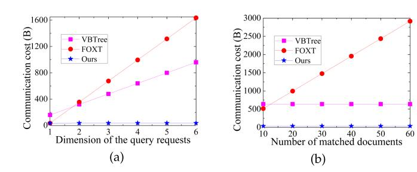

Fig. 12. Comparison of communication cost.

keyword in a three-dimension queried request other than the fixed one.

Fig. 10 shows that the search process in our scheme was faster than that in [\[15\]](#page-16-0) in the tests, and the search performance in [\[15\]](#page-16-0) is very unstable, especially the test in the Enron email dataset, which shows us that the data distribution in VBtree has an important impact on query performance. Here, we need to know that, although an optimization for the dataset is given in [\[15\],](#page-16-0) it can only play a certain optimization role. Because files will be added constantly after the construction of the index, and we cannot predict the content of documents that will be added in the future, so the final distribution of the data will tend to be random. Therefore, to be more realistic, the documents were added randomly in the experiments without optimization. And under the circumstances, the test results tell us the search performance in [\[15\]](#page-16-0) is unstable, which is also due to the limited test cases subject to the Enron email dataset, as its performance in Wikimedia is much better.

In Fig. 11, we also test the scheme FOXT that is proposed in [\[18\],](#page-16-0) which can also support conjunctive queries and achieve forward security. However, since FOXT introduces time-consuming trapdoor permutation operations in the construction of the index, which is based on RSA, the search time cost of FOXT is significantly increased compared to VBTree and ours. From the test results in both Figs. 10 and 11, we can observe that the performance of conjunctive query in our protocol was stable and faster when the minimum number of matched documents among the queried terms was fixed.

In Fig. 12, we count the communication cost of conjunctive query tokens. In Fig. 12(a), we fix the number of documents matched by the least frequent queried term to 20, and record the change of the communication cost of the search token with the increase of the query dimension. In Fig. 12(b), we fix the query dimension to 4, and record the change of the communication cost of the query token with the increase of the number of documents matched by the least frequent queried term. The token traffic in the VBTree scheme increases with the increase of the query dimension and the total update times of all queried words in the conjunctive query after the search process. In Fig. 12, the number of updates after the search process of all statistical keywords is set to 10. The token communication overhead in FOXT increases with the increase of query dimension and the number of documents matched by the least frequent queried term. In our scheme, the communication cost of search token

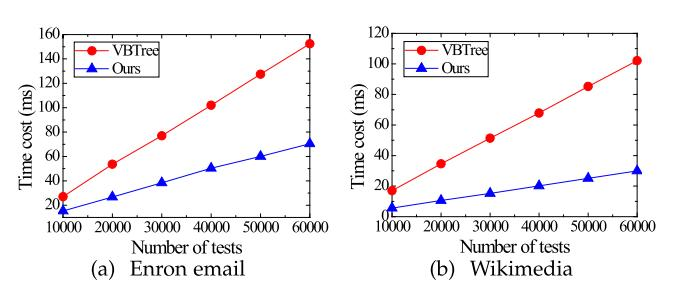

Fig. 13. Two-dimensional queries on random keywords.

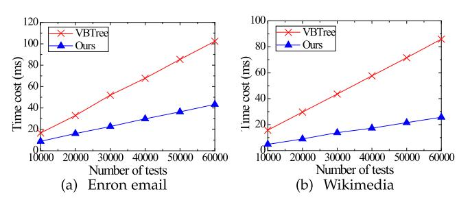

Fig. 14. Three-dimensional queries on random keywords.

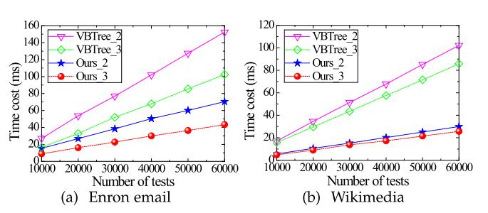

Fig. 15. Comparison of 2 & 3-dimensional queries.

has nothing to do with the above factors, and it is more stable and much smaller than it in both VBTree and FOXT.

To evaluate the performance of conjunctive queries in a general situation, we selected keywords randomly and tested 2-dimension and 3-dimension queries 60,000 times over two datasets. Figs. 13 and 14 show the results of the tests, and it is apparent that our query speed was about twice that of VBTree in both the 2-dimension and 3-dimension queries in the experimental environment. In addition, to compare 2- and 3-dimension queries, we put the test results above into Fig. 15, where the solid line represents 2-dimensional queries and the dotted line represents the 3-dimension queries. Apparently, the test results for such random cases were relatively stable. Moreover, we can see that the 3-dimension queries were faster, and this was because the minimum number of matched documents for keywords in 3-dimensional queries usually is smaller than it is in 2-dimensional queries.

The experimental tests in Figs. 16, 17, and 18 are to explore some ways to further improve query efficiency. Fig. 15 mainly tests the improvement of query efficiency by cache. Figs. 17 and 18 use multi-threaded parallel methods to improve query efficiency. The method of using cache is universal, and we

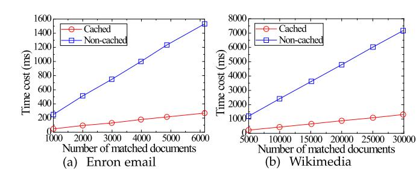

Fig. 16. The efficiency of cached and non-cached.

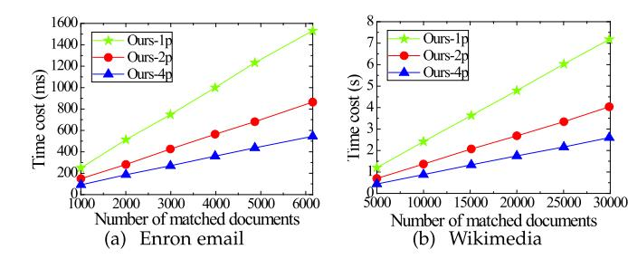

Fig. 17. Evaluations of the multi-process of our scheme.

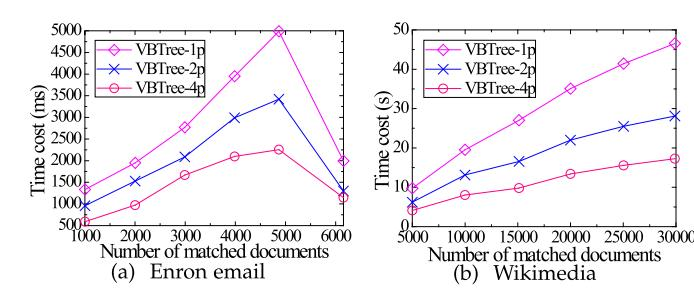

Fig. 18. Evaluations of the multi-process of [\[15\].](#page-16-0)

can cache the results of this query in the cache, which can speed up the next retrieval of this part of the data. Whether the multi-threaded parallel method can be used depends on the specific design of the index in the scheme. The structure that has no dependencies between indexes can generally be improved by multi-threaded parallel methods, such as[\[14\],](#page-16-0) [\[15\].](#page-16-0) Some indexes constructed in the form of singly linked lists have dependencies between indexes, which is not easy to use multi-threaded parallel approach, such as [\[13\].](#page-16-0)

The improvement of the query efficiency of the cache is usually related to the number of indexes currently cached. In general, if the number of cached indexes is larger, the query efficiency will be improved more, because if the query cache is not added, these indexes need to be retrieved one by one during the subsequent queries, which will do a lot of repetitive retrieval work. Fig. 16 also proves that the search efficiency with cache can be improved significantly.

The multi-threaded parallel query method improves query efficiency in proportion to the number of threads. Assuming that  $n(n \geq 2)$  threads are used for parallel query at the same time, the query efficiency is about  $n$  times that of a single thread. In Fig. 18, we show the results of the search on the non-cached part, as it is the main consumption in the search process. We can complete

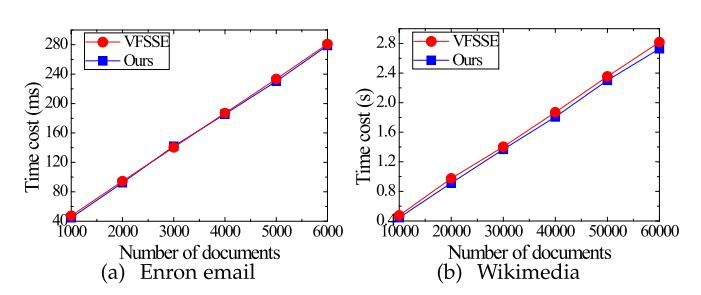

Fig. 19. The verification cost between VFSSE and ours.

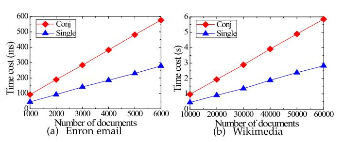

Fig. 20. The verification cost between different dimensional queries.

the multi-process query operations by evenly distributing the counters for non-cached data, and if there exists a previous cache, we can find cached data first and then compute the counters for non-cached data. In addition, from Fig. [18,](#page-14-0) we can observe that the improvement of multi-threading efficiency in [\[15\]](#page-16-0) may be unstable for some queries, which is caused by uneven data distribution in its tree index.

## *D. Verification Process Evaluations*

In this part, we test the Verification Process that is performed by the client. And we use VFSSE to represent the work of [\[10\]](#page-16-0) for convenience.

Fig. 19 shows the comparison of the verification cost between VFSSE and our scheme when performing single-keyword search. First, it is apparent that the verification cost of both VF-SSE and ours is positive linearly with the number of documents. It is because that we must recompute the authentication information for each document in the search result during the verification Process. In addition, the verification efficiency between the two is similar owing to the main time cost is recomputing the authentication information for each document, which is about the calculation time of one HMAC operation in both of VFSSE and ours.

Fig. 20 shows the comparison of the verification cost between single-keyword search and conjunctive search in our scheme. Apparently, we can observe that the verification overhead of conjunctive query is about 2 times that of single-keyword query. It is because that we must compute two pieces of authentication information during conjunctive query, each of which is similar to computation cost in the single-keyword query.

## *E. Extended Scheme Evaluations*

The work [\[19\]](#page-16-0) gave a forward and backward private conjunctive searchable symmetric encryption scheme, called Oblivious

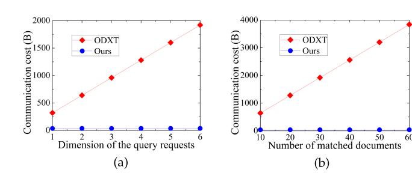

Fig. 21. Comparison of communication cost.

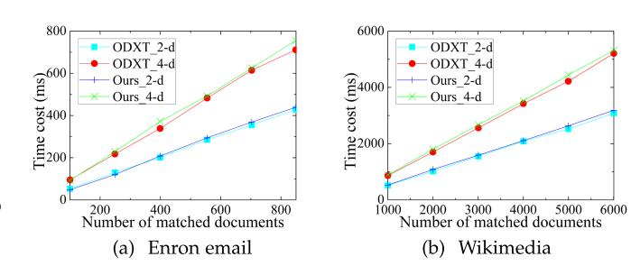

Fig. 22. Comparison of search time cost.

Dynamic Cross Tags (ODXT). In the ODXT scheme, when performing a conjunctive query, the server can first query the documents that match the least update frequent queried keyword, and then further judge whether these documents contain the other queried keywords to get the final results. Compared with ODXT, the weakness of our scheme is that the workload of the server is mainly to retrieve the documents that match the least update frequent queried keyword, but the further work of determining whether these documents contain the other queried keywords needs to be completed by the client. It is because that we make a compromise in our scheme to complete the conjunctive query and verification in one-round interaction.

Considering that both the ODXT and our extended scheme realize the Type-II backward privacy, here we give some performance comparisons between them.

Fig. 21 shows the communication cost of the conjunctive query token of the ODXT scheme and our extended scheme. In Fig. 21(a), the number of documents matched by the least frequent queried keyword is fixed to 20. Fig. 21(b), the query dimension is fixed to 2, and the abscissa is the number of documents matched by the least frequent queried keyword. It can be observed that the communication overhead of the search token in ODXT increases significantly with the increase of the query dimension and the number of documents of the least frequent queried term. In contrast, communication cost of the query token in our extended scheme is stable and small, which has obvious advantages for saving client computing and network resources.

Fig. 22 shows the comparison between the ODXT scheme and our extended scheme in the time cost of conjunctive queries. The figure depicts the time cost of 2-dimension and 4-dimension queries, and the abscissa shows the number of documents matched by the least frequent queried keyword in tested query requests. From Fig. 22, it can be observed that the search time cost of our extended scheme is slightly more than that of the ODXT scheme. However, note that the ODXT scheme cannot support the verification of the returned results, while our extended scheme verifies the search result. Therefore, compared with the ODXT scheme, although our scheme reduces a slight query performance, it ensures the correctness and completeness of the query results. And our scheme also greatly reduces the amount of search token computation.

### VIII. CONCLUSION

In this paper, a verifiable DSSE protocol was proposed to support conjunctive query and forward privacy over encrypted database. The scheme builds inverted indices and forward indices constructed with *t*-Pun-PRF, and designs the authentication tag by only symmetric cryptography that can support accumulative operations, and achieves adaptive and forward security, scalable index size, and efficient search and update operations. In order to improve the conjunctive query speed as much as possible, we present an exact method to find the least frequent term among queried terms, which is not given in other approaches. Performance evaluations on two datasets demonstrated that our scheme supports efficient conjunctive queries and updates with strong privacy guarantee.

### REFERENCES

[1] D. X. Song, D. Wagner, and A. Perrig, "Practical techniques for searches on encrypted data," in *Proc. IEEE Symp. Secur. Privacy*, 2000, pp. 44–55. [2] G. Asharov, M. Naor, G. Segev, and I. Shahaf, "Searchable symmetric encryption: Optimal locality in linear space via two-dimensional balanced allocations," in *Proc. 48th Annu. ACM Symp. Theory Comput*, 2016, pp. 1101–1114. [3] D. Cash, S. Jarecki, C. Jutla, H. Krawczyk, M.-C. Ro¸su, and M. Steiner, "Highly-scalable searchable symmetric encryption with support for boolean queries," in *Proc. 33rd Annu. Cryptol. Conf.*, 2013, pp. 353–373. [4] M. Chase and S. Kamara, "Structured encryption and controlled disclosure," in *Proc. 16th Int. Conf. Theory Appl. Cryptol. Inf. Secur.*, 2010, pp. 577–594. [5] R. Curtmola, J. Garay, S. Kamara, and R. Ostrovsky, "Searchable symmetric encryption: Improved definitions and efficient constructions," in *Proc. 13th ACM Conf. Comput. Commun. Secur.*, 2006, pp. 79–88. [6] Y. Zhang, J. Katz, and C. Papamanthou, "All your queries are belong to us: The power of file-injection attacks on searchable encryption," in *Proc. 25th USENIX Secur. Symp.*, 2016, pp. 707–720. [7] Q. Chai and G. Gong, "Verifiable symmetric searchable encryption for semi-honest-but-curiouscloud servers," in *Proc. IEEE Int. Conf. Commun*, 2012, pp. 917–922. [8] W. Sun, X. Liu, W. Lou, Y. T. Hou, and H. Li, "Catch you if you lie to me: Efficient verifiable conjunctive keyword search over large dynamic encrypted cloud data," in *Proc. IEEE Conf. Comput. Commun.*, 2015, pp. 2110–2118. [9] J. Wang, X. Chen, S. Sun, J. K. Liu, M. H. Au, and Z. Zhan, "Towards efficient verifiable conjunctive keyword search for large encrypted database," in *Proc. 23rd Eur. Symp. Res. Comput. Secur.*, 2018, pp. 83–100. [10] Z. Zhang, J. Wang, Y. Wang, Y. Su, and X. Chen, "Towards efficient verifiable forward secure searchable symmetric encryption," in *Proc. 24th Eur. Symp. Res. Comput. Secur.*, 2019, pp. 304–321. [11] X. Ge et al., "Towards achieving keyword search over dynamic encrypted cloud data with symmetric-key based verification," *IEEE Trans. Dependable Secur. Comput.*, vol. 18, no. 1, pp. 490–504, Jan./Feb. 2021. [12] E. Stefanov, C. Papamanthou, and E. Shi, "Practical dynamic searchable encryption with small leakage," in *Proc. 21st Annu. Netw. Distrib. Syst. Secur. Symp.*, 2014, pp. 72–75. [13] R. Bost, "o ϕ oς: Forward secure searchable encryption," in *Proc. ACM Conf. Comput. Commun. Secur.*, 2016, pp. 1143–1154. [14] K. S. Kim, M. Kim, D. Lee, J. H. Park, and W.-H. Kim, "Forward secure dynamic searchable symmetric encryption with efficient updates," in *Proc. ACM Conf. Comput. Commun. Secur*., 2017, pp. 1449–1463.

[15] Z. Wu and K. Li, "VBtree: Forward secure conjunctive queries over encrypted data for cloud computing," *VLDB J.*, vol. 28, no. 1, pp. 25–46, 2019. [16] S.-F. Sun et al., "Practical backward-secure searchable encryption from symmetric puncturable encryption," in *Proc. ACM Conf. Comput. Commun. Secur.*, 2018, pp. 763–780. [17] S. Lai et al., "Result pattern hiding searchable encryption for conjunctive queries," in *Proc. ACM Conf. Comput. Commun. Secur.*, 2018, pp. 745– 762. [18] Y. Wang, J. Wang, S. Sun, M. Miao, and X. Chen, "Toward forward secure SSE supporting conjunctive keyword search," *IEEE Access*, vol. 7, pp. 142 762–142 772, 2019. [19] S. Patranabis and D. Mukhopadhyay, "Forward and backward private conjunctive searchable symmetric encryption," in *Proc. Annu. Netw. Distrib. Syst. Secur. Symp.*, 2021, pp. 1–18. [Online]. Available: [https://www.ndss-symposium.org/ndss-paper/forward](https://www.ndss-symposium.org/ndss-paper/forward-and-backward-private-conjunctive-searchable-symmetric-encryption/)[and-backward-private-conjunctive-searchable-symmetric-encryption/](https://www.ndss-symposium.org/ndss-paper/forward-and-backward-private-conjunctive-searchable-symmetric-encryption/) [20] R. Bost, B. Minaud, and O. Ohrimenko, "Forward and backward private searchable encryption from constrained cryptographic primitives," in*Proc. ACM Conf. Comput. Commun. Secur*., 2017, pp. 1465–1482. [21] C. Zuo, S.-F. Sun, J. K. Liu, J. Shao, and J. Pieprzyk, "Dynamic searchable symmetric encryption with forward and stronger backward privacy," in *Proc. 24th Eur. Symp. Res. Comput. Secur.*, 2019, pp. 283–303. [22] D. Cash, P. Grubbs, J. Perry, and T. Ristenpart, "Leakage-abuse attacks against searchable encryption," in *Proc. 22nd ACM Conf. Comput. Commun. Secur.*, 2015, pp. 668–679. [23] M. S. Islam, M. Kuzu, and M. Kantarcioglu, "Access pattern disclosure on searchable encryption: Ramification, attack and mitigation," in *Proc. 19th Annu. Netw. Distrib. Syst. Secur. Symp*., 2012, pp. 1–15. [Online]. Available: [https://www.ndss-symposium.org/ndss2012/ndss-](https://www.ndss-symposium.org/ndss2012/ndss-2012-programme/access-pattern-disclosure-searchable-encryption-ramification-attack-and-mitigation/)[2012-programme/access-pattern-disclosure-searchable-encryption](https://www.ndss-symposium.org/ndss2012/ndss-2012-programme/access-pattern-disclosure-searchable-encryption-ramification-attack-and-mitigation/)[ramification-attack-and-mitigation/](https://www.ndss-symposium.org/ndss2012/ndss-2012-programme/access-pattern-disclosure-searchable-encryption-ramification-attack-and-mitigation/) [24] M. Naveed, S. Kamara, and C. V. Wright, "Inference attacks on propertypreserving encrypted databases," in *Proc. 22nd ACM Conf. Comput. Commun. Secur.*, 2015, pp. 644–655. [25] S. Kamara and C. Papamanthou, "Parallel and dynamic searchable symmetric encryption," in *Proc. 17th Int. Conf. Financial Cryptogr. Data Secur.*, 2013, pp. 258–274. [26] R. Li, A. X. Liu, A. L. Wang, and B. Bruhadeshwar, "Fast range query processing with strong privacy protection for cloud computing," *VLDB Endow.*, vol. 7, no. 14, pp. 1953–1964, 2014. [27] R. Li, A. X. Liu, A. L. Wang, and B. Bruhadeshwar, "Fast and scalable range query processing with strong privacy protection for cloud computing," *IEEE/ACM Trans. Netw.*, vol. 24, no. 4, pp. 2305–2318, Aug. 2016. [28] R. Li and A. X. Liu, "Adaptively secure conjunctive query processing over encrypted data for cloud computing," in *Proc. IEEE 33rd Int. Conf. Data Eng*., 2017, pp. 697–708. [29] J. Ghareh Chamani, D. Papadopoulos, C. Papamanthou, and R. Jalili, "New constructions for forward and backward private symmetric searchable encryption," in *Proc. ACM Conf. Comput. Commun. Secur.*, 2018, pp. 1038–1055. [30] I. Demertzis, J. G. Chamani, D. Papadopoulos, and C. Papamanthou, "Dynamic searchable encryption with small client storage," in *Proc. 27th Annu. Netw. Distrib. Syst. Secur. Symp*., 2020, pp. 1–18, [Online]. Available: [https://www.ndss-symposium.org/ndss-paper/dynamic-searchable](https://www.ndss-symposium.org/ndss-paper/dynamic-searchable-encryption-with-small-client-storage/)[encryption-with-small-client-storage/](https://www.ndss-symposium.org/ndss-paper/dynamic-searchable-encryption-with-small-client-storage/) [31] S.-F. Sun et al., "Practical non-interactive searchable encryption with forward and backward privacy," in *Proc. 28th Annu. Netw. Distrib. Syst. Secur. Symp*., 2021, pp. 1–18. [Online]. Available: [https://www.ndss](https://www.ndss-symposium.org/ndss-paper/practical-non-interactive-searchable-encryption-with-forward-and-backward-privacy/)[symposium.org/ndss-paper/practical-non-interactive-searchable](https://www.ndss-symposium.org/ndss-paper/practical-non-interactive-searchable-encryption-with-forward-and-backward-privacy/)[encryption-with-forward-and-backward-privacy/](https://www.ndss-symposium.org/ndss-paper/practical-non-interactive-searchable-encryption-with-forward-and-backward-privacy/) [32] S. Goldwasser and M. Bellare, "Lecture notes on cryptography," MIT, 2008. [Online]. Available: [https://cseweb.ucsd.edu/](https://cseweb.ucsd.edu/~mihir/papers/gb.pdf)∼mihir/papers/gb.pdf [33] S. Hohenberger, V. Koppula, and B. Waters, "Adaptively secure puncturable pseudorandom functions in the standard model," in *Proc. 21st Int. Conf. Theory Appl. Cryptol. Inf. Secur*., 2015, pp. 79–102. [34] S. Kamara, C. Papamanthou, and T. Roeder, "Dynamic searchable symmetric encryption," in *Proc. 19th ACM Conf. Comput. Commun. Secur.*, 2012, pp. 965–976. [35] D. Cash et al., "Dynamic searchable encryption in very-large databases: Data structures and implementation," in *Proc. 21st Annu. Netw. Distrib. Syst. Secur. Symp*., 2014, pp. 1–16. [Online]. Available: [https://www.ndss](https://www.ndss-symposium.org/ndss2014/programme/dynamic-searchable-encryption-very-large-databases-data-structures-and-implementation/)[symposium.org/ndss2014/programme/dynamic-searchable-encryption](https://www.ndss-symposium.org/ndss2014/programme/dynamic-searchable-encryption-very-large-databases-data-structures-and-implementation/)[very-large-databases-data-structures-and-implementation/](https://www.ndss-symposium.org/ndss2014/programme/dynamic-searchable-encryption-very-large-databases-data-structures-and-implementation/)

**Cheng Guo** (Member, IEEE) received the BS degree in computer science from the Xian University of Architecture and Technology, in 2002, the MS degree from the Dalian University of Technology, Dalian, China, in 2006, and the PhD degree in computer application and technology from the Dalian University of Technology, Dalian, China, in 2009. From July 2010 to July 2012, he was a postdoc with the Department of Computer Science, National Tsing Hua University, Hsinchu, Taiwan. Since 2020, he has been a professor with the School of Software Technology, Dalian University of Technology. His current research interests include information security, cryptology, and cloud security.

**Wenfeng Li** received the bachelor's and master's degrees in software engineering from the Dalian University of Technology, in 2019 and 2022, respectively. His research interests include primarily focused on searchable encryption. With a strong academic background in computer science, he has a passion for exploring the latest developments in cryptology, information security and cloud security. Through his dedication and hard work, he is determined to make a significant contribution to the field of cybersecurity.

**Xinyu Tang** received the bachelor's and master's degrees in software engineering from the Dalian University of Technology, China, in 2016 and 2018, respectively. He is currently working toward the PhD degree with the Dalian University of Technology. His research interests include cryptography, private data protection, and cloud storage technology. He has already published several papers in related fields and is now focusing on secure machine learning and secure multi-party computation.

**Kim-Kwang Raymond Choo** (Senior Member, IEEE) received the PhD degree in information security from the Queensland University of Technology, Australia, in 2006. He currently holds the Cloud Technology Endowed Professorship with the University of Texas at San Antonio. He is the founding co-editor-in-chief of ACM Distributed Ledger Technologies: Research & Practice, and the founding chair of *IEEE Technology and Engineering Management Society Technical Committee (TC)* on Blockchain and Distributed Ledger Technologies. He is the recipient of the 2022 IEEE Hyper-Intelligence TC Award for Excellence in Hyper-Intelligence Systems (Technical Achievement award), the 2022 IEEE TC on Homeland Security Research and Innovation Award, the 2022 IEEE TC on Secure and DependableMeasurementMid-Career Award, and the 2019 IEEE TC on Scalable Computing Award for Excellence in Scalable Computing (Middle

Career Researcher).

**Yining Liu** received the BS degree in applied mathematics from the Information Engineering University, Zhengzhou, China, in 1995, the ME degree in computer software and theory from the Huazhong University of Science and Technology, Wuhan, China, in 2003, and the PhD degree in mathematics from Hubei University, Wuhan, China, in 2007. He is currently a professor with the School of Computer and Information Security, Guilin University of Electronic Technology, Guilin, China. His research interests include the information security protocol, and data privacy.

