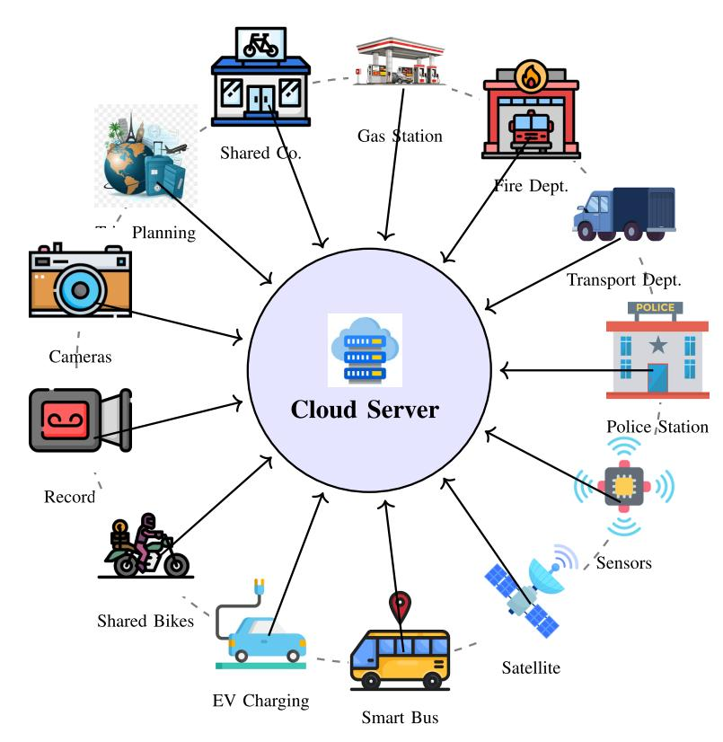
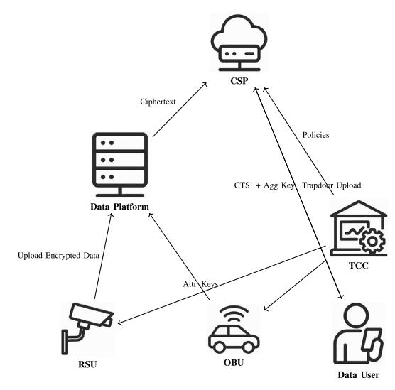
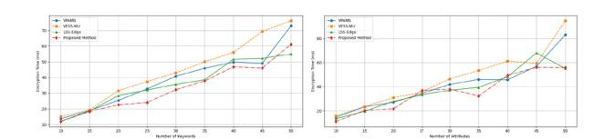
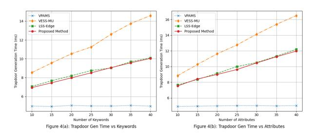
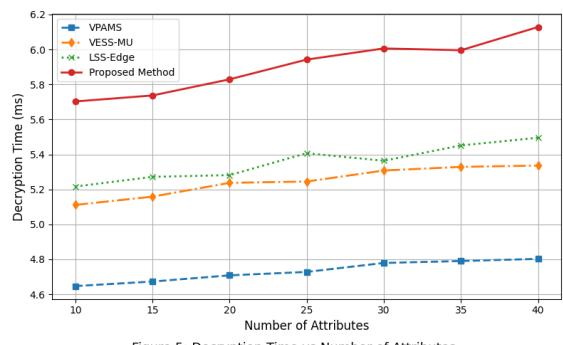

# Secure and Privacy-Preserving Post-Quantum Attribute-Based Searchable Encryption for Edge-Driven Transportation Systems

Chintureena Thingo[m](https://orcid.org/0000-0003-4305-7026) , Bhagavan Konduri, Isha Da[s](https://orcid.org/0009-0007-7812-4627) , V. Rama Krishna, Rahul Suryoda, Shrabani Mallick, Faheem Ahmad Reeg[u](https://orcid.org/0000-0002-9167-3061) , Feruza Saidova, and Deepak Kumar Goyal

*Abstract*— To address the risks of data leakage and unauthorized access in Intelligent Transportation Systems (ITS), particularly in the post-quantum era where traditional cryptographic algorithms are vulnerable, this paper proposes a novel Post-Quantum Attribute-Based Searchable Encryption (PQ-ABSE) scheme. The scheme is designed to resist quantum attacks while providing privacy-preserving search, key aggregation, and lightweight computation. The proposed PQ-ABSE scheme ensures end-to-end privacy protection during key generation, access control, and partial decryption phases. By embedding search keywords into the access policy, it achieves partial policy hiding and ensures keyword confidentiality under quantumresilient assumptions. Moreover, by leveraging key aggregation techniques, the scheme consolidates all file identifiers that meet both the search and access conditions into a single aggregate key, significantly reducing user-side key storage overhead while ensuring file and data security. Security analysis confirms that the scheme achieves hidden access structure security, keyword ciphertext indistinguishability, and trapdoor indistinguishability in a post-quantum setting. Theoretical analysis and simulation results further demonstrate the scheme's practicality and efficiency in terms of both computational and communication overhead, making it a promising solution for post-quantum secure ITS data management.

Received 29 June 2025; revised 2 September 2025 and 11 October 2025; accepted 9 November 2025. Date of publication 12 November 2025; date of current version 25 March 2026. *(Corresponding author: Chintureena Thingom.)*

Chintureena Thingom is with the Department of CSE, Aditya University, Surampalem, Andhra Pradesh 533437, India (e-mail: reena.thingom01@ gmail.com).

Bhagavan Konduri is with the Department of Computer Science and Engineering, Koneru Lakshmaiah Education Foundation, Guntur, Andhra Pradesh 522302, India (e-mail: bhagavan@kluniversity.in).

Isha Das is with the Network Communication and IoT Laboratory, Chittagong University of Engineering and Technology, Chattogram 4349, Bangladesh (e-mail: ishadas2006@gmail.com).

V. Rama Krishna is with the CVR College of Engineering, Hyderabad 501510, India (e-mail: rama.vishwa@gmail.com).

Rahul Suryoda is with Data Governance, Data Analytics (Enterprise Performance Management), AI & ML, Seattle, WD 98101 USA(e-mail: rsuryodai@outlook.com).

Shrabani Mallick is with the Department of CSE, Dr. B. R. Ambedkar Institute of Technology, Sri Vijaya Puram 744103, India (e-mail: shrabani.

reek@gmail.com). Faheem Ahmad Reegu is with the College of Engineering and Computer Science, Department of Electrical and Electronic Engineering, Jazan Univer-

sity, Jazan 45142, Saudi Arabia (e-mail: freegu@jazanu.edu.sa). Feruza Saidova is with the Department of Foreign Languages, Tashkent State University of Economics, Tashkent 100066, Uzbekistan (e-mail:

f.saidova@tsue.uz). Deepak Kumar Goyal is with the Vaish College of Engineering, Rohtak, Haryana 124001, India (e-mail: deepakgoyal.vce@gmail.com).

Digital Object Identifier 10.1109/TCE.2025.3632071

*Index Terms*— Post-quantum cryptography, intelligent transportation systems, attribute-based searchable encryption, privacy preservation, quantum-resistant encryption.

#### I. INTRODUCTION

I NTELLIGENT Transportation Systems (ITS) are an integration of various technologies extensively applied in transportation and represent one of the most critical pillars of smart cities. They promote intelligent, convenient, and safe urban transportation [\[1\],](#page-10-0) [\[2\],](#page-10-1) [\[3\]. In](#page-10-2) the era of big data, ITS generates massive amounts of data [\[4\]. As](#page-10-3) shown in Figure [1,](#page-1-0) numerous roadside units and onboard units upload data to cloud servers via data platforms, and various application platforms search and download transportation data as needed. Governments use cloud data to predict future traffic flows and passenger trends; enterprises obtain data to assist decisionmaking and business analytics to offer better services; public users access real-time traffic information, plan travel routes, use autonomous driving features, and perform charging planning through application platforms [\[5\],](#page-10-4) [\[6\]. On](#page-10-5)ce traffic data is leaked, both data users and data providers can suffer significant losses. Therefore, ensuring the security of traffic data is a pressing issue for big data applications in ITS.

When assessing cryptographic algorithms, infrastructure, and architectural decisions for large-scale deployments of millions of ciphertexts in Industrial Threat Systems (ITS), scalability analysis must be conducted with an emphasis on performance (throughput, latency), resource consumption (CPU, memory, energy), and the system's capacity to grow horizontally through resource additions. Key tactics include the use of scalable cloud infrastructure with container orchestration, such as Kubernetes, the selection of effective lightweight cryptographic algorithms, and the design of distributed systems that steer clear of single sources of congestion, such a central sorting warehouse in a delivery system. Long-term scalability also depends on future-proofing with post-quantum cryptography (PQC) and making sure that key management is strong.

In 2018, Li et al. [\[7\]](#page-10-6) first proposed searchable encryption, which enables searching over encrypted data without revealing the search content. Currently, most searchable encryption schemes focus on fuzzy keywords [\[8\],](#page-10-7) [\[9\]](#page-10-8) and ranked search keywords [\[10\],](#page-10-9) [\[11\], a](#page-10-10)iming to improve search

Fig. 1. Architecture of Intelligent Transportation System (ITS) in big data environment.

efficiency on the server side and meet users' data retrieval needs [\[12\],](#page-10-11) [\[13\]. M](#page-10-12)obility and topology variability are deployment factors for vehicle networks that go beyond latency limitations. This calls for reliable network designs that can manage frequent handoffs and shifting network configurations. Security and privacy are also important considerations; to safeguard sensitive vehicle data, robust encryption and authentication are required. Supporting a high number of vehicles and devices requires scalability, while interoperability guarantees smooth communication between various infrastructure elements and vehicle brands. Tian et al. [8] [em](#page-10-7)ployed Bloom filters and locality-sensitive hashing to compute inner products on index vectors, improving search accuracy without sacrificing efficiency. Li et al. [\[10\]](#page-10-9) used locality-sensitive hashing and Bloom filters to achieve fuzzy keyword search. However, as user search histories grow, untrusted cloud servers accumulate increasingly detailed information, making user profiles more transparent.

In 2020, Zhao et al. [\[14\],](#page-10-13) [\[15\]](#page-10-14) first combined attributebased encryption (ABE) with searchable encryption, proposing Attribute-Based Searchable Encryption (ABSE). Quantum computers can effectively solve the underlying asymmetric encryption problems that pre-quantum Attribute-Based Search Encryption (ABSE) schemes in Intelligent Transportation Systems (ITS) rely on, like factoring large integers or the discrete logarithm problem, these schemes have security limitations. Accordingly, present ABSE schemes are susceptible to future quantum attacks since quantum adversaries have the ability to jeopardize the security and integrity of data in ITS networks, which could result in fraudulent activity, unauthorized access, and the interruption of vital services. Based on the number of keywords, ABSE schemes are categorized into singlekeyword and multi-keyword schemes. The latter includes conjunctive multi-keyword ABSE [\[16\], r](#page-10-15)anked multi-keyword ABSE [\[17\],](#page-10-16) [\[18\],](#page-10-17) and ABSE schemes supporting Linear Secret Sharing Schemes (LSSS) [\[19\],](#page-10-18) [\[20\],](#page-10-19) [\[21\],](#page-10-20) [\[22\],](#page-10-21) [\[23\].](#page-10-22) Comparing all of the subjects under comparison using the same set of criteria or characteristics is part of the analysis's organized approach to comparison. The term "provide a sufficiently deep comparative discussion" refers to the methodical analysis of two or more subjects (such as concepts, methods, or systems) in order to pinpoint and emphasize their similarities and differences in a thorough and perceptive manner, frequently with the intention of making inferences regarding their individual advantages, disadvantages, environments, or developmental trends. The particular topics and the analysis's goal will determine how in-depth and focused the comparison is; it may compare their characteristics, historical development, real-world uses, or theoretical foundations. Fu et al. [\[19\]](#page-10-18) proposed the first LSSS-based multi-keyword ABSE that supports trapdoors, embedding keyword information in access policies. However, since the access policies are public, the keywords are also exposed. Singamaneni et al. [\[21\]](#page-10-20) associated keywords with file attributes so that user trapdoors are keyword-related, but their scheme outsources encryption to the cloud, thus exposing access structures containing keyword information. Sun et al. [\[23\]](#page-10-22) proposed a searchable encryption scheme combining ABE with a time-sharing mechanism, enabling secure data access, fine-grained search, and timecontrolled data validity. In computer science and building, the term "aggregate key construction" is not accepted or used consistently. In addition to discussing the notion of composite or aggregate keys in database systems, the search results also cover the characteristics and uses of construction aggregates (such as sand, gravel, and crushed stone) and the building process. Key Construction Aggregate: By allowing users to decrypt all matched ciphertexts with a single key, an effective aggregate key technique improves file-level security and saves key storage. The discrepancy between a device's stated storage capacity and its actual useable space is known as storage overhead. The normal operation of a storage system, which must utilize a percentage of the capacity for system files, is the cause of the space loss rather than a flaw. It is difficult to quantify this overhead in precise MB/GB figures because it varies on a variety of factors, such as the number of characteristics, security parameters, and algorithms selected. Here are the variables influencing storage overhead and research-based representative values for context.

However, with the emergence of quantum computing, these classical cryptographic schemes face significant vulnerabilities. Quantum algorithms such as Shor's and Grover's can break many of the hardness assumptions on which existing searchable encryption and ABE models rely [\[24\],](#page-10-23) [\[25\].](#page-10-24) Therefore, it is crucial to redesign ABSE schemes that are secure under post-quantum assumptions—particularly in privacy-sensitive domains like ITS where data integrity and confidentiality are paramount.

The main contributions of this paper are as follows:

- Enhanced Privacy Protection: The scheme ensures user and keyword privacy across key generation, access control, and partial decryption. Attribute keys are jointly negotiated, and keywords are securely embedded in access policies, with cloud-assisted partial decryption minimizing user-side exposure.
- Aggregate Key Construction: An efficient aggregate key mechanism enables users to decrypt all matched ciphertexts with a single key, reducing key storage and enhancing file-level security.
- Lightweight and Outsourced Encryption: By integrating online/offline encryption and outsourcing heavy computation, the scheme reduces the burden on resourceconstrained ITS edge devices. The plan protects user and keyword privacy during partial decryption, access control, and key creation. In addition to securely embedding keywords in access controls and mutually negotiating attribute keys, cloud-assisted partial decryption reduces user-side exposure. system known as Post-Quantum Attribute-Based Searchable Encryption (PQ-ABSE). The system is made to withstand quantum attacks while offering lightweight compute, key aggregation, and privacy-preserving search. Privacy protection from beginning to end is guaranteed by the suggested PQ-ABSE scheme.

Recent developments in post-quantum lattice-based searchable encryption include blockchain log system-specific schemes that rely on decentralized trust rather than a central authority and thwart keyword guessing attacks. Additionally, research focuses on assessing global digital security frameworks, emphasizing the necessity of effective and robust lattice-based encryption against quantum adversaries, and investigating a number of underlying mathematical issues to guarantee longterm security against quantum computers.

- Post-Quantum Security: RSA and ECC are two examples of classical algorithms that are susceptible to quantum algorithms like the Shors algorithm. Lattice-based cryptography presents a viable substitute.
- Basis of Security: Complex mathematical difficulties involving point lattices in a high-dimensional Euclidean space are the foundation of lattice-based cryptography's security.

The plan protects user and keyword privacy during partial decryption, access control, and key creation. In addition to securely embedding keywords in access controls and mutually negotiating attribute keys, cloud-assisted partial decryption reduces user-side exposure. system known as Post-Quantum Attribute-Based Searchable Encryption (PQ-ABSE). The system is made to withstand quantum attacks while offering lightweight compute, key aggregation, and privacy-preserving search. Privacy protection from beginning to end is guaranteed by the suggested PQ-ABSE scheme.

### II. PRELIMINARIES

#### *A. Linear Secret Sharing Schemes*

A secret sharing scheme over the attribute set  $\mathcal{W}$  is said to be a *linear secret sharing scheme* (LSSS) over a finite field  $X_w$  if it satisfies the following properties:

- 1) Each share of the secret is a vector over *X*w.
- 2) There exists an  $e \times n$  secret-sharing matrix  $N$ . The  $j$ -th row of  $N$  is associated with an attribute  $\mu(j)$ , for all  $j = 1, 2, \dots, e$ , where  $\mu$  is a mapping from row indices to attributes:  $\mu : \{1, 2, \dots, e\} \rightarrow \mathcal{W}$ .

Given a column vector *o* = (*s*, *o*2, *o*3, . . . , *on*) L , where *s* ∈ *X*w is the secret and *o*2, *o*3, . . . , *on* ∈ *X*w are randomly chosen values, the product *No* defines the vector of shares in the LSSS 5. Each component (*No*)*j* corresponds to the share for the attribute µ(*j*), and the full vector *No* has length *e*.

# *B. Hardness Assumption*

The Decisional Bilinear Diffie-Hellman (DBDH) assumption is defined as follows: Let w be a large prime, *I* be a multiplicative cyclic group of order w, and *i* be a generator of *I*. Let *a*, *b*, *c*,*z* ∈ *X*w be randomly chosen.

Given the tuples

| $(i, i^a, i^b, i^c, e(i, i)^{abc})$ | and | $(i, i^a, i^b, i^c, e(i, i)^z)$ | (1) |
|-------------------------------------|-----|---------------------------------|-----|
|                                     |     |                                 |     |

if no probabilistic polynomial-time algorithm can distinguish between *e*(*i*,*i*) *abc* and *e*(*i*,*i*) *z* with non-negligible advantage, then the DBDH assumption holds [\[23\]. T](#page-10-22)his assumption forms the foundation of the post-quantum security claims in this work, as it underpins the intractability of the pairing-based computations used in key generation, encryption, and search, even against adversaries equipped with quantum computing

capabilities. The post-quantum security claims in this study are founded on this assumption, which supports the intractability of the pairing-based computations used for search, encryption, and key generation—even against attackers with quantum computing capabilities. A unique Post-Quantum Attribute-Based Searchable Encryption (PQ-ABSE) approach is proposed in this study to address the vulnerabilities of standard cryptographic algorithms in the post-quantum era.

#### III. SCHEME MODEL DEFINITION

#### *A. System Model*

To address the post-quantum privacy requirements of Intelligent Transportation Systems (ITS), this scheme adopts a four-entity architecture composed of:

- Cloud Service Providers (CSP): Responsible for storing encrypted traffic data, performing search operations over encrypted indexes, and assisting in partial decryption using token-based access to support quantum-resilient privacy.
- Transportation Control Center (TCC): A semi-trusted authority that manages attributes, generates user-specific keys, and initializes the cryptographic parameters under post-quantum assumptions.
- Data Owner (DO): Terminal entities (e.g., roadside or onboard units) that collect traffic data and perform lightweight encryption before outsourcing ciphertext and keyword indexes to the cloud platform.
- Data User (DU): Applications or public users who generate search trapdoors using their secret keys and receive matched results securely without revealing private queries to the server.

In the context of Public-Key Encryption with Keyword Search (PEKS) schemes, security proofs for trapdoor indistinguishability—a cryptographic feature that guarantees that keywords cannot be distinguished from their associated trapdoors—are usually provided. These proofs frequently reduce the security of the test phases or trapdoor generation to well-known hard issues in cryptography, including pairingbased assumptions or the Diffie-Hellman problem. Particular PEKS scheme constructs that are intended to keep attackers from recognizing keywords even when a legitimate trapdoor is used are frequently supported by proofs. Figure [2](#page-3-0) illustrates the architecture of this post-quantum secure ITS framework.

As shown in Figure [2,](#page-3-0) this architecture allows data owners to upload encrypted traffic data and searchable indexes to the cloud, while data users issue keyword trapdoors based on their attributes. The CSP performs trapdoor matching and returns partially decrypted ciphertexts along with aggregate keys. These operations, when implemented using post-quantum secure primitives, ensure that both data content and access patterns remain protected even in the presence of quantumenabled adversaries.

After completing trapdoor matching, the CSP provides aggregate keys and partially decrypted ciphertexts. These procedures, when carried out with post-quantum secure primitives, guarantee that access patterns and data content are safeguarded even when adversaries with quantum capabilities are present. Control Center for Transportation (TCC): Setting up the system, controlling user attributes, and creating attribute

Fig. 2. System model.

keys for data owners and users fall within the purview of TCC, a semi-trusted authority.

- 1) Cloud Service Provider (CSP): When a Data User (DU) wants to search over encrypted data, the CSP matches the trapdoor uploaded by the DU with the keyword index uploaded by the data owner (DO). It then partially decrypts the matched ciphertext and generates an aggregate key. The CSP sends both the aggregate key and the partially decrypted ciphertext to the data user. Following trapdoor matching, the CSP provides aggregate keys and partially decrypted ciphertexts. These procedures, when carried out with post-quantum secure primitives, guarantee that access patterns and data content are safe even when adversaries with quantum capabilities are present. The keyword index uploaded by the data owner (DO) and the trapdoor uploaded by the DU are matched by the CSP.
- 2) Transportation Control Center (TCC): TCC is a semitrusted authority responsible for initializing the system, managing user attributes, and generating attribute keys for both data owners and data users.
- 3) Data Owner (DO): Data owners include terminal data collection devices such as onboard units and roadside units in intelligent transportation systems. These terminals collect traffic data, encrypt it, and outsource the ciphertext to the cloud server, which handles storage and sharing.
- 4) Data User (DU): Data users refer to various application platforms such as automotive service centers, vehicle rescue systems, and navigation software that utilize traffic data. These platforms upload keyword trapdoors to the server, and in return, receive partially decrypted ciphertexts and aggregate keys. Platforms receive aggregate keys and partially decrypted ciphertexts in exchange for uploading keyword trapdoors to the server. It is commonly anticipated that storage savings will increase dramatically as the quantity of ciphertexts in Intelligent Transportation Systems (ITS) datasets increases, particularly when employing data deduplication techniques that

#### Algorithm 1 Game 1: oAS-RCCA (Replayable CCA Security With Hidden Access Structures)

**Require:** Two attribute keys  $\text{SCK}_{UR0}$ ,  $\text{SCK}_{UR1}$  for sets  $I_{UR0}$ ,  $I_{UR1}$   
**1:** Challenge  $\mathcal{CS}$  returns ciphertext CPTSS for policy  $(N^*, \mu^*)$  and corresponding transformation keys

| 2: Adversary $\mathcal{AS}$ chooses a challenge bit $b \in \{0, 1\}$                                   |
|--------------------------------------------------------------------------------------------------------|
| 3: $\mathcal{CS}$ verifies if $I_{URB}$ satisfies $(N^*, \mu^*)$ and outputs verification result $V_b$ |
| 4: $\mathcal{AS}$ outputs guess $b'$                                                                   |
| 5: <b>return</b> $\mathcal{AS}$ wins if $b = b'$                                                       |

eliminate redundancy. Reductions in decryption time are more difficult to achieve; although some methods, such as data compression or dynamic RSA, can increase efficiency by reducing the amount of data or repetitive computations, the complexity of decryption itself means that overall time may increase with more ciphertexts, albeit possibly more slowly than without optimizations.

#### *B. Security Model*

To formally define the security of the proposed PQ-ABSE scheme, we adopt a post-quantum game-based simulation framework. A classical adversary targets a computing environment with traditional hardware and algorithms. Replay able CCA security with hidden access structures (oAS-RCCA), keyword ciphertext in-distinguishability, and trapdoor in-distinguishability are the three security games that are available. Each game lays forth the requirements for success in breaching privacy and describes the capabilities of an adversary in polynomial time under adaptive questions. A quantum adversary can use quantum phenomena like superposition and entanglement to perform some complex computations (like factoring large numbers) much more efficiently than a classical attacker, who can only perform operations on bits. Therefore, quantum adversaries pose a serious threat for the future. Three security games are modeled: (1) Replayable CCA security with hidden access structures (oAS-RCCA), (2) Keyword ciphertext indistinguishability, and (3) Trapdoor indistinguishability. Each game defines the capabilities of a polynomial-time adversary under adaptive queries and outlines success conditions for breaking privacy. A scheme is considered secure if the adversary's advantage in each game is negligible, even against quantum-capable adversaries. The corresponding security games are detailed in Algorithms 1–3. Non-specialist readers of ITS (Information Technology Systems) are people who have little to no technical background in the topic being discussed. Whether they are supervisors, clients, or members of the general public, their main concern is frequently how a technology might help them in their daily lives or how to make judgments about it, rather than the intricate technical details of the system. Information must be presented simply to non-specialist ITS readers, minimizing the use of jargon or highly technical phrases while converting complicated ideas into plain English and providing the required background information.

# IV. CONCRETE SCHEME

This scheme consists of five main phases: system setup, key generation, encryption, search, and decryption.

### Algorithm 2 Game 2: Keyword Ciphertext Indistinguishability

| <b>1: Settup:</b> Challenger initializes system; adversary defines access structure $(N^*, \mu^*)$ |
|----------------------------------------------------------------------------------------------------|
|----------------------------------------------------------------------------------------------------|

- **2: Phase 1:**  $\mathcal{AS}$  issues adaptive queries:
- • Keyword ciphertext queries for arbitrary  $w_w$3: **Challenge**:  $\mathcal{AS}$  submits  $w'_0, w'_1$ ;  $\mathcal{CS}$  picks  $b$ , encrypts  $w'_b$ , and returns  $I_{wb}$ 

  4: **Phase 2:** Continue queries for keys  $S' \notin (N^*, \mu^*)$  and  $w' \notin \{w'_0, w'_1\}$ 

  5: **Guess:**  $\mathcal{AS}$  outputs  $b'$ ; wins if  $b = b'$ 

  6: **return Advantage:**  $\text{Adv}_{\mathcal{AS}}^{CLP}(\delta) = |\Pr[b' = b] - \frac{1}{2}|$

#### Algorithm 3 Game 3: Trapdoor Indistinguishability

- 1: **Init:**  $CS$  generates public parameters
- 2: **Phase 1:**  $\mathcal{AS}$  issues key queries for  $S \not\subseteq (N^*, \mu^*)$
- 3: **Challenge:** Submit  $w'_0, w'_1; CS$  selects  $b$ , computes trapdoor  $L_{wb}$
- 4: **Phase 2:** Continue queries excluding reused attributes
- 5: **Guess:**  $\mathcal{AS}$  outputs  $b'$
- 6: **return Advantage:**  $\text{Adv}_{\mathcal{AS}}^{TRA}(\delta) = \left| \Pr[b' = b] - \frac{1}{2} \right|$

#### *A. System Setup Phase*

The Traffic Control Center (TCC) runs the system initialization algorithm, selects a security parameter  $\varpi$ , and sets up two multiplicative cyclic groups  $I_1$  and  $I_2$  of prime order  $w$ , with  $i$  and  $h$  as generators of  $I_1$ . A bilinear map is defined as  $e : I_1 \times I_1 \rightarrow I_2$ . The performance and security of systems that use a hash function are greatly impacted by the hash function selection. It is assumed that the outputs of the hash functions mapping to these sets have the same bit lengths. Reversing the hash function to determine the original input from a particular hash output (preimage attack) should be computationally impossible. The following hash functions are selected:

| $O_1 : \{0, 1\}^* \rightarrow F_w$ , | $O_2 : \{0, 1\}^* \rightarrow I_1$ , |     |
|--------------------------------------|--------------------------------------|-----|
|                                      | $O_3 : \{0, 1\}^* \rightarrow I_1$   | (2) |

Randomly select  $\gamma, \xi \in F_w$ , and compute  $i^\gamma, i^\xi, h^\xi$ , and  $e(i, i)$ . The primary secret key is MSCK =  $\{\gamma, \xi\}$ , and the public parameters are:

$$\text{PRP} = \{g, h, p, i^\gamma, i^{\tilde{\xi}}, h^{\tilde{\xi}}, e(i, i), I_1, I_2, e, O_1, O_2, O_3\}. \quad (3)$$

# *B. Key Generation Phase*

In this phase, the Data User (DU) collaborates with the Transportation Control Center (TCC) to generate an attribute based secret key without disclosing sensitive information. The DU first blinds its attributes using random parameters and constructs a partial secret key. This key is securely transmitted to the TCC, which completes the key generation by incorporating its own randomness. This process ensures user attribute privacy under post-quantum security assumptions. End-user confidentiality is maintained under robust cryptographic assumptions, meaning that neither the Transportation Control Center (TCC) nor the Cloud Service Provider (CSP) have access to the private information of platform or vehicle users. In order to improve scalability and efficiency, an aggregate key generation technique is included. The aggregate key generation technique

#### Algorithm 4 Post-Quantum Key Generation Phase

Require: Public parameters *P R P*, primary secret key *M SC K* = {γ , ξ }, user attribute set 1*U R*, global identity *G I DU R*

Ensure: Post-quantum attribute secret key *SC KU R*

1. 1: // User-side randomized encoding (post-quantum privacy)
2. 2: DU selects  $CS_{UR} \in \mathbb{Z}_w$  and maps  $\Delta_{UR} \rightarrow \{\text{Cate}_z : \text{Value}_z\}$
3. 3: Sample  $a_z \in \mathbb{Z}_w$  for each attribute, compute  $\mu \leftarrow O_1(GID_{UR})$
4. 4: // Trapdoor-hardened partial key generation
5. 5: Compute:

$$K'_{0,z} = (i^{\gamma})^{a_z}, \quad K'_{1,z} = i^{\xi \cdot O_2(\{Cate_z\})-a_z}$$

$$K'_2 = (o^{\xi})^{\mu \cdot CSUR}, \quad K'_3 = (o^{\xi})^{qUR}$$

| <b>6: Send partial key <math>SK'_{U,R}</math> to TCC over secure quantum-resistant channel</b> <b>7: // TCC completes key using blinded values</b> <b>8: TCC selects <math>w_1 \in \mathbb{Z}_w</math> and computes:</b> |
|--------------------------------------------------------------------------------------------------------------------------------------------------------------------------------------------------------------------------------|
|--------------------------------------------------------------------------------------------------------------------------------------------------------------------------------------------------------------------------------|

| $K_2 = (K_2')^{w_1}, \quad K_3 = (K_3')^{a \cdot w_1}$ |
|--------------------------------------------------------|
|--------------------------------------------------------|

9: Return *SC KU R* = {*K*0,*z* , *K*1,*z* , *K*2, *K*3}

creates and applies a single, small cryptographic key to provide access to a predetermined collection of encrypted data. This method, called a Key-Aggregate Cryptosystem (KAC), provides notable gains in efficiency and scalability, especially in cloud storage settings. An effective public key encryption system that allows for flexible delegation is the Key Aggregate Cryptosystem, which facilitates scalable data sharing in cloud storage. An attribute-based secret key will be generated by the Transportation Control Center (TCC) without revealing private data. The DU creates a partial secret key after blinding its properties with random parameters. This key is safely sent to the TCC, which adds its own randomness to finish the key creation. The detailed steps are outlined in Algorithm [4.](#page-5-0)

A searchable encryption mechanism is a cryptographic technology that, usually on a distant server or cloud, enables users to look for specific data inside an encrypted dataset without having to decrypt it. This makes it appropriate for situations like cloud storage where data may be given to a third party because it safeguards the confidentiality of both the data and the search queries. Public-Key Searchable Encryption (PKSE), which employs both a public and a secret key for encryption and decryption, and Searchable Symmetric Encryption (SSE), which uses a single secret key, are the two main varieties.

1) *Key Generation Algorithm*: The TCC randomly selects  $w_1 \in F_w$ , and the Data User (DU) randomly selects  $CS_{UR} \in F_w$ . DU and TCC jointly generate  $f_{UR} = CS_{UR}w_1$  through a secure channel.

DU maps its attribute set  $\Delta_{\text{UR}}$  into the form  $\{\text{Cat}_z: \text{Value}_z\}_{z=1}^{|\Delta_{\text{UR}}|}$  and randomly selects  $a_z \in F_w$  for each attribute. Let  $\mu = O_1(\text{GID}_{\text{UR}})$ , where  $\text{GID}_{\text{UR}}$  is DU's global identity.

DU computes the following:

$$K_{0,z} = (i^\gamma)^{a_z}, \quad K'_{1,z} = i^{\tilde{\xi}} \cdot O_2(\{\text{Cate}_z : \text{Value}_z\})^{-a_z}, \quad (4)$$

$$K'_2 = (\phi^S)^{\mu CS_{\text{UR}}}, \quad K'_3 = (\phi^S)^{qUR}. \quad (5)$$

Then, SCK′ UR = {*K* ′ 0,*z* , *K* ′ 1,*z* , *K* ′ 2 , *K* ′ 3 } is securely sent to the TCC.

Upon receiving SCK′ UR, the TCC keeps the first two components unchanged, i.e., *K*0,*z* = *K* ′ 0,*z* , *K*1,*z* = *K* ′ 1,*z* ,

#### Algorithm 5 Post-Quantum Encryption Phase

Require: File *Bj* , ID *Iid j* , keyword ww, access policy (*N*, φ), public parameters *P R P*

Ensure: Post-quantum ciphertext *C PT SS*

| 1: <i><b>Post-quantum file protection via bilinear map</b></i>    |
|-------------------------------------------------------------------|
| 2: Sample $v_j \in \mathbb{Z}_m$ , compute $ky_j = e(i, i)^{v_j}$ |
| 3: $CF_j \leftarrow \text{Enc}(B_j, ky_j)$                        |
| 4: Compute:                                                       |

$$CS_{0,j} = i^{\gamma j}, \quad CS_{1,j} = i^{-lid}, \quad CS_{2,j} = i^{jl}$$

- 5: Form offline ciphertext  $CPTSS_{off} = \{iid_j, CF_j, CS_{0,j}, CS_{1,j}, CS_{2,j}\}$
- 6: *// Keyword and policy encryption using LSSS under DBDH*
- assumption
- 7: Construct access matrix  $N$ , sample  $s \in \mathbb{Z}_w$ , compute share vector  $\delta =$
- $N \cdot o$
- 8: **for** each row  $j$  **do**
- 9:      $CS_{3,j} = (i^\gamma)^\delta j; CS_{4,j} = O_2(\{\phi(j) : v(j)\})^\delta j$
- 10: **end for**
- 11: Encrypt keyword:

$$CS_w = e(i^{\xi}, O_3(w_w)^s), \quad CS'_w = i^{\xi'},$$

12: Form index: *I*w = {(*C S*3,*j* ,*C S*4,*j* )∀ *j* ,*C S*w,*C S*′ w, *N*, φ} 13: Return *C PT SS* = {*C PT SSof f* , *I*w}

and computes:

| $K_2 = (K_2')^{w_1}, \quad K_3 = (K_3')^{aw_1}.$ | $(6)$ |
|--------------------------------------------------|-------|
|--------------------------------------------------|-------|

TCC then sends the attribute secret key SCKUR = {*K*0,*z*, *K*1,*z*, *K*2, *K*3} back to the DU via a secure channel.

DU generates SCK′ UR by encrypting their attribute information, ensuring that the TCC cannot obtain any attribute-related data, thereby preserving DU's privacy.

2) *Token Generation Algorithm:* To prevent the server from accessing user information during outsourced decryption, the DU randomly selects  $t \in F_w$  and computes:

| $DECS_0 = K_2^{1/t}$ | $DECS_1 = K_3^{1/t}$ | $DECS_2 = i^t$ | $i$ |
|----------------------|----------------------|----------------|-----|
|                      |                      |                |     |

The generated token is *DEC S*UR = {*DEC S*0, *DEC S*1, *DEC S*2}.

# *C. Encryption Phase*

The data owner (DO) encrypts traffic data and its associated keyword under a fine-grained access policy. This phase combines an offline encryption mechanism with an online encryption process using Linear Secret Sharing Schemes (LSSS). The encrypted file, attribute-based access structure, and keyword index are embedded into the ciphertext. The construction ensures that only authorized users with matching attributes can perform secure search and decryption. The encryption procedure, designed to be quantum-resistant, is detailed in Algorithm [5.](#page-5-1)

More complicated offline calculations cut down on the amount of time required to encrypt and decode data later on. This trade-off between upfront "offline" computational complexity and eventual "online" encryption and decryption speed are known as the "online/offline encryption trade-off." Even if the offline phase involves a large initial investment, it can result in quicker and more effective online operations, especially for bulk data or dynamic attribute management. However, if the precomputed components are not completely exploited, there is a chance that work will be squandered.

1) *Offline Encryption Algorithm*: The Data Owner (DO) encrypts data files in a computationally powerful environment. For each file  $B_j \in F$  with identifier  $I_{id_j} \in F_w$ , the DO randomly selects  $v_j \in F_w$ , and computes the file encryption key as  $ky_j = e(i, i)^{v_j}$ . The encrypted file is generated as  $CF_j = \text{Enc}(B_j, ky_j)$ . Then, the following components are computed:

| $CS_{0,i} = i^{\nu_j}$ , | $CS_{1,i} = i^{-I_{\text{dj}}}$ , | $CS_{2,i} = i^{\nu_j}$ , | (8) |
|--------------------------|-----------------------------------|--------------------------|-----|
|--------------------------|-----------------------------------|--------------------------|-----|

The offline ciphertext is:

| $\text{CPTSS}_{\text{off}} = \{I_{\text{id}_j}, \text{CF}_j, CS_{0,i}, CS_{1,i}, CS_{2,i}\}_{i \in  F }$ | (9) |
|----------------------------------------------------------------------------------------------------------|-----|
|----------------------------------------------------------------------------------------------------------|-----|

*2) Online Encryption Algorithm:* After receiving the attribute category set from the cloud server, the DO converts the access policy into a Linear Secret Sharing Scheme (LSSS) access matrix *Nl*×*n*. Each row *Nj* of *N* corresponds to an attribute satisfying the access policy and is composed of an attribute category *tj* and a value v *j* , i.e., {*tj* : v *j*} *e j* .

A mapping function φ : φ(*j*) → *tj* maps each row *j* to its attribute category *tj* . Note that φ maps only the attribute category (not the attribute value), preventing malicious users from learning sensitive attribute values directly from the matrix *N* and the function φ, thereby ensuring the privacy of the access policy.

The DO randomly selects a secret  $s \in F_w$  and sets the vector  $o = (s, o_2, o_3, \dots, o_n)^T$  with  $o_2, o_3, \dots, o_n \in F_w$ . Then, the secret share vector is computed as:

$$\boldsymbol{\delta} = \mathbf{M}\mathbf{y} = (\delta_1, \delta_2, \dots, \delta_n)^L. \quad (10)$$

For each attribute  $j \in \text{Att}$ , the DO computes:

$$CS_{3,i} = (i^\gamma)^{\delta_i}, \quad CS_{4,i} = O_2(\{\phi(j) : v(j)\})^{\delta_i}. \quad (11)$$

For the encryption of the file keyword ww, compute:

$$CS_w = e(i^{\xi}, O_3(w_w)^s), \quad CS'_w = i^{\xi^s}. \quad (12)$$

The keyword index is then:

$$I_w = \{(CS_{3,i}, CS_{4,i})_{\forall i \in \text{Att}}, CS_w, CS'_w, M_{I \times n}, \phi\}. \quad (13)$$

The DO uploads the complete ciphertext CPTSS = {CPTSSoff, *I*w}, containing both the file ciphertext and the keyword index, to the Cloud Service Provider (CSP).

# *D. Search Phase*

1) *Trapdoor Generation Algorithm*: This algorithm is executed by the Data User (DU). DU inputs the public system parameters, their own attribute secret key, and the keyword  $w_w$  they wish to search. The cost of creating a trapdoor in information technology systems (ITS) is usually a computational overhead, with computation time and output length being the main expenses. Depending on the particular searchable encryption scheme employed, this cost may differ. The total time and resource requirements may be impacted by the quantity of documents, keywords, the complexity of the cryptographic operations (such as lattice or bilinear pairing), and the size of the encrypted dataset. DU selects a random value  $\eta \in F_w$  and computes:

$$L_{0,z} = (K_{0,z})^\eta = i^{\gamma a_z \eta},$$

#### Algorithm 6 Post-Quantum Decryption Phase

Require: Aggregated key *ky*agg, partial ciphertext *CT S*′ *j* , component *C S*2,*j* ,

file ciphertext *C Fj*

Ensure: Decrypted file *Bj*

1: // Recover encryption key using pairing computation 2: Compute:

$$ky_j = \left( \frac{e(CS_{2,j}, ky_{agg})}{CTS'_j} \right)^{1/e}$$

3: // Final file decryption 4: *Bj* = *Dec*(*C Fj* , *ky j* ) 5: Return *Bj*

$$\begin{aligned} L_{1,z} &= (K_{1,z})^\eta, \\ &= i^{\xi\eta} \cdot O_2(\{\text{Cate}_z : \text{Value}_z\})^{-a_z\eta} \end{aligned} \quad (14)$$

| $L_2 = i^{\gamma \eta} \cdot O_3(w_w).$ | (15) |
|-----------------------------------------|------|
|-----------------------------------------|------|

| $L_w = \{L_{0,z}, L_{1,z}, L_2\}.$ | (16) |
|------------------------------------|------|
|------------------------------------|------|

*2) Search Algorithm:* Upon receiving a data access request from the DU, the cloud server inputs the stored ciphertext and the DU's trapdoor. It checks whether the DU's attributes satisfy the access policy specified by the DO during encryption, and whether the keyword requested by the DU matches the one encrypted in the ciphertext.

The server first computes the parameter:

$$B_t = \Omega_{i \in |\Delta|} \left( e(CS_{3,i}, L_{1,z}) \cdot e(CS_{4,i}, L_{0,z}) \right)^{w_j}, \quad (17)$$

and then verifies whether the following equation holds:

$$\frac{e(CS'_w, L_2)}{B_t} = CS_w \quad (18)$$

## *E. Decryption Phase*

Once the search is complete, the cloud server returns a partially decrypted ciphertext and an aggregate key to the data user. Using these and their private token, the user derives the file encryption key and decrypts the content. This process ensures that only eligible users can access the data, even in the presence of quantum-capable adversaries. The steps for computing the decryption key and retrieving the plaintext file are provided in Algorithm [6.](#page-6-0)

*1) Partial Decryption Algorithm:* After completing the search, the Cloud Service Provider (CSP) computes a partial decryption for each ciphertext that satisfies the search condition. It generates an aggregated key kyagg and produces a partially decrypted ciphertext CPTSS′ *j* corresponding to the original ciphertext.

The CSP records the identifiers of all matched ciphertexts, denoted as *I*id *j* , and computes:

$$D = \Omega_{j \in |\text{CPTSS}|} I_{\text{id}_j}. \quad (19)$$

(1) Partial Decryption Algorithm (continued) The cloud server takes the system parameter *i* γ and the user's token *DEC S*2 as input, and computes the aggregated key as:

$$\text{ky}_{\text{agg}} = (i^\gamma \cdot i^{-D} \cdot DECS_2). \quad (20)$$

Since the CSP uses the user's token when generating the aggregation key, only the intended user can successfully derive the file encryption key from it.

Pairing-based cryptography is not thought to be feasible in a post-quantum setting since it depends on Diffie-Hellmantype problems, which quantum computers can solve effectively with methods such as Shor's algorithm. Pairings are not a postquantum security solution since they do not provide resistance to quantum attacks, even though they allow a variety of sophisticated cryptographic applications. Rather, post-quantum cryptography is based on alternative mathematical foundations, including lattices, which are thought to be impervious to quantum processing.

During partial decryption of ciphertext CPTSS, the CSP uses the parameter:

$$D = \Omega_{j \in |\text{CPTSS}|} I_{\text{id}_j}, \quad (21)$$

which can only be computed once the matching ciphertexts are determined.

For each ciphertext component, the CSP computes:

$$\begin{aligned} CS_{\text{pub},i} &= (CS_{1,i})^{D/l_{\text{ali}}}, \\ \text{CPTSS}_0 &= e(DECS_0, CS_{0,i})^{1/\mu}, \\ \text{CTS}_1 &= e(DECS_1 \cdot CS_{\text{pub},i} \cdot i^{\gamma}, CS_{2,i}). \end{aligned} \quad (22)$$

The partially decrypted ciphertext is then calculated as:

$$\text{CTS}'_j = \frac{\text{CTS}_1}{\text{CTS}_0}. \quad (23)$$

This process involves both the ciphertext data and the user-supplied token. However, the token does not reveal any attribute or identity information of the DU, ensuring user privacy even during server-side computation.

The cloud server returns the aggregated key kyagg and the partially decrypted ciphertext CTS′ to the DU.

*j 2) Decryption Algorithm:* The DU downloads the aggregation key kyagg, the ciphertext CTS, and the corresponding partially decrypted ciphertext CTS′ *j* from the cloud server. To recover the file encryption key ky*j* , the DU computes:

$$\text{ky}_j = \left( \frac{e(CS_{2,i}, \text{ky}_{\text{agg}})}{\text{CTS}'_j} \right)^{1/\epsilon}. \quad (24)$$

Finally, the DU uses the derived file key to decrypt the file:

$$B_j = \text{Dec}(\text{CF}_j, \text{ky}_j). \quad (25)$$

(1) Partial Decryption Algorithm (continued): The cloud server takes the system parameter *i* γ and the user's token *DEC S*2 as input, and computes the aggregated key as:

$$\text{ky}_{\text{agg}} = (i^\gamma \cdot i^{-D} \cdot DECS_2). \quad (26)$$

Re-encryption is a cryptographic technique that converts a ciphertext encrypted under one key into a ciphertext encrypted under a different key, frequently to update access permissions during revocation or for data sharing without disclosing the original plaintext. Revocation entails rescinding a user's access to encrypted data by changing access policies or re-encrypting data. Re-encryption can take place within cloud-based systems, which lessens the user's communication load. Since the CSP uses the user's token in generating the aggregated key, only the legitimate user can successfully derive the file encryption key. The cloud server calculates the parameter:

$$D = \Omega_{j \in |\text{CTS}|} I_{\text{id}_j}, \quad (27)$$

which can only be obtained after matching the ciphertexts.

For each ciphertext CTS, the server computes:

$$CS_{\text{pub},i} = (CS_{1,i})^{\text{D}/\text{lali}},$$

$$CTS_0 = e(DECS_0, CS_{0,i})^{1/\mu}, \quad (28)$$

$$CTS_1 = e(DECS_1 \cdot CS_{pub,i} \cdot i^{\gamma}, CS_{2,i}). \quad (29)$$

The partially decrypted ciphertext is:

$$\text{CTS}'_j = \frac{\text{CTS}_1}{\text{CTS}_0}. \quad (30)$$

The CSP uses ciphertext components and the token sent by the DU to compute this result. Since the DU's token does not contain explicit identity or attribute information, the CSP cannot learn any sensitive data, thereby preserving the DU's privacy. Key aggregate encryption makes management easier, it makes key updates and revocation more challenging because a single aggregate key frequently decrypts several ciphertexts, making it challenging to update a key or revoke a user without impacting others. Techniques like changing public parameters, using secret sharing, or re-encrypting particular ciphertexts are examples of effective methods that isolate the effects of modifications while preserving flexibility and efficiency and guaranteeing that non-revoked users may still decrypt. In this stage, an online encryption procedure utilizing Linear Secret Sharing Schemes (LSSS) is combined with an offline encryption mechanism. The ciphertext includes the encrypted file, attribute-based access structure, and keyword index. The design guarantees that only authorized users with matching attributes to the specified access structure are able to decrypt and access the file, while non-authorized users are prevented, thereby ensuring fine-grained access control and secure data sharing.

The CSP returns the aggregated key kyagg and the partially decrypted ciphertext CTS′ to the DU.

*j 3) Final Decryption Algorithm:* The DU downloads the aggregation key kyagg, the ciphertext CTS, and the corresponding partially decrypted ciphertext CTS′ *j* from the cloud server. It then computes the file encryption key:

$$\text{ky}_j = \left( \frac{e(CS_{2,i}, \text{ky}_{\text{agg}})}{\text{CTS}'_j} \right)^{1/\epsilon}. \quad (31)$$

Finally, the DU uses the recovered key to decrypt the desired file:

$$B_j = \text{Dec}(\text{CF}_j, \text{ky}_j). \quad (32)$$

# V. PERFORMANCE ANALYSIS

# *A. Functionality Comparison*

Table [I](#page-8-0) provides a detailed comparison of the proposed scheme with schemes in related works [\[16\],](#page-10-15) [\[17\],](#page-10-16) [\[20\],](#page-10-19) [\[22\],](#page-10-21) [\[23\]](#page-10-22) IInd [\(12\).](#page-6-1) Compared to these works, the proposed scheme introduces three new features: online/offline encryption, full privacy protection, and key aggregation.

TABLE I COMMUNICATION OVERHEAD ANALYSIS ON THE USER SIDE

| Scheme          | Encryption Phase                                                                         | Frappord Content                                                  | Decryption Phase                                    | Frappord Content |
|-----------------|------------------------------------------------------------------------------------------|-------------------------------------------------------------------|-----------------------------------------------------|------------------|
| VPAMS           | (2 + n + u)  X w   + (1 + l + 3n + 3u)  vl  + (u + n)  I 2   + n H | X w   + 3  vl  + u  I 2                     | n'  X w   + n'  I 2   + n'l H |                  |
| VESS-MU         | (u + 1)n  X w   + (2u + 3)n  I 1   + (2 + u)n  I 2      | (u + 1)  I 1                                           | un'  I 1   + 2n'  I 2         |                  |
| LSS-Edge        | (3u + 3)n  X w   + (4 + u)n  I 1   + 2n  I 2            | (3 + u)  X w   + 2  I 1   +  I 2 | n'  I 2                                  |                  |
| Proposed Method | X w   + (5 + e)  I 1   + (l + n)  I 2   +  (N, f)       | (2u + e)  I 1                                          | n'  I 1                                  |                  |

#### *B. Communication Overhead Analysis*

This section compares the communication overhead on the user side in the proposed scheme with that of schemes in [\[16\],](#page-10-15) [\[20\], a](#page-10-19)nd [\[22\]. F](#page-10-21)or clearer comparison, let |*X*w|, |*I*1|, and |*I*2| denote the bit lengths of the field *X*w, and groups *I*1, *I*2, respectively. The hash functions mapping to these sets are assumed to have outputs of the same bit lengths. Let |*H*| denote the bit length of the hash function output. Also, let *u*, *e*, *n*, and *n* ′ denote the numbers of attributes, keywords, files, and ciphertexts, respectively.

Revocation mechanisms render cryptographic keys or certificates invalid in order to stop an identified entity from using them in the future. Certificate Revocation Lists (CRLs) and Online Certificate Status Protocol (OCSP) are the key techniques; list management, dissemination, and verification incur expenses. If the key used to encrypt the ciphertext is revoked, the most significant effect on the current ciphertext is that it becomes undecryptable, requiring re-encryption with a new, valid key to preserve data security and accessibility.

Table [I](#page-8-0) compares the communication overhead of a single user in the encryption phase, trapdoor generation phase, and decryption phase. From Table [I,](#page-8-0) it is evident that the proposed scheme incurs lower communication costs in all phases compared to [\[16\]. B](#page-10-15)oth the encryption and decryption communication costs are lower than those of [\[20\]. L](#page-10-19)imited resources Internet of Things devices are those with constrained energy, memory, communication bandwidth, and processing power. These limitations are frequently brought on by their low cost, tiny size, and dependence on batteries or other finite power sources. This restriction makes it difficult to implement intricate security procedures, execute complex algorithms, and handle substantial volumes of data on the device itself. While the decryption overhead is similar to [\[22\], t](#page-10-21)he encryption and trapdoor generation overheads are lower. These results indicate that the proposed scheme imposes low storage requirements on devices and achieves lightweight communication for users.

# *C. Computation Cost Analysis and Simulation*

This section evaluates the computational overhead of the proposed scheme on user-side terminals and compares it with existing schemes [\[16\],](#page-10-15) [\[20\],](#page-10-19) [\[22\]. A](#page-10-21)ll algorithms were implemented in C on a Linux environment. Let *L*a, *L*h, *L*m, *L*e, *L*w denote the costs of addition, hash, multiplication, exponentiation, and bilinear pairing operations, respectively. The suggested PQABSE scheme's security is formally defined using a post-quantum game-based simulation framework. A classical adversary uses conventional hardware and algorithms to target a computing environment. Three security games are available: keyword ciphertext indistinguishability,

TABLE II ENCRYPTION COST ON TERMINAL DEVICES

| Scheme   | Overhead Extremes                                            |
|----------|--------------------------------------------------------------|
| VPAMS    | $(l + 3 + u)L_h + (2 + u)L_m + (7 + l + 4u)L_e + (1 + u)L_w$ |
| VESS-MU  | $(l + u)L_h + (2 + u + e)L_m + (6 + 2l + u)L_e + lL_w$       |
| LSS-Edge | $l + uL_h + (2 + u)L_m + (7 + 3u)L_e + 2L_w$                 |
| Proposed | $uL_h + (2u + l + 4)L_e + lL_w$                              |

Fig. 3. Encryption time vs. keyword count (l = 30) and attribute count (u = 30).

trapdoor indistinguishability, and replayable CCA security with hidden access structures (oAS-RCCA). Each game outlines the conditions necessary to successfully violate privacy and explains an adversary's capabilities in polynomial time when faced with adaptive questions. The selection of bilinear pairing is crucial in a post-quantum setting since conventional pairing-based encryption is insecure due to its reliance on assumptions that are susceptible to quantum attacks. NIST's post-quantum algorithm guidelines show that lattice-based cryptography is the most promising approach in post-quantum cryptography, which instead emphasizes security against quantum computers. As researchers assess algorithms and create frameworks for quantum-safe attributebased encryption (ABE), the emphasis switches to creating quantum-resistant schemes that circumvent or adjust to the shortcomings of pairing assumptions, even as the basic characteristics of bilinear pairings (such as those employed in identity-based encryption) are still investigated.

The method greatly lowers user-side key storage cost while maintaining file and data security by combining all file identifiers that satisfy the search and access criteria into a single aggregate key by utilizing key aggregation techniques. Security study verifies that the plan accomplishes indistinguishability of trapdoors, hidden access structure security, and keyword ciphertext indistinguishability in a post-quantum setting.

To analyze runtime trends, we fix the number of attributes (*l* = 30) to measure keyword-based impact and fix the number

of keywords (*u* = 30) to evaluate attribute impact. As shown in Table [II](#page-8-1) and Figure [3,](#page-8-2) encryption time increases with both attribute and keyword count. The proposed scheme exhibits lower keyword sensitivity than [\[20\],](#page-10-19) and outperforms [\[16\]](#page-10-15) for keyword counts below 30. For attribute counts exceeding 40, it gradually outperforms [\[20\].](#page-10-19)

TABLE III TRAPDOOR GENERATION AND DECRYPTION COST

| Scheme    | Trapdoor Generation                         | Definition                         |
|-----------|---------------------------------------------|------------------------------------|
| VPAMS     | $(2l-2)L_0 + uL_m + 2L_m + (3+u)L_e + uL_w$ | $L_h + L_m + L_e$                  |
| VESS-MU   | $eL_h + (l+1)L_m + L_e$                     | $2uL_h + uL_m + 2uL_e + (2u+1)L_w$ |
| LOSS-Edge | $(u+1)L_e + uL_h + 3L_m + (3+u)L_e + L_w$   | $L_m + L_e$                        |
| Proposed  | $(u+e)L_h + (u+e)L_m + L_e$                 | $L_m + L_e + L_w$                  |

Fig. 4. Trapdoor time vs. keyword count (fixed *l*) and attribute count (fixed *u*).

Fig. 5. Decryption time vs. attribute count.

"Varying attribute set sizes and keyword counts" describes data management where the quantity of attributes or related keywords can fluctuate on the fly. In programming, this is utilizing keywords like VARYING or VARCHAR to create variable-length attributes instead of fixed-length ones in data modeling. The term "search engine optimization" (SEO) refers to adjusting the "keyword density" (the proportion of keywords to total words) and the quantity and kind of keywords used in content to satisfy shifting search trends or platform specifications.

Table [III](#page-9-0) and Figure [4](#page-9-1) show that the trapdoor generation time in the proposed scheme increases modestly with keyword count but more sharply with attribute count. Performance is better than [\[20\], c](#page-10-19)omparable to [\[22\], a](#page-10-21)nd slightly below [\[16\]](#page-10-15) due to keyword-attribute coupling.

Figure [5](#page-9-2) shows that decryption time is largely independent of attribute count across all schemes. Although the proposed method incurs slightly higher decryption time than [\[16\]](#page-10-15) and [\[22\],](#page-10-21) it supports one-time aggregate key decryption, significantly reducing key management complexity while maintaining strong security for file keys.

Key management features called forward and backward secrecy are intended to shield encrypted communications from long-term secrets that may be compromised. In the event that a long-term secret is compromised, prior session keys and associated messages will still be safe because to forward secrecy, which shields previous communications from future compromise. In contrast to a long-lived secret compromise, which prevents an attacker from deciphering previous messages, backward secrecy shields future communications from the compromise of old session keys and "self-heals" compromised previous sessions, preventing future data loss.

#### VI. CONCLUSION

To address the growing privacy and security challenges associated with traffic data in Intelligent Transportation Systems (ITS), this paper presents a post-quantum attribute-based searchable encryption (PQ-ABSE) scheme. In Intelligent Transportation Systems (ITS), schemes can adjust to highly dynamic attribute sets by implementing attribute-based access control with dynamic policies for real-time access management, using dynamic weighting and fuzzy logic to adjust attribute relevance, and incorporating incremental attribute reduction to update attribute importance over time. This ensures that schemes remain effective even as attributes change. When data changes, traditional attribute reduction techniques necessitate starting over with a new calculation. Highly effective for dynamic data, incremental approaches use past findings to update the present reduct (a basic collection of attributes that retain crucial information). The proposed framework ensures that sensitive user attributes and keyword information remain hidden throughout the processes of attribute key generation, encrypted keyword search, and partial decryption. Notably, neither the Transportation Control Center (TCC) nor the Cloud Service Provider (CSP) gains access to the private data of platform or vehicle users, preserving end-user confidentiality under strong cryptographic assumptions. To enhance efficiency and scalability, an aggregate key generation mechanism is incorporated. Once a search operation identifies matching ciphertexts, the CSP generates a single aggregate key corresponding to all matched entries. The future goal of the PQ-BASE project is to build the network architecture for the upcoming 6G telecommunications infrastructure by including AI-native features to support new services like hyper-connectivity, extended reality, and ubiquitous sensing. By developing a strong data architecture, maximizing resource placement, and encouraging sustainability throughout the network's lifecycle, it seeks to build a 6G infrastructure that is resilient, secure, and energy-efficient. The data user can then utilize this compact key to decrypt multiple files, significantly reducing storage and key management overhead. Furthermore, to accommodate the resource-constrained nature of edge devices and application platforms in ITS, the scheme employs a lightweight encryption structure with an outsourced decryption model. Most computationally intensive operations are delegated to the cloud server, while sensitive

- computations are retained by the user to maintain privacy. Comprehensive security and performance analyses confirm that the scheme achieves both robustness and efficiency, even in the presence of quantum-capable adversaries. By combining fine-grained access control, secure keyword search, and quantum-resistant cryptographic primitives, the proposed PQ-ABSE scheme offers a practical and future-proof solution for privacy-preserving data sharing in next-generation ITS environments. The suggested PQ-ABSE technique, which uses quantum-resistant cryptographic primitives, provides a workable and secure alternative for data exchange that protects privacy in next-generation ITS contexts. The ciphertext contains the keywords index and re. Secure search and decryption can only be carried out by authorized users who possess the necessary characteristics, thanks to the construction. A strong way to protect communications from quantum computers is by quantum-resistant lattice-based encryption, which leverages the complexity of lattice problems such as the Shortest Vector Problem (SVP) to provide security. REFERENCES [\[1\]](#page-0-0) A. Ghasemi, A. Keshavarzi, A. M. Abdelmoniem, O. R. Nejati, and
- T. Derikvand, "Edge intelligence for intelligent transport systems: Approaches, challenges, and future directions," *Expert Syst. Appl.*, vol. 280, Jun. 2025, Art. no. 127273. [\[2\]](#page-0-0) D. Xu et al., "Post-quantum authentication against cyber-physical attacks in V2X-based autonomous vehicle platoon," *IEEE Trans. Intell. Transp. Syst.*, vol. 25, no. 6, pp. 5034–5044, Jun. 2024. [\[3\]](#page-0-0) K.-A. Shim, "A survey on post-quantum public-key signature schemes for secure vehicular communications," *IEEE Trans. Intell. Transp. Syst.*, vol. 23, no. 9, pp. 14025–14042, Sep. 2022. [\[4\]](#page-0-1) S. Xu et al., "Post-quantum anonymous, traceable and linkable authentication scheme based on blockchain for intelligent vehicular transportation systems," *IEEE Trans. Intell. Transp. Syst.*, vol. 25, no. 9, pp. 12108–12119, Sep. 2024. [\[5\]](#page-0-2) L.-Y. Yeh, N.-X. Shen, and R.-H. Hwang, "Blockchain-based privacypreserving and sustainable data query service over 5G-VANETs," *IEEE Trans. Intell. Transp. Syst.*, vol. 23, no. 9, pp. 15909–15921, Sep. 2022. [\[6\]](#page-0-2) H. Guo, X. Zhou, J. Liu, and Y. Zhang, "Vehicular intelligence in 6G: Networking, communications, and computing," *Veh. Commun.*, vol. 33, Jan. 2022, Art. no. 100399. [\[7\]](#page-0-3) H. Li, D. Liu, Y. Dai, T. H. Luan, and S. Yu, "Personalized search over encrypted data with efficient and secure updates in mobile clouds," *IEEE Trans. Emerg. Topics Comput.*, vol. 6, no. 1, pp. 97–109, Jan. 2018. [\[8\]](#page-0-4) H. Tian, Z. Fan, Z. Ruan, and A. Zhao, "Efficient searchable encryption scheme supporting fuzzy multi-keyword ranking search on blockchain," *Comput., Mater. Continua*, vol. 83, no. 3, pp. 5199–5217, 2025. [\[9\]](#page-0-4) Z. Tang et al., "Enabling efficient and accurate semantic search over encrypted cloud data," *Inf. Sci.*, vol. 719, Nov. 2025, Art. no. 122437. [\[10\]](#page-0-5) M. Li, G. Wang, S. Liu, and J. Yu, "Multi-keyword fuzzy search over encrypted cloud storage data," *Proc. Comput. Sci.*, vol. 187, Jan. 2021, pp. 365–370. [\[11\]](#page-0-5) Z. Fu, X. Sun, N. Linge, and L. Zhou, "Achieving effective cloud search services: Multi-keyword ranked search over encrypted cloud data supporting synonym query," *IEEE Trans. Consum. Electron.*, vol. 60, no. 1, pp. 164–172, Feb. 2014. [\[12\]](#page-1-1) H. Zhong, Z. Li, J. Cui, Y. Sun, and L. Liu, "Efficient dynamic multikeyword fuzzy search over encrypted cloud data," *J. Netw. Comput. Appl.*, vol. 149, Jan. 2020, Art. no. 102469. [\[13\]](#page-1-1) B. Lang, J. Wang, M. Li, and Y. Liu, "Semantic-based compound keyword search over encrypted cloud data," *IEEE Trans. Services Comput.*, vol. 14, no. 3, pp. 850–863, May 2021. [\[14\]](#page-1-2) F. Zhao, C. Peng, D. Xu, Y. Liu, K. Niu, and H. Tang, "Attribute-based multi-user collaborative searchable encryption in COVID-19," *Comput. Commun.*, vol. 205, pp. 118–126, May 2023. [\[15\]](#page-1-2) Z. Cao, "A note on 'AESM2 attribute-based encrypted search for multiowner and multi-user distributed systems,"' *IEEE Trans. Parallel Distrib. Syst.*, vol. 36, no. 4, pp. 675–676, Apr. 2025. [\[16\]](#page-1-3) Y. Liang, Y. Li, Q. Cao, and F. Ren, "VPAMS: Verifiable and practical attribute-based multi-keyword search over encrypted cloud data," *J. Syst. Archit.*, vol. 108, Sep. 2020, Art. no. 101741. [\[17\]](#page-1-4) W. Sun, S. Yu, W. Lou, Y. T. Hou, and H. Li, "Protecting your right: Verifiable attribute-based keyword search with fine-grained ownerenforced search authorization in the cloud," *IEEE Trans. Parallel Distrib. Syst.*, vol. 27, no. 4, pp. 1187–1198, Apr. 2016. [\[18\]](#page-1-4) L. Guo, Z. Li, W.-C. Yau, and S.-Y. Tan, "A decryptable attributebased keyword search scheme on eHealth cloud in Internet of Things platforms," *IEEE Access*, vol. 8, pp. 26107–26118, 2020. [\[19\]](#page-1-5) Z. Fu, J. Shu, X. Sun, and N. Linge, "Smart cloud search services: Verifiable keyword-based semantic search over encrypted cloud data," *IEEE Trans. Consum. Electron.*, vol. 60, no. 4, pp. 762–770, Nov. 2014. [\[20\]](#page-1-5) X. Liu, S. Zhang, H. Huang, W. Wang, and R. Malekian, "A verifiable and efficient secure sharing scheme in multiowner multiuser settings," *IEEE Syst. J.*, vol. 17, no. 4, pp. 5798–5809, Apr. 2023. [\[21\]](#page-1-5) K. K. Singamaneni, G. Muhammad, and Z. Ali, "A novel multi-qubit quantum key distribution ciphertext-policy attribute-based encryption model to improve cloud security for consumers," *IEEE Trans. Consum. Electron.*, vol. 70, no. 1, pp. 1092–1101, Feb. 2024. [\[22\]](#page-1-5) W. Wang, P. Xu, D. Liu, L. T. Yang, and Z. Yan, "Lightweighted secure searching over public-key ciphertexts for edge-cloud-assisted industrial IoT devices," *IEEE Trans. Ind. Informat.*, vol. 16, no. 6, pp. 4221–4230, Jun. 2020. [\[23\]](#page-1-5) J. Sun, S. Hu, and X. Nie, "Fine-grained ranked multi-keyword search over hierarchical data for IoT-oriented health system," *IEEE Access*, vol. 7, pp. 101969–101980, 2019. [\[24\]](#page-2-0) H. Khalid, S. J. Hashim, F. Hashim, W. A. M. Al-Jawher,
  - M. A. Chaudhary, and H. H. M. Altarturi, "RAVEN: Robust anonymous vehicular end-to-end encryption and efficient mutual authentication for post-quantum intelligent transportation systems," *IEEE Trans. Intell. Transp. Syst.*, vol. 25, no. 11, pp. 17574–17586, Nov. 2024. [\[25\]](#page-2-0) Z. Qu, X. Liu, and M. Zheng, "Temporal–spatial quantum graph convolutional neural network based on Schrödinger approach for traffic congestion prediction," *IEEE Trans. Intell. Transport. Syst.*, vol. 24, no. 8, pp. 8677–8686, Aug. 2023.