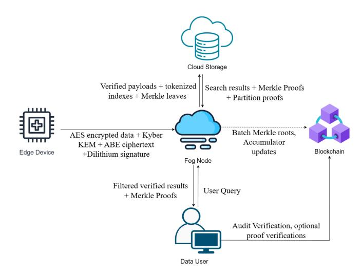
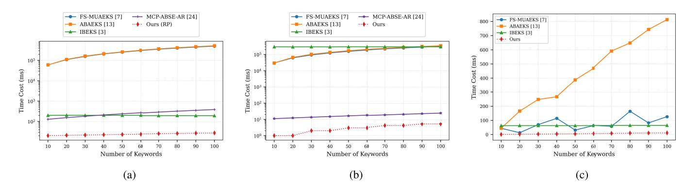
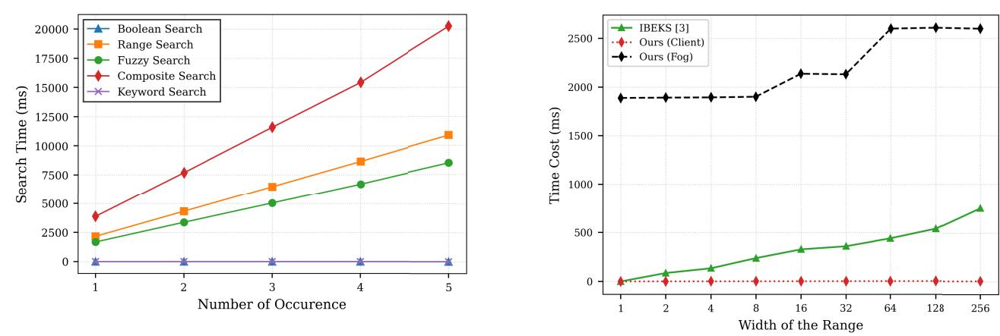

# <span id="page-0-0"></span>LV-PQ-ABSE: A Lightweight Verifiable Postquantum Attribute-Based Searchable Encryption Scheme With Hybrid Indexing and Provenance-Aware Verification for IoT-Based EHRs

Maneesha Perer[a](https://orcid.org/0009-0000-0684-726X) and Somchart Fugkeaw [,](https://orcid.org/0000-0001-7156-184X) *Member, IEEE*

*Abstract*—The rapid adoption of Internet of Things (IoT) technologies in healthcare has enabled continuous collection and sharing of electronic health records (EHRs) but has also introduced critical challenges in privacy preservation, fine-grained access control, and long-term security against quantum adversaries. Searchable encryption (SE) combined with attribute-based access control provides a promising foundation for secure EHR querying, yet existing solutions remain either quantum-insecure, computationally expensive, or lack verifiable correctness and provenance guarantees in fog–cloud environments. In this article, we propose *LV-PQ-ABSE*, a lightweight verifiable postquantum attribute-based SE framework for IoT-based EHR systems. LV-PQ-ABSE enables expressive multikeyword, Boolean, range, and fuzzy queries over encrypted data while preserving postquantum confidentiality. To achieve scalability, the framework offloads indexing and search execution to fog nodes, where encrypted hybrid indices are constructed and provenance-aware commitments are generated. Each ciphertext is cryptographically bound to its data source and timestamp, and search results are verified using partitioned Merkle proofs anchored on a blockchain, ensuring integrity, completeness, and freshness with low overhead. Extensive evaluation demonstrates that the proposed framework significantly reduces client-side computation and verification cost compared to existing state-of-the-art schemes, making it practical for large-scale IoT–EHR deployments.

*Index Terms*—Ciphertext-policy attribute-based encryption (CP-ABE), Dilithium, fog computing, Kyber, lattice-based cryptography, multikeyword search, postquantum cryptography (PQC), searchable encryption (SE), verifiable search.

## NOMENCLATURE

| $\lambda$       | Security parameter.                                   |
|-----------------|-------------------------------------------------------|
| $n, q, \sigma$  | Lattice dimension, modulus, and Gaussian noise width. |
| $\mathcal{U}$   | Global attribute universe.                            |
| $\mathbb{A}$    | Attribute set associated with a user.                 |
| mpk, msk        | Master public and secret keys.                        |
| SK <sub>A</sub> | User secret key for attribute set A.                  |

Received 12 January 2026; revised 3 May 2026; accepted 19 May 2026.

Date of publication 22 May 2026; date of current version 27 July 2026. *(Corresponding author: Somchart Fugkeaw.)*

The authors are with the Sirindhorn International Institute of Technology, Thammasat University, Pathum Thani 12120, Thailand (e-mail:

maneesha.nick@gmail.com; somchart@siit.tu.ac.th). Digital Object Identifier 10.1109/JIOT.2026.3695855

| K   | m               | Master     | symmetric     | key.            |             |                |
|-----|-----------------|------------|---------------|-----------------|-------------|----------------|
| K   | index , K query | Derived    | keys for      | indexing        | and         | trapdoor       |
| K   | mac             | Key        | for message   | authentication. |             |                |
| K   | s               | Symmetric  | session       | key             | for data    | encryp        |
| C   | doc             | Encrypted  | data          | payload         |             | (AES-GCM       |
| ct  | abe             | CP-ABE     | ciphertext    |                 | component.  |                |
| ct  | kem             | KEM        | ciphertext    | (encapsulation  |             | output).       |
| σ   | sig             | Digital    | signature     | on              | ciphertext  | or meta       |
|     | ObjID           | Unique     | identifier    | of an           | encrypted   | record.        |
| T   | w               | Trapdoor   | corresponding |                 | to          | keyword w      |
|     | token ( x )     |            | PRF-generated | token for       | attribute   | x              |
|     | root T          | Merkle     | tree root     | of indexed      | data.       |                |
| π   |                 | Merkle     | proof path.   |                 |             |                |
| t   |                 | Epoch      | index.        |                 |             |                |
|     | Acc t           |            | Cryptographic | accumulator     | value       | at epoch       |
| BC  | Params          | Blockchain |               | configuration   |             | parameters and |
|     |                 | system     | settings.     |                 |             |                |
| n   |                 | Security   | parameter     | or              | lattice     | dimension.     |
| m   |                 | Matrix     | / vector size |                 | parameter   | in lattice     |
| L   |                 | Number     | of outsourced |                 | documents   | or key        |
| k   |                 | Number     | of            | attributes or   | access      | policy         |
| N   |                 | Total      | number of     | users or        | ciphertexts | in the         |
| T   | mul             | Time       | for a single  | modular         |             | multiplication |
|     |                 | over       | Z q           |                 |             |                |
| T   | mult            | Time       | for one       | polynomial      | or          | matrix multi  |
| T   | G               | Time       | for lattice   | key or          | trapdoor    | generation     |
|     |                 | (TrapGen   | / SamplePre). |                 |             |                |
| T s |                 | Time       | for digital   | signature       |             | generation     |
| T v |                 | Time       | for digital   | signature       |             | verification.  |

2327-4662 © 2026 IEEE. All rights reserved, including rights for text and data mining, and training of artificial intelligence and similar technologies. Personal use is permitted, but republication/redistribution requires IEEE permission.

| T   | h      | Time        | for              | a single hash | computation. |             |
|-----|--------|-------------|------------------|---------------|--------------|-------------|
| T   | H      | Time        | for              | hash-based    | key          | derivation  |
| T   | p      | Time        | for              | pseudorandom  | function     | (PRF)       |
| T   | E      | Time        | for              | symmetric     | encryption   | (AES       |
| T   | D      | Time        | for              | symmetric     | decryption.  |             |
| T   | Kyber  | Time        |                  | for           | Kyber        | encapsula  |
|     |        | tion        | / decapsulation. |               |              |             |
| T   | verify | Time        | for              | verification  | (Merkle      | proof, sig |
|     |        | nature,     | parity).         |               |              |             |
| log | N      | Logarithmic |                  | factor        | from Merkle  | proof       |
| O   | ( )    | Asymptotic  |                  | computational | complexity.  |             |

#### I. INTRODUCTION

<span id="page-1-0"></span>T HE integration of the Internet of Things (IoT) with cloud–fog computing has enabled continuous collection, processing, and sharing of electronic health records (EHRs) from wearable sensors, medical devices, and hospital gateways. This paradigm supports real-time diagnosis, telemedicine, and collaborative clinical analytics. However, outsourcing sensitive EHR data to semi-trusted fog and cloud infrastructures raises critical concerns regarding privacy, authenticity, data provenance, and regulatory compliance (e.g., HIPAA and GDPR). In such environments, healthcare systems require not only secure storage but also *expressive and verifiable search over encrypted EHRs* with long-term security guarantees—an open and challenging problem.

Despite extensive research in searchable encryption (SE) and ciphertext-policy attribute-based encryption (CP-ABE), existing solutions fail to simultaneously address the key requirements of IoT-enabled healthcare systems. In practice, clinicians and analysts require complex queries that combine multiple conditions (e.g., Boolean, fuzzy, and range predicates) over encrypted data, while IoT devices impose strict computational constraints and the underlying infrastructure operates under partial trust. However, current approaches typically achieve only a subset of these requirements—either providing strong security at the cost of efficiency, supporting limited query expressiveness, or lacking verifiable guarantees. This gap between real-world system demands and existing cryptographic capabilities motivates the need for a unified framework that jointly ensures *postquantum security, expressive search, lightweight computation, and verifiable correctness*.

*Searchable Encryption:* Enables keyword search over encrypted data without revealing plaintext contents or query information, while its integration with CP-ABE enforces fine-grained, attribute-driven access control. However, most existing SE and CP-ABE constructions rely on classical public-key or pairing-based cryptography, making them vulnerable to quantum adversaries and unsuitable for long-term medical data protection.

<span id="page-1-4"></span><span id="page-1-3"></span>Classical SE frameworks—beginning with Boneh et al. [\[1\]](#page-14-0) and extended in [\[3\]—](#page-14-1)as well as more recent systems such as semantic-aware SE for IoT [\[4\],](#page-14-2) attribute-authenticated SE <span id="page-1-27"></span><span id="page-1-26"></span><span id="page-1-11"></span>[\[13\],](#page-15-0) and verifiable SE schemes [\[29\]–](#page-15-1)[\[31\]](#page-15-2) suffer from several fundamental limitations, as follows.

1) Heavy reliance on bilinear pairings and exponentiations, resulting in prohibitive computational overhead for resourceconstrained IoT devices.

2) Centralized and largely static index architectures that do not scale to dynamic, distributed edge–fog deployments.

3) Absence of cryptographic provenance binding that can irrefutably link ciphertexts to their originating sensors or patients.

4) Limited verifiability guarantees, particularly regarding result completeness and freshness, under decentralized trust assumptions. Moreover, these designs are inherently quantuminsecure.

Lattice-based cryptography, grounded in the learning with error (LWE) problem, offers a promising foundation for postquantum security. Recent advances, including latticebased CP-ABE schemes [\[25\],](#page-15-3) [\[32\]](#page-15-4) and blockchain-assisted SE frameworks [\[15\],](#page-15-5) [\[20\],](#page-15-6) [\[23\],](#page-15-7) have addressed important aspects such as fine-grained access control, revocation, and auditability.

<span id="page-1-31"></span><span id="page-1-30"></span><span id="page-1-29"></span><span id="page-1-28"></span><span id="page-1-23"></span><span id="page-1-22"></span><span id="page-1-21"></span><span id="page-1-20"></span><span id="page-1-18"></span><span id="page-1-17"></span><span id="page-1-16"></span><span id="page-1-15"></span><span id="page-1-14"></span><span id="page-1-13"></span><span id="page-1-12"></span><span id="page-1-10"></span><span id="page-1-8"></span><span id="page-1-6"></span><span id="page-1-5"></span><span id="page-1-2"></span>However, existing postquantum and lattice-based SE schemes [\[2\],](#page-14-3) [\[5\],](#page-14-4) [\[6\],](#page-14-5) [\[8\],](#page-15-8) [\[11\],](#page-15-9) [\[14\],](#page-15-10) [\[18\],](#page-15-11) [\[22\],](#page-15-12) [\[23\],](#page-15-7) [\[26\],](#page-15-13) [\[37\],](#page-15-14) [\[38\],](#page-15-15) [\[41\]](#page-15-16) still exhibit fundamental limitations. Most designs support only restricted query models [\[16\],](#page-15-17) [\[17\],](#page-15-18) [\[19\]](#page-15-19) and incur significant computational overhead due to costly lattice operations, including sampling and trapdoor generation. While enhancements such as forward security [\[7\],](#page-14-6) [\[27\],](#page-15-20) revocation [\[9\],](#page-15-21) IoT-aware search [\[4\],](#page-14-2) multiuser support [\[28\],](#page-15-22) and hardware-assisted homomorphic evaluation for encrypted search [\[21\]](#page-15-23) improve specific properties, these approaches fail to simultaneously achieve expressive query support, efficiency, and verifiability—particularly in fog-assisted environments where intermediate nodes cannot be fully trusted.

<span id="page-1-25"></span><span id="page-1-24"></span><span id="page-1-19"></span><span id="page-1-9"></span><span id="page-1-7"></span>This gap between existing cryptographic capabilities and real-world system requirements highlights the need for a unified and practical framework that jointly addresses expressiveness, efficiency, and verifiable security.

To better illustrate these limitations, consider a clinician issuing a composite encrypted query such as:

(blood\\_pressure BETWEEN 120-140)

AND (diagnosis CONTAINS ''DIABTES'' OR ''diabetic'')

AND (timestamp \lt 30 days).

This query combines numeric range predicates, fuzzy keyword matching, Boolean logic, and temporal constraints—features that are essential for practical healthcare analytics. However, existing postquantum SE schemes cannot support such expressive queries efficiently without leaking search patterns, incurring excessive computational cost, or sacrificing verifiability. These limitations become even more pronounced in IoT–EHR settings, where devices are resourceconstrained, and system components operate under partial trust.

<span id="page-1-1"></span>To address these challenges, we propose *LV-PQ-ABSE*, a *lightweight verifiable postquantum attribute-based SE* framework for secure and scalable IoT-based EHR data man-

<span id="page-2-0"></span>

TABLE I  
FUNCTIONAL FEATURE COMPARISON OF REPRESENTATIVE LATTICE-BASED SEARCHABLE/ATTRIBUTE-BASED ENCRYPTION SCHEMES

<span id="page-2-1"></span>

| Scheme                  | F1             | F2             | F3             | F4             | F5 | F6             |
|-------------------------|----------------|----------------|----------------|----------------|----|----------------|
| <b>IBEKS [3]</b>        | ✓              | ×              | <i>Partial</i> | <i>Partial</i> | ×  | ×              |
| <b>MCP-ABSE-AR [24]</b> | ✓              | ×              | ×              | ×              | ×  | ×              |
| <b>ABAEKS [13]</b>      | ×              | ×              | ×              | <i>Partial</i> | ×  | ×              |
| <b>FS-MUAEKS [7]</b>    | ×              | ×              | ×              | ×              | ×  | ×              |
| <b>PunSearch [37]</b>   | ✓              | <i>Partial</i> | ×              | ×              | ×  | <i>Partial</i> |
| <b>CP-ABSEL [38]</b>    | ✓              | ×              | ×              | ×              | ×  | <i>Partial</i> |
| <b>PPSEB [41]</b>       | ✓              | ×              | ×              | ×              | ×  | ✓              |
| <b>CT-PAEKS [43]</b>    | <i>Partial</i> | ×              | ×              | ×              | ×  | ×              |
| <b>Ours</b>             | ✓              | ✓              | ✓              | ✓              | ✓  | ✓              |

*Note:* F1 = Multi-Keyword Search, F2 = Provenance Awareness, F3 = Range Queries, F4 = Boolean Queries, F5 = Fuzzy Search, F6 = Verifiable Search Results.

“Partial” indicates limited or constrained support.

agement. Built on lattice-based cryptography and fog-assisted processing, LV-PQ-ABSE offers the following key contributions.

1. 1) *Expressive Postquantum Search:* To the best of our knowledge, we propose the first lattice-based ABSE framework that supports multikeyword, Boolean, fuzzy, and numeric range queries within a unified encrypted search model. Unlike existing postquantum SE schemes that are limited to exact or conjunctive queries, our design integrates B+-tree structures for range queries, bitmap indexing for efficient filtering, and n-gram tokenization for fuzzy matching, enabling expressive search with sublinear query complexity while preserving keyword and trapdoor privacy.
2. 2) *Fog-Assisted Offloading With Cryptographic Provenance:* To address the high computational cost of lattice operations, we introduce a fog-assisted computation model that securely offloads expensive cryptographic tasks from IoT devices to fog nodes. By leveraging Kyber KEM for secure key encapsulation and Dilithium signatures for authentication, the framework ensures that edge devices perform only lightweight operations. Additionally, we incorporate a cryptographic provenance binding mechanism that links each ciphertext to its origin, enabling traceable authenticity and tamper-evident data lineage, which is not supported in existing PQ-SE systems.
3. 3) *Verifiable and Partition-Optimized Retrieval:* We design a lightweight verifiable search mechanism that guarantees result correctness, completeness, and freshness in untrusted fog environments. Our approach combines partitioned Merkle trees for scalable verification, parity-based validation for early tamper detection, and threshold-based root anchoring on blockchain to ensure public auditability. Compared to monolithic verification schemes, this design significantly reduces verification overhead and improves scalability for large EHR datasets.

In summary, LV-PQ-ABSE reconciles *expressiveness, efficiency*, and *verifiability* in postquantum SE. By enabling hybrid fuzzy–Boolean–range search, fog-assisted computation, and blockchain-anchored verification, the proposed framework provides a scalable and quantum-resilient foundation for secure and auditable IoT-based healthcare data sharing.

## II. RELATED WORK

The need to protect outsourced data against both classical and quantum adversaries has driven a paradigm shift from pairing- and number-theory-based cryptography to postquantum cryptography (PQC). Among PQC families, lattice-based constructions have emerged as the most practical and versatile, supported by the NIST standardization process. Their security relies on the hardness of LWE, Ring-LWE, and SIS problems, which remain resistant to both classical and quantum attacks. Consequently, SE has evolved toward lattice-based designs that aim to combine security, access control, and query functionality.

Early progress in postquantum SE was established by Behnia et al. [2], who analyzed LWE- and NTRU-based PEKS constructions, highlighting the tradeoff between provable security and computational efficiency. Their study provided important insights into the practicality of lattice-based designs, particularly in balancing security guarantees with performance. Liu et al. [6] extended this direction by integrating PEKS with KP-ABE, enabling attribute-aware keyword search within a unified framework and demonstrating the feasibility of combining fine-grained access control with encrypted search. These foundational works established the viability of lattice-based SE, but also revealed inherent efficiency challenges due to costly lattice sampling, trapdoor generation, and key management operations.

Subsequent research focused on improving security properties and scalability in dynamic and multiuser environments. Xu et al. [7] proposed a forward-secure multiuser SE scheme that mitigates key exposure risks through temporal key evolution, while Yu et al. [8] introduced revocable PEKS with

<span id="page-3-0"></span>bounded trapdoor exposure using structured key update mechanisms. Additional works [9], [10] extended functionality to equality testing and puncturable encryption, enabling more flexible control over search capabilities and key revocation. Despite these advances, most designs remain limited to basic keyword search or simple conjunctive queries, lacking support for expressive query functionality and complex data retrieval requirements.

Another line of work incorporates authentication and integrity into PQ-SE frameworks. Jiang and Wang [12] proposed QPASE using TOPRFs to achieve password-authenticated SE, while Luo et al. [13] introduced ABAEKS with authentication-integrated trapdoors to strengthen query legitimacy and data integrity. More recent schemes, such as CT-PAEKS [41], further improve efficiency through constant trapdoor generation and multiuser support, reducing computation overhead in large-scale settings. However, these approaches still focus on basic keyword matching and do not support expressive queries, provenance awareness, or verifiable search mechanisms.

Recent lattice-based efforts aim to enhance functionality and usability. CP-ABSEL [38] extends CP-ABE to enable attribute-controlled search over encrypted data, while Pun-Search [37] introduces puncturable encryption with partial support for verifiable search. PPSEB [23] further incorporates blockchain to achieve verifiable search and auditability through integrity anchoring. Nevertheless, these schemes remain limited in providing unified support for expressive query processing and provenance-aware data binding, which are critical for complex IoT-driven applications.

In parallel, nonlattice (pairing-based) approaches have explored richer functionality. PHP-ABMKSE-VR [39] supports hidden policies, verification, and revocation, improving access control but remaining limited to keyword-based queries and lacking postquantum security. Similarly, AXT [40] provides authorization-aware conjunctive search with result pattern hiding but does not support expressive queries or verifiable guarantees. In addition, MK-WISE [41] introduces multikeyword wildcard search with keyword-level revocation in a device–edge–cloud EHR setting, enhancing query flexibility and fine-grained revocation. However, it does not address broader multimodal query support.

Despite these advances, both lattice-based and classical SE schemes exhibit key limitations. Lattice-based designs often lack expressive query support and incur high computational overhead, while classical approaches do not provide quantum resistance. Moreover, most existing works fail to incorporate provenance-aware mechanisms or provide unified support for expressive queries and verifiable retrieval.

Table I summarizes these limitations by comparing representative schemes across six key functionalities relevant to IoT-based EHR systems. As shown, most schemes focus on isolated features. While several works (e.g., IBEKS [3], MCP-ABSE-AR [24], PunSearch [37], CP-ABSEL [38], and CT-PAEKS [42]) support keyword-based search, they lack expressive query capabilities such as Boolean, range, and fuzzy queries. Some provide partial enhancements—for example, IBEKS supports limited range and Boolean queries.

and PunSearch offers partial verifiability—but these remain constrained. Although PPSEB [23] achieves verifiable search via blockchain integration, it still lacks expressive queries and provenance awareness. Overall, existing approaches do not provide a unified solution combining expressiveness, provenance, and verifiability.

#### III. PRELIMINARIES

<span id="page-3-1"></span>This section establishes the mathematical foundations and lattice-based primitives supporting the proposed postquantum ciphertext-policy attribute-based SE (LV-PQ-ABSE) framework.

#### *A. Postquantum Hardness Assumptions*

1) *Learning With Errors:* Let  $n, q \in \mathbb{N}$  and let  $\chi$  be a discrete Gaussian distribution over  $\mathbb{Z}$  with standard deviation  $\sigma$ . For a secret  $\mathbf{s} \in \mathbb{Z}_q^n$ , an LWE sample is

(**a**, *b* = 
$$\langle \mathbf{a}, \mathbf{s} \rangle + e \bmod q$$
)

where  $\mathbf{a} \leftarrow \mathbb{Z}_q^n$  and  $e \leftarrow \chi$ . The decisional LWE assumption states that for any PPT adversary  $\mathcal{A}$ 

$$|\Pr [\mathcal{A} (\text{LWE}_{n,q,\chi}) = 1] - \Pr [\mathcal{A} (\text{U}_{n,q}) = 1]| \leq \varepsilon n.$$

for negligible  $\varepsilon(\cdot)$ , where  $U_{n,q}$  is the uniform distribution over  $\mathbb{Z}_q^n \times \mathbb{Z}_q$ . The hardness of LWE reduces to worst case lattice problems such as the shortest vector problem (SVP) and short integer solution (SIS) on  $n$ -dimensional lattices, guaranteeing postquantum security.

2) *Ring- and Module-LWE:* For efficiency, computations are performed over the polynomial ring  $R_q = \mathbb{Z}_q[x]/(f(x))$  with  $f(x) = x^\ell + 1$ . Given  $s, e \in R_q$ , an RLWE sample is  $(a, b = a \cdot s + e \bmod q)$  for random  $a \in R_q$ . Module-LWE generalizes this to matrices  $\mathbf{A} \in R_q^{k \times \ell}$  and provides a balance between compact representation and flexible parameterization. Both problems are reducible to standard LWE and retain its quantum hardness.

<span id="page-3-3"></span><span id="page-3-2"></span>**A**  $\leftarrow \sum_{i=1}^S T_i^{\text{trapdoor}} \mathbf{A}$ . A trapdoor  $\mathbf{T}_A$  for  $\mathbf{A}$  is a short basis of the lattice.

$$\Lambda_q^\perp(\mathbf{A}) = \{\mathbf{x} \in \mathbb{Z}^m : \mathbf{A}\mathbf{x} = \mathbf{0} \bmod q\}.$$

The algorithm `TrapGen(n, m, q)` outputs  $(\mathbf{A}, \mathbf{T}_A)$  statistically close to uniform  $\mathbf{A}$  and a corresponding trapdoor basis  $\mathbf{T}_A$ . Given  $(\mathbf{A}, \mathbf{T}_A)$  and a target  $\mathbf{u} \in \mathbb{Z}_q^n$ , the sampling algorithm

SamplePre (A,T*<sup>A</sup>*, u, σ)

returns a short vector  $\mathbf{x} \leftarrow D_{\Lambda_{(\mathbf{A}),\sigma}}$  such that  $\mathbf{Ax} = \mathbf{u} \bmod q$  and  $\|\mathbf{x}\| \approx \sigma \sqrt{n}$ . This property enables efficient construction of lattice-based keys and delegation tokens with provable indistinguishability from random Gaussian noise.

4) *Basis Delegation:* Given a master trapdoor  $\mathbf{T}_A$  for matrix  $\mathbf{A}$  and a derived matrix  $\mathbf{B} = r\mathbf{A} + \mathbf{E}$  with small noise  $\mathbf{E}$ , the algorithm

Deleg 
$$(\mathbf{A}, \mathbf{T}_A, r, \mathbf{E}) \rightarrow \mathbf{T}_B$$

produces a delegated trapdoor  $\mathbf{T}_B$  for  $\mathbf{B}$ , whose distribution is statistically close to that of an independently generated trapdoor. This mechanism supports secure delegation of partial keys or search capabilities to fog nodes without exposing the master secret.

#### *B. Lattice-Based Cryptographic Primitives*

*1) Ciphertext-Policy Attribute-Based Encryption:* A latticebased CP-ABE scheme consists of the algorithms

#### Setup,KeyGen,Encrypt, Decrypt

defined as follows.

- 1) Setup(1<sup>λ</sup> ) → (MPK, MSK)*:* Generate public matrix A and master trapdoor T*A*; publish MPK = (A, *q*) and keep MSK = T*A*.
- 2) KeyGen(MSK, A)  $\rightarrow$  SK<sub>A</sub>: For attribute set A, employ SamplePre to obtain short vectors encoding A within  $\Lambda_q^\perp(A)$ , forming the user secret key.
- 3) Encrypt(MPK,  $\mathcal{P}, M$ )  $\rightarrow$  CT: Represent the access point in  $\mathcal{P}$  by an LSSS matrix  $\mathbf{M}$ ; sample randomness  $\mathbf{y}$  and output

CT = (c<sup>1</sup> = Ay + *q*/2 · *M*, c<sup>2</sup> = My) .

- 4) Decrypt(SK<sub>A</sub>, CT): Decrypt if A  $\models$  P using the reconstruction coefficients  $\{\omega_i\}$  to cancel My in c<sub>1</sub>.

*2) Trapdoor-Based Key Delegation and Revocation:* To achieve dynamic user or attribute revocation, LV-PQ-ABSE employs binary-tree-based key-update structures. Each nonrevoked user receives updated information derived via Kyber key encapsulation, KU*<sup>t</sup>* = EncKEM(*Kt*), where *K<sup>t</sup>* is the epoch key. Trapdoor delegation through Deleg allows fog-assisted nodes to update keys or ciphertext components without decrypting data, preserving both scalability and confidentiality.

3) *Verifiable Index Structures:* To ensure integrity and completeness, each index partition maintains a local Merkle root  $\text{root}_i = H(I_i)$ . A global root  $\text{root}_{\mathcal{T}}$  is computed as

$$\text{root}_{\mathcal{T}} = \mathcal{H}(\text{root}_1 \parallel \text{root}_2 \parallel \cdots \parallel \text{root}_n)$$

and periodically committed to a blockchain ledger. Given a result set  $\mathcal{R}$  with authentication path  $\pi$ , verification succeeds if  $H(\mathcal{R}||\pi) = \text{root}_{\mathcal{T}}$ . Since  $H$  is a collision-resistant hash (e.g., SHA-3), verifiability remains quantum-resilient and tamper-evident.

## IV. OUR PROPOSED LV-PQ-ABSE FRAMEWORK

This section presents the details of the system model and the cryptographic construction of our scheme.

## *A. System Model*

The proposed LV-PQ-ABSE framework enables secure outsourcing, expressive encrypted search, and verifiable retrieval in an edge–fog–cloud architecture composed of five entities: edge devices, fog nodes, cloud storage, data users (DUs), and the blockchain (Fig. [1\)](#page-4-0).

The system entities are described below in a concise, implementation-oriented manner.

- 1) *Edge Devices:* (e.g., IoT or medical sensors) collect data and apply hybrid protection: symmetric encryption (e.g., AES-GCM) with postquantum key encapsulation (e.g., Kyber) and digital signatures (e.g., Dilithium) for integrity and authenticity. The protected payload



Fig. 1. System architecture of LV-PQ-ABSE.

<span id="page-4-0"></span>is transmitted to the fog layer via a quantum-resistant channel.

- 2) *Fog Nodes:* They verify signatures, enforce fine-grained access control via lattice-based CP-ABE, and construct encrypted searchable indexes. They batch data, compute integrity commitments (e.g., Merkle roots), and maintain revocation states, which are periodically anchored to the blockchain.
- 3) *Cloud Storage:* It stores encrypted data and indexes and performs privacy-preserving search without accessing plaintext. It returns matching ciphertexts along with verifiable proofs of correctness and completeness.
- 4) *Data Users:* They hold attribute-based keys, generate trapdoors, and query the cloud. They verify returned proofs and, if policies are satisfied, recover the session key to decrypt the data securely.
- 5) *Blockchain Network:* It acts as a tamper-evident audit layer, recording integrity commitments, revocation states, and query summaries. Smart contracts ensure consistency and enable publicly verifiable integrity.

## *B. Design Goals*

The design of LV-PQ-ABSE is driven by the limitations identified in Section [I](#page-1-0) and the operational requirements of IoTenabled healthcare systems. The following goals are tightly coupled with the system architecture (Fig. [1\)](#page-4-0) and the cryptographic construction described in Phases 1–5.

- 1) *Postquantum Security:* The framework must ensure longterm confidentiality, authenticity, and robustness against quantum-capable adversaries. All cryptographic components are instantiated using lattice-based primitives and NIST-standardized postquantum algorithms (e.g., Kyber and Dilithium), eliminating reliance on pairing-based or number-theoretic assumptions.
- 2) *Leakage-Resilient Search Privacy:* The system should preserve keyword and query privacy under adaptive adversaries by ensuring that trapdoors and search tokens reveal no information beyond a formally defined leakage profile. This is achieved through PRF-based tokenization

and lattice-based trapdoor generation, and is formally captured via IND-CKA security in Section [V.](#page-9-0)

- 3) *Expressive Encrypted Search:* The framework must support rich query functionality required for healthcare analytics, including multikeyword, Boolean, fuzzy, and numeric range queries. This is realized through a hybrid encrypted index combining B<sup>+</sup> -trees, bitmap indices, and n-gram tokenization, enabling sublinear and composable query execution over encrypted data.
- 4) *Lightweight Edge-Side Computation:* Given the resource constraints of IoT devices, client-side operations should remain lightweight, consisting primarily of symmetric encryption, hashing, and token generation. Computationally expensive lattice-based operations are securely offloaded to fog nodes (Phases 2–3), enabling nearconstant trapdoor generation and low client-side latency as validated in Section [V.](#page-9-0)
- 5) *Verifiable Retrieval with Completeness and Freshness:* Search results must be publicly verifiable with guarantees of correctness, completeness (no omission of valid results), and freshness. This is achieved through partitioned Merkle trees, authenticated data structures, and blockchain-based anchoring, with formal security guarantees provided in Section [V.](#page-9-0)
- 6) *Provenance Awareness and Auditability:* Each encrypted record should be cryptographically bound to its origin to ensure traceable data lineage, tamper detection, and accountability. Provenance-aware commitments are constructed at the fog layer and anchored on-chain, enabling verifiable attribution without exposing sensitive identities.
- 7) *Scalable Fog–Cloud Operation:* The system must efficiently support large-scale, distributed deployments. This is achieved through fog-assisted computation, hybrid indexing, and partition-based verification, ensuring low-latency query processing and logarithmic verification complexity with respect to dataset size.
- 8) *Forward Security and E*ffi*cient Revocation:* The framework should limit the impact of key compromise through epoch-based key evolution and revocation mechanisms. By binding trapdoors and ciphertext access to time epochs and leveraging KEM-based key updates, the system achieves forward security and efficient revocation without requiring global ciphertext re-encryption.

Collectively, these design goals ensure that LV-PQ-ABSE achieves a principled balance between postquantum security, query expressiveness, efficiency, verifiability, and scalability, while remaining practical for real-world IoT-based EHR deployments.

## *C. Cryptographic Construction*

This section details the cryptographic foundation and operational phases of the proposed postquantum ciphertext-policy attribute-based SE (LV-PQ-ABSE) framework. All algorithms are constructed over lattice-based assumptions and NISTstandardized postquantum primitives to ensure efficiency, scalability, and long-term quantum resilience. For clarity, Nomenclature summarizes all notations used throughout this section and subsequent phases.

*1) Phase 1: System Setup and Initialization:* Phase 1 bootstraps the global cryptographic context of LV-PQ-ABSE, including postquantum parameters, master keys, attribute commitments, and blockchain anchoring primitives. This phase is executed once at system initialization and upon each global epoch transition.

The trusted authority (TA) takes as input a security parameter 1<sup>λ</sup> and initializes the global cryptographic environment of the LV-PQ-ABSE system. The system adopts λ = 192 (NIST Category 3) and selects lattice parameters (*n*, *q*, σ) consistent with Kyber768 and Dilithium3 to ensure postquantum security.

The TA instantiates domain-separated hash functions *H*1, *H*2, *H*<sup>3</sup> and a key derivation function HKDF-SHA3-256. Symmetric encryption is defined using AES-256-GCM.

Next, the TA runs the attribute-based encryption setup algorithm

## ABE.Setup $$(1^\lambda) \rightarrow (\text{PP}_{\text{ABE}}, \text{MK}_{\text{ABE}})$$

and generates postquantum key pairs

Kyber.KeyGen() → PKKyber,SKKyber

Dilithium.KeyGen() → VPKDilithium,SSKDilithium

To support efficient lattice operations, the TA precomputes a set of trapdoor matrices  $\{(\mathbf{A}_i, \mathbf{T}_{\mathbf{A}_i})\}$ , where each  $\mathbf{A}_i \in \mathbb{Z}_q^{n \times n}$  is generated via seeded expansion and  $\mathbf{T}_{\mathbf{A}_i}$  is obtained using TrapGen( $\cdot$ ) with Gaussian parameter  $\sigma$ .

A master key *K<sup>m</sup>* is sampled and expanded using HKDF to derive

$$(K_{\text{index}}, K_{\text{mac}}, K_{\text{query}}) = \text{HKDF}(K_m).$$

For each user *U*, a query-specific key is derived as *K* (*U*) query = HKDF(*K<sup>m</sup>*, UserID*U*) to prevent cross-user query linkability.

Finally, the TA defines the master public and secret keys as

$$\text{mpk} = \{\text{PP}_{\text{ABE}}, \text{PK}_{\text{Kyber}}, \text{VPK}_{\text{Dilithium}}\}$$

$$\text{msk} = \{\text{MK}_{\text{ABE}}, \text{SK}_{\text{Kyber}}, \text{SSK}_{\text{Dilithium}}\}.$$

The public parameters mpk are published, while msk is securely maintained by the authority.

2) *System Initialization and Data Structures:* The TA defines an attribute universe  $\mathcal{U} = \{u_1, \dots, u_m\}$  and computes a commitment

AttrRoot = SHA3-256 (serialize 
$$(\mathcal{U}) \parallel \text{ver} \parallel t_0$$
)

which is anchored on-chain to support efficient updates and revocation.

A smart contract maintains epoch-related metadata (root $_{\mathcal{T}}$ , Acc $_t$ , epoch), while fog nodes batch Merkle roots prior to submission to reduce communication and gas costs.

To support expressive search, the system initializes a hybrid encrypted index consisting of B<sup>+</sup> -trees for ordered attributes, bucketized bitmaps for range queries, equality bitmaps for categorical attributes, time-partitioned indices, and *n*-gram indices for fuzzy keyword matching. All index entries are pseudorandomized using *K*index and authenticated via HMAC*<sup>K</sup>*mac .

Key evolution is enforced through epoch-based derivation. For each session, an ephemeral key is computed as

$$K_{\text{ephem}} = \text{HKDF}(K_m, \text{id}_{\text{session}})$$

ensuring forward secrecy and limiting cross-epoch linkage. Key evolution also enables coarse-grained revocation. At each epoch transition, updated keying material is derived, and previously issued keys become invalid for future access. Thus, revoked users cannot decrypt newly generated ciphertexts or issue valid trapdoors beyond the current epoch.

While the proposed framework provides efficient epochbased revocation with forward security, it does not support immediate or fine-grained revocation mechanisms, such as attribute-level revocation or ciphertext update. These capabilities typically incur significant computational and communication overhead in postquantum settings and are therefore beyond the scope of the current design.

For integrity verification, the system selects encoding parameters (*n<sup>e</sup>*, *k<sup>e</sup>*, *de*) and matrices (*G*, *H*) to enable compact de-Hamming encoding of Merkle authentication paths.

Finally, public parameters and commitments are distributed to system participants, while the master secret is protected using (*t*, *n*) threshold secret sharing and authenticated via Dilithium-based signatures.

*Lattice Parameterization and Security Justification:* The system employs postquantum primitives based on standardized lattice-based constructions. In particular, Kyber768 and Dilithium3 are adopted for quantum-resistant key encapsulation and digital signatures, respectively, both targeting NIST Category 3 security.

The lattice parameters (*n*, *q*, σ) are selected to align with these standardized schemes, where *n* denotes the lattice dimension, *q* is the modulus defining the underlying ring, and σ is the standard deviation of the discrete Gaussian noise used in sampling. In practice, these parameters follow established configurations consistent with Kyber768 and Dilithium3, ensuring robust resistance against both classical and quantum adversaries.

*3) Phase 2: Edge-Side Data Preparation and Hybrid Encryption:* Phase 2 transforms raw IoT–EHR data into confidential, authentic, and verifiable ciphertexts suitable for fog-assisted processing. All cryptographic operations in this phase are executed locally at the edge device to minimize trust assumptions on downstream entities, as formally described in Algorithm [1.](#page-7-0)

- 1) *Authenticated Data Capture:* Each edge device acquires a raw medical record *D*raw and associates it with metadata (seq, ts), where seq denotes a monotonic sequence number and ts is a timestamp. Let aad = seq k ts denote the associated data. To ensure integrity and freshness, a message authentication code is computed

mac\_tag = HMAC\_SHA3-256 (
$$K_{\text{mac}}, H_2(D_{\text{raw}}) \parallel \text{aad}$$
).

- 2) *Privacy-Preserving Tokenization:* Let  $\mathcal{A} = \{a_1, \dots, a_m\}$  denote the set of extracted attributes from  $D_{\text{raw}}$ . Each

attribute is transformed into unlinkable tokens via a PRF *F<sup>K</sup>*index (·)

$$\tau_i = F_{K_{\text{index}}}(a_i) \quad \forall a_i \in \mathcal{A}.$$

For structured attributes, specialized encodings are applied: 1) numeric values are mapped to bucket identifiers  $\tau_b = F_{K_{\text{index}}}(\lfloor v/\Delta \rfloor)$ ; 2) temporal values are mapped to epoch identifiers  $\tau_t = F_{K_{\text{index}}}(\text{epoch}(\text{ts}))$ ; and 3) textual attributes are decomposed into  $n$ -grams  $\mathcal{G}(w)$  and tokenized as

$$\tau_g = F_{K_{\text{index}}}(g) \quad \forall g \in \mathcal{G}(w).$$

This transformation ensures search functionality while hiding raw attribute values under standard PRF security.

- 3) *Hybrid Index Preparation:* The token set  $\mathcal{T}$  generated above is structured to support a hybrid encrypted index. Formally, tokens are partitioned as

$$\mathcal{T} = \mathcal{T}_{\text{kw}} \cup \mathcal{T}_{\text{num}} \cup \mathcal{T}_{\text{cat}} \cup \mathcal{T}_{\text{time}} \cup \mathcal{T}_{\text{ngram}}.$$

These are mapped to index primitives as follows: 1)  $\mathcal{T}_{\text{kw}} \rightarrow \text{B}^+$ -tree entries  $\mathcal{I}_{\text{kw}}$ ; 2)  $\mathcal{T}_{\text{num}} \rightarrow \text{bucketized bitmaps } \mathcal{B}_{\text{num}}$ ; 3)  $\mathcal{T}_{\text{cat}} \rightarrow \text{equality bitmaps } \mathcal{B}_{\text{cat}}$ ; 4)  $\mathcal{T}_{\text{time}} \rightarrow \text{epoch-partitioned indices } \mathcal{T}_{\text{epoch}}$ ; and 5)  $\mathcal{T}_{\text{ngram}} \rightarrow \text{inverted index structures}$ . This mapping enables efficient Boolean composition and sublinear query processing while preserving token-level unlinkability.

- 4) *Symmetric Record Encryption:* A fresh symmetric key *K*sym is sampled for each record

$$K_{\text{sym}} \leftarrow \text{SecureRandom}(256)$$

and used to encrypt *D*raw via AES-256-GCM with authenticated associated data aad = (seq k ts)

$$\begin{aligned} & (C_{\text{doc}}, \text{auth\_tag}) \\ &= \text{AES\_GCM\_Enc}(K_{\text{sym}}, D_{\text{raw}}, \text{iv}, \text{aad}) \end{aligned}$$

where iv ∈ {0, 1} <sup>96</sup> is a uniformly random nonce. This guarantees confidentiality and integrity of the medical payload under standard AEAD security.

- 5) *Hybrid Postquantum Key Encapsulation:* To simultaneously enforce fine-grained access control and postquantum confidentiality, the edge device performs dual encapsulation

ct<sub>abe</sub>  
 = PQ -CP -ABE.Encapsulate (
$$K_{\text{sym}}$$
, policy)  
 (ct<sub>kem</sub>,  $K_{\text{kem}}$ )  
 = Kyber768.Encapsulate (pk<sub>recipient</sub>) .

The ABE encapsulation binds access privileges to *K*sym, while the KEM ensures quantum-resistant transport security. A unified session key is derived using a conservative KEM-combiner based on HKDF

$$K_{\text{hyb}}$$
  
 $= \text{HKDF}_{\text{SHA3-256}} (K_{\text{sym}} \parallel K_{\text{kem}}, ''\text{Iv} - \text{pq} - \text{abse} - \text{session}'')$ 

which preserves security as long as at least one encapsulation primitive remains secure.

## <span id="page-7-0"></span>Algorithm 1 EdgeEncrypt(*D*raw, policy, pkrecipient)

**Input:** Raw data  $D_{\text{raw}}$ , access policy policy, recipient public key  $pk_{\text{recipient}}$ 

### 7.1 Recipient Output: Ciphertext package C

#### Begin

(seq, ts) ← GenMeta()

## aad ← seq || ts

iv  $\leftarrow \{0, 1\}^c$ 

<sup>[1]</sup> 96meta  $\leftarrow$  Tokenize( $D_{\text{raw}}; K_{\text{index}}$ )

```
$$K_{\text{seed}} \leftarrow \{0, 1\}^{256}$$

 $\text{ctabe} \leftarrow \text{PQ-CP-ABE.Encapsulate}(K_{\text{seed}}, \text{policy})$ 
 $(\text{ctkem}, K_{\text{kem}}) \leftarrow \text{Kyber768.Encapsulate}(\text{pk}_{\text{recipient}})$ 
 $K_{\text{sym}} \leftarrow \text{HKDF}_{\text{SHA3-256}}(K_{\text{seed}} \parallel K_{\text{kem}} \parallel H_2(\text{ctkem}), "1\text{v-pq-abse-session}")$ 
 $(C_{\text{doc}}, \text{auth\_tag}) \leftarrow \text{AES\_GCM\_Enc}(K_{\text{sym}}, D_{\text{raw}}, \text{iv}, \text{aad})$ 
 $\text{mac\_tag} \leftarrow \text{HMAC}_{K_{\text{mac}}}(H_2(C_{\text{doc}}) \parallel \text{seq} \parallel \text{ts})$ 
 $\sigma_{\text{edge}} \leftarrow \text{Dilithium3.Sign}(sk_{\text{edge}}, H_2(C_{\text{doc}}) \parallel \text{meta} \parallel \text{seq} \parallel \text{ts}))$ 
 $\mathcal{C} \leftarrow \{\text{ctabe}, \text{ctkem}, C_{\text{doc}}, \text{iv}, \text{auth\_tag}, \sigma_{\text{edge}}, \text{mac\_tag}, \text{meta}, \text{seq}, \text{ts}\}$ 
return  $\mathcal{C}$
```

## End

- 6) *Edge-Side Authentication and Nonrepudiation:* The edge device signs a compact digest of the encrypted record and metadata

$$\begin{aligned} \sigma_{\text{edge}} &= \text{Dilithium3.Sign} \\ &\times (sk_{\text{edge}}, H_2 (C_{\text{doc}} \parallel \text{meta} \parallel \text{seq} \parallel \text{ts})). \end{aligned}$$

This signature provides data-origin authentication and nonrepudiation, even in the presence of a malicious fog or cloud service.

- **7)** Secure Transmission and Forg-Side Verification The edge device transmits

˚ ctabe, ctkem, *C*doc, σedge, mac tag 

to the fog node over an authenticated PQ-hybrid channel. Upon receipt, the fog node verifies  $\sigma_{\text{edge}}$  and mac\_tag, and inserts the corresponding leaf hash into its local Merkle batch for the next anchoring epoch. The fog node learns no plaintext content and cannot modify records without detection.

This phase employs *n*-gram tokenization for efficient fuzzy search and a hybrid postquantum encapsulation strategy that combines CP-ABE and Kyber768. The HKDF-based key derivation ensures that confidentiality is preserved as long as at least one primitive remains secure, while signature verification can be efficiently amortized at the fog layer.

- 4) *Phase 3: Fog-Assisted Verification, Provenance Binding, and Hybrid Index Construction:* Phase 3 processes authenticated ciphertexts at fog nodes to ensure verifiable integrity, establish provenance binding, construct hybrid encrypted

indices, and anchor integrity commitments on-chain.

- *a) Verification and provenance binding:* Upon receiving a ciphertext package  $C$ , the fog node first verifies authenticity

## and integrity by checking the digital signature and message authentication code

SigVer (
$$\text{VPK}_{\text{edge}}, \sigma_{\text{edge}}, H_2$$
 ( $C_{\text{doc}} \parallel \text{meta} \parallel \text{seq} \parallel \text{ts}$ )) = 1

MACVer (
$$K_{\text{mac}}, H_2(C_{\text{doc}}) \parallel \text{seq} \parallel \text{ts}, \text{mac}\_\text{tag}) = 1$$
.

If either verification fails, the record is rejected.

To enable verifiable and privacy-preserving provenance tracking, each record is bound to a pseudonymous provenance digest. Let  $\text{ID}_{\text{src}} = (\text{PID}, \text{PubKey})$  denote the source identity. The provenance tag and digest are computed as

$$\text{tag}_{\text{prov}} = H_2 \left( \text{PID} \parallel \text{PubKey} \parallel \text{seq} \right)$$

$$\text{ProvDigest} = H_3 \left( \text{tag}_{\text{prov}} \| H_2 (C_{\text{doc}}) \| \text{ts} \right).$$

This ensures each record is cryptographically bound to its origin while preserving unlinkability across epochs.

b) *Hybrid index construction:* Searchable attributes are transformed into pseudorandom tokens using

$$\tau_x = \text{PRF}_{K_{\text{index}}}(x)$$

where  $x$  denotes a keyword, numerical value, or categorical attribute.

The tokenized outputs from Phase 2 are mapped to a hybrid index

- 1) *Keyword Index:*  $\mathcal{I}_{kw}[\tau_w] \mapsto \{(\text{ObjID}, \text{ProvDigest})\}$  ( $\text{B}^+$ )
- 2) *Numeric Index:*  $\mathcal{B}_{\text{num}}[\tau_b][\text{Obj}|\text{ID}] \in \{0, 1\}$  (bucketized bitmap),
- 3) *Categorical Index:*  $\mathcal{B}_{\text{cat}}[\tau_c][\text{ObjID}] \in \{0, 1\}$  (equality bitmap),
- 4) *Temporal Index:*  $T_i[\text{ObjID}] = \text{ProvDigest}(\text{epoch}, \text{partitioned})$ .

These structures are populated using tokenized outputs from Phase 2, ensuring consistent mapping between token types and index representations. Query evaluation is performed via set intersection

$$\mathcal{R} = \bigcap_i \mathcal{R}_i$$

where  $\mathcal{R}_i$  denotes candidate sets from each index component. This design supports expressive queries while minimizing leakage via domain-separated tokenization.

c) *Merkle commitment and blockchain anchoring:* Each processed record is converted into a cryptographic digest

$$\begin{aligned} & \text{digest}_{\text{payload}} \\ &= H_3 (\text{ObjID} \parallel \text{ProvDigest} \parallel \text{digest}_{\text{ct}} \parallel \text{meta} \parallel \text{ts}) \end{aligned}$$

where

$$\text{digest}_{\text{ct}} = H_3(\text{ct}_{\text{abe}} \parallel \text{ct}_{\text{kem}}).$$

Fog nodes aggregate these digests into a Merkle tree  $\mathcal{T}$ . The root  $\text{root}_{\mathcal{T}}$  is signed using threshold Dilithium

$$\sigma_{\text{root}} \leftarrow \text{Dilithium.Sign}(sk_{\text{agg}}, \text{root}_{\mathcal{T}})$$

---

and anchored on-chain. This enables public verification via Merkle proofs  $\pi$ , ensuring integrity, completeness, and tamper detection without revealing plaintext data.

---

This phase establishes a unified fog-side pipeline integrating postquantum verification, provenance-aware indexing, and

## <span id="page-8-0"></span>Algorithm 2 SearchExec(TDQ, σuser)

**Input:** Trapdoor  $TD_{\mathcal{Q}}$ , user signature  $\sigma_{\text{user}}$ 

**Output:** Result set  $\mathcal{R}$ , audit commitment AuditCommit Begin

if  $\text{SigVer}(\text{VPK}_U, \sigma_{\text{user}}, H_2(\text{TD}_Q)) \neq 1$  then return  $\perp$   
 $(\mathcal{T}, \text{range}, \text{op}, \text{epoch}) \leftarrow \text{TD}_Q$ 

## if Revoked(UserID, epoch) ∨ Expired(epoch)

**then return  $\perp$** 

 $\text{Cand}_{kw} \leftarrow \text{BooleanEval}(\{\mathcal{I}_{kw}[\tau] \mid \tau \in \mathcal{T}\}, \text{op})$ 

 $\text{Cand}_{\text{num}} \leftarrow \{\text{ObjID} \mid \mathcal{B}_{\text{num}}[\text{range}][\text{ObjID}] = 1\}$ 

 $\text{Cand}_{\text{time}} \leftarrow \{\text{ObjID} \mid \text{ObjID} \in \mathcal{T}_{\text{epoch}}[\text{epoch}]\}$ 

Cand  $\leftarrow$  Cand<sub>kw</sub>  $\cap$  Cand<sub>num</sub>  $\cap$  Cand<sub>time</sub>

for each  $\text{ObjID}_i \in \text{Cand do}$   
 $\text{score}(\text{ObjID}_i) \leftarrow \sum_{\tau \in \mathcal{T}} \mathbf{1}((\text{ObjID}_i, *) \in \mathcal{I}_{\text{kw}}[\tau])$ 

**end for**

Cand  $\leftarrow \{\text{ObjID}_i \mid \text{score}(\text{ObjID}_i) \geq \theta\}$ 

$$\mathcal{R} \leftarrow \emptyset$$

### for each ObjID<sub>i</sub> in Cand do

Retrieve  $(c_{\text{tkem},i}, c_{\text{tabe},i}, C_{\text{doc},i}, \pi_i, \text{ProvDigest}_i, \sigma_{\text{edge},i})$ 

 $R_i \leftarrow \{\text{ObjID}_i, \text{ct}_{\text{kem},i}, \text{ct}_{\text{abe},i}, C_{\text{doc},i}, \pi_i, \text{ProvDigest}_i, \sigma_{\text{edge},i}\}$ 

$$\mathcal{R} \leftarrow \mathcal{R} \cup \{R_i\}$$

### end for

AuditCommit  $\leftarrow H_2(\text{"query"} \parallel H_3(\mathcal{T}) \parallel \text{root}_{\mathcal{T}} \parallel$  epoch)

### return ( $\mathcal{R}$ , AuditCommit)

### End

| blockchain-backed integrity, enabling scalable and auditable encrypted data management. |
|-----------------------------------------------------------------------------------------|
|-----------------------------------------------------------------------------------------|

5) *Phase 4: Verifiable Search and Trapdoor Execution:*

Phase 4 enables authorized users to perform privacy-preserving and verifiable search over encrypted IoT-EHR data. It integrates attribute-based access control, postquantum security, and expressive query evaluation over the hybrid encrypted index. The complete search execution workflow, including verification, index evaluation, and result construction, is formally specified in Algorithm 2.

a) *Query representation and token generation:* Let a user query be defined as

### $$\mathcal{Q} = (W, \text{op}, \text{range}, \text{epoch})$$

where  $W = \{w_1, \dots, w_k\}$  denotes a set of query keywords, op is a Boolean operator, and range specifies numeric constraints.

Each keyword is transformed into pseudorandom tokens

$$\tau_i = \text{PRF}_{K_{\text{query}}}(w_i) \quad \forall w_i \in W.$$

For fuzzy matching, keywords are decomposed into  $n$ -grams

$$\mathcal{T}_i = \left\{ \text{PRF}_{K_{\text{query}}^{(U)}}(g) \mid g \in \mathcal{G}(w_i) \right\}.$$

### The complete token set is

$$\mathcal{T} = \bigcup_{i=1}^k (\{\tau_i\} \cup \mathcal{T}_i).$$

b) *Trapdoor generation and authorization:* The trapdoor is constructed as

binding query tokens to the user's attribute-based secret key. Authenticity is ensured by

$$\sigma_{\text{user}} = \text{Dilithium3.Sign}(sk_U, H_2(\text{TD}_{\emptyset}))$$
.

c) *Revocation and epoch enforcement:* Trapdoors are validated against revocation and epoch constraints

– Revoked (UserID, epoch) ∧ – Expired(epoch).

Invalid trapdoors are rejected prior to query execution.

d) *Hybrid index evaluation:* Candidate sets are retrieved from the hybrid index

$$\text{Cand}_{kw} = \text{BooleanEval}(\{\mathcal{I}_{kw} \mid \tau \in \mathcal{T}\}, \text{op})$$

$$\text{Cand}_{\text{num}} = \{\text{ObjID} \mid \mathcal{B}_{\text{num}}[\text{range}][\text{ObjID}] = 1\}$$

$$\text{Cand}_{\text{time}} = \{ \text{ObjID} \mid \text{ObjID} \in \mathcal{T}_{\text{epoch}}[\text{epoch}] \}.$$

### The final candidate set is

Cand = Candkw ∩ Candnum ∩ Candtime.

e) *Fuzzy matching and ranking*: Each candidate is scored:

$$\text{score}(\text{ObjID}) = \sum_{\tau \in \mathcal{T}} \mathbf{1}[(\text{ObjID}, *) \in \mathcal{I}_{\text{kw}}[\tau]].$$

**Candidates satisfying threshold  $\theta$  are retained**

Cand = {ObjID | score(ObjID) ≥ 
$$\theta$$
} .

f) *Verifiable result construction:* For each  $\text{ObjID}_i \in \text{Cand}$ 

$$R_i = \{ \text{ObjID}_i, \text{ct}_{\text{kem},i}, \text{ct}_{\text{abe},i}, \text{Cdoc}, \pi_i, \text{ProvDigest}_i, \sigma_{\text{edge},i} \}.$$

The result set is  $\mathcal{R} = \{R_i\}$ .

g) *Audit commitment:* The query execution is summarized as

AuditCommit =  $H_2 (''\text{query}'' \parallel H_3(\mathcal{T}) \parallel \text{root}_{\mathcal{T}} \parallel \text{epoch})$ 

which can be optionally anchored on-chain.

This phase ensures that query execution is privacy-preserving, access-controlled, and verifiable while supporting expressive search under a postquantum model.

## 6) Phase 5: Secure Retrieval, Decryption, and Verification:

Phase 5 enables DUs to securely retrieve, decrypt, and verify the correctness and integrity of query results returned by the fog-cloud system. This phase ensures end-to-end confidentiality, authenticity, completeness, and auditability of IoT-EHR data. The complete procedure is formally specified in Algorithm 3.

a) *Hybrid key reconstruction and decryption:* For each record  $R_i \in \mathcal{R}$ , the DU reconstructs the symmetric session key using both attribute-based and KEM-based components

$$K_{\text{seed}} \leftarrow \text{ABE.Dec}(\text{ct}_{\text{abe},i}, \text{SK}_{\mathbb{A}})$$

$$K_{\text{kem}} \leftarrow \text{Kyber768.Decaps}(\text{ct}_{\text{kem},i}, \text{SK}_{DU})$$

$$K_{\text{sym}} = \text{HKDF} \left( K_{\text{seed}} \parallel K_{\text{kem}} \parallel H_2 \left( \text{ct}_{\text{kem},i} \right) \right)$$

## <span id="page-9-1"></span>Algorithm 3 RetrieveVerify(R,SK*DU*,SKA)

**Input:** Result set  $\mathcal{R}$ , user KEM secret key  $\text{SK}_{DU}$ , attribute key  $\text{SK}_{\text{A}}$ 

**Output:** Verified plaintext set  $\mathcal{R}_{\text{final}}$ 

#### Begin

$$\mathcal{R}_{\text{final}} \leftarrow \emptyset$$
**for each**  $R_i \in \mathcal{R}$  **do**

### Parse $R_i$ as

{ObjID<sub>i</sub>, ct<sub>kem,i</sub>, ct<sub>abe,i</sub>, C<sub>doc,i</sub>, π<sub>i</sub>, ProvDigest<sub>i</sub>, σ<sub>ede,i</sub>}

## Fetch auxiliary metadata

(iv<sub>i</sub>, auth\_tag<sub>i</sub>, meta<sub>i</sub>, seq<sub>i</sub>, ts<sub>i</sub>, mac\_tag<sub>i</sub>)

$$K_{\text{seed}} \leftarrow \text{ABE.Dec}(\text{ct}_{\text{abe},i}, \text{SK}_{\text{A}})$$

## $K_{\text{kem}} \leftarrow \text{Kyber768.Decaps}(c_{\text{kem},i}, \text{SK}_{DU})$

| $K_{\text{sym}}$ | $\leftarrow$ | $\text{HKDF}_{\text{SHA3-256}}(K_{\text{seed}})$ | $\parallel$ | $K_{\text{kem}}$ | $\parallel$ |
|------------------|--------------|--------------------------------------------------|-------------|------------------|-------------|
|                  |              |                                                  |             |                  |             |

### $H_2(\mathfrak{ct}_{\text{kem},i}), \text{"lv-pq-abse-session"}$

aad<sub>i</sub> ← seq<sub>i</sub> || ts<sub>i</sub>

 $D_i \leftarrow \text{AES\_GCM\_Dec}(K_{\text{sym}}, C_{\text{doc},i}, \text{iv}_i, \text{aad}_i, \text{auth\_tag}_i)$ 

## if $-\text{MACVer}(K_{\text{mac}}, H_2(C_{\text{doc},i}) \parallel \text{seq}_i \parallel \text{ts}_i, \text{mac\_tag}_i)$

### then continue

if  $\neg \text{SigVer}(\text{VPK}_{\text{edge}}, \sigma_{\text{edge},i}, H_2(C_{\text{doc},i} \parallel \text{meta}_i \parallel \text{seq}_i))$ 

ts\_i)))

### then continue

 $\text{digest}_{\text{ct},i} \leftarrow H_3(\text{"ct"} \parallel \text{ct}_{\text{abe},i} \parallel \text{ct}_{\text{kem},i})$ 

digest'<sub>i</sub> ← H<sub>3</sub>("leaf" || ObjID<sub>i</sub> || ProvDigest<sub>i</sub> ||

digest\_ct\_i || meta\_i || ts\_i)

**if** MerkleVerify( $\pi_i, \text{digest}'_i, \text{root}_{\mathcal{T}}$ ) = 1 **then**

$$\mathcal{R}_{\text{final}} \leftarrow \mathcal{R}_{\text{final}} \cup \{D_i\}$$
**end if**

**end for**

return  $\mathcal{R}_{\text{final}}$   
 End

The plaintext is recovered via authenticated decryption

$$D_i \leftarrow \text{AES\_GCM\_Dec}(K_{\text{sym}}, C_{\text{doc},i}, \text{iv}_i, \text{aad}_i, \text{auth\_tag}_i)$$
where  $aad_i = seq_i \parallel ts_i$ .

b) *Authenticity and source verification:* Each decrypted record is validated using MAC and signature verification

## MACVer $(K_{\text{mac}}, H_2(C_{\text{doc},i}) \parallel \text{seq}_i \parallel \text{ts}_i, \text{mac\_tag}_i)$

= 1

**SigVer** ( $\text{VPK}_{\text{edge}}, \sigma_{\text{edge},i}, H_2$  ( $C_{\text{doc},i} \parallel \text{meta}_i \parallel \text{seq}_i \parallel ts_i$ ))

 $y = 1$ .

Only records satisfying both conditions are accepted, ensuring authenticity and correct data origin.

autumnicity and correct data origin. c) *Integrity and completeness verification:* To detect tampering and omission, the user recomputes the Merkle leaf digest

digest'<sub>i</sub> = H<sub>3</sub> (“leaf” || ObjID<sub>i</sub> || ProvDigest),

 $\| \text{digest}_{\text{ct},i} \| \text{meta}_i \| \text{ts}_i \|$ 

where

$$\text{digest}_{\text{ct},i} = H_3 \left( \text{"ct"} \parallel \text{ct}_{\text{abe},i} \parallel \text{ct}_{\text{kem},i} \right).$$
The inclusion proof is verified as

MerkleVerify  $(\pi_i, \text{digest}'_i, \text{root}_{\mathcal{T}}) = 1$ .

This guarantees integrity (no modification) and completeness (no missing results).

*d) Freshness verification:* Freshness is ensured by validating that the Merkle root  $\text{rOot}_T$  corresponds to the most recent blockchain-anchored commitment. Let  $\text{rOot}_T^*$  denote the latest on-chain root obtained from the smart contract. The verification condition is

 $\text{root}_{\mathcal{T}} = \text{root}_{\mathcal{T}}^*.$ 

This guarantees that the retrieved data are consistent with the latest globally committed state, preventing replay of outdated results or the use of stale indices. Any mismatch indicates that the returned results were generated from an obsolete or tampered index snapshot and are therefore rejected.

*e) Auditability and accountability:* To support verifiable logging of query execution, the result set is summarized into a compact audit commitment

AuditCommit =  $H_2$  ("query"  $\| H_3(\mathcal{T}) \|$  root $_{\mathcal{T}} \|$  epoch).

Here,  $H_3(\mathcal{T})$  binds the query token set,  $\text{root}_{\mathcal{T}}$  captures the authenticated data state, and  $\text{epoch}$  enforces temporal consistency. This commitment uniquely represents the query execution without revealing the underlying keywords or plaintext data. The resulting `AuditCommit` can be optionally anchored on-chain or stored in an audit log, enabling independent verification of query correctness, traceability of access events, and nonrepudiation of user actions while preserving query privacy.

This phase completes the LV-PQ-ABSE workflow by ensuring that retrieved data are confidential, authentic, complete, and verifiable under a unified postquantum security framework.

## V. SECURITY ANALYSIS

<span id="page-9-0"></span>In this section, we prove that the proposed LV-PQ-ABSE framework satisfies: data confidentiality; 2) trapdoor/keyword privacy (IND-CKA); 3) verifiable integrity, *completeness*, and freshness of search results; and 4) authenticity and provenance correctness (PACT). Our proofs follow the standard game-based methodology. Unless otherwise stated, all adversaries are PPT and all advantages are taken over the random choices of the challenger.

## *A. Security Model*

We consider an adversary  $\mathcal{A}$  that may eavesdrop, replay, and reorder messages, adaptively query trapdoors, collude with honest-but-curious fog/cloud servers, and attempt to forge search proofs. The attribute authority (AA) and the blockchain layer are trusted and noncolluding. Fog nodes and cloud servers faithfully follow the protocol but are curious about plaintext, keywords, policies, and provenance. Since LV-PQ-ABSE uses cooperative fog processing and threshold signing in Phases 3–5, we assume fewer than  $t$  fog nodes collude; otherwise, threshold signatures and anchored roots could be forged.

We formalize security using the following games.

- **1) IND-CPA Game:** for data confidentiality of the hybrid CP-ABE + Kyber + AES stack.
- **2) *IND-CKA Game*:** for search/trapdoor privacy in the presence of adaptive trapdoor queries (including fuzzy-token sets).
- **3) *Merkle-Verifiability Game:*** for soundness, completeness and freshness of search results under partitioned fog-side commitments.
- **b) Proven unforeseen Game:** for the PACT mechanism introduced in Phase 3.

We show that if LWE (and its module/ring variants), the PRF, Kyber, Dilithium are secure, and SHA3 is collision resistant, then no adversary can win any of these games with nonnegligible advantage.

#### *B. Data Confidentiality*

*Definition 1* (*IND-CPA for LV-PQ-ABSE*): Let  $\Pi$  be our scheme. The IND-CPA game  $\text{Game}_\Pi^{\text{IND-CPA}}(\mathcal{A})$  proceeds as follows.

- 1)  $\mathcal{C}$  runs  $\text{Setup}(1^k)$  and gives  $\text{mpk}$  to  $\mathcal{A}$ .
- 2) A may issue attribute-key queries for any attribute set. A that does *not* satisfy the challenge policy  $\mathcal{P}^*$ .
- 3)  $\mathcal{A}$  submits  $(M_0, M_1, \mathcal{P}^*)$  with  $|M_0| = |M_1|$ .
- 4)  $\mathcal{C}$  chooses  $b$   $\leftarrow$   $\{0,1\}$  and returns  $\mathcal{C}^* \leftarrow$  Encrypt( $M_b, \mathcal{P}^*$ ).
- 5)  $\mathcal{A}$  continues to query keys for nonsatisfying attributes.
- (6)  $\mathcal{A}$  outputs  $b'$ . It wins if  $b' = b$ .

The advantage of  $\mathcal{A}$  is  $\text{Adv}_{\text{I}}^{\text{IN-CPA}}(\mathcal{A}) = |\Pr[b' = b] - \frac{1}{2}|$ .

**Theorem 1** (*Data Confidentiality*): If: 1) the underlying lattice-based CP-ABE is IND-CPA secure under LWE; 2) Kyber KEM is IND-CPA secure; and 3) AES-GCM is IND-CPA secure, then  $\text{Adv}_{\text{ID}}^{\text{IND-CPA}}(\mathcal{A})$  is negligible in  $\lambda$ .

*Proof:* We use a sequence of games.

- 1) *Game 0 (Real)*: This is exactly the IND-CPA game defined above. Let  $\text{Adv}_0 = \text{Adv}_{\Pi}^{\text{IND-CPA}}(\mathcal{A})$ .
- 2) Game 1 (Replace the challenge CP-ABE encapsulation  $c_{\text{ABE}} = \text{LWE\_CP\_ABE.Enc}(K_{\text{sym}}, P^*)$  with a random string  $c'_{\text{ABE}}$  of the same length. By IND-CPA of the lattice-based CP-ABE, there exists a PPT distinguisher  $\mathcal{B}_1$  such that

$$\left| \Pr \left[ \text{Game}_0 = 1 \right] - \Pr \left[ \text{Game}_1 = 1 \right] \right| \leq \varepsilon_{\text{ABE}}(\lambda).$$

- 3)  $\text{Game } 2$  ( $\text{Replace } \text{Kyber } \text{Capsule}$ ):  $\text{Replace } (\text{ct}_{\text{KEM}}, K_{\text{enc}}) \leftarrow \text{Kyber.Encaps}(\text{PK})$  with  $(\text{ct}'_{\text{KEM}}, K'_{\text{enc}})$ , where  $K'_{\text{enc}}$  is uniform. By IND-CPA of Kyber

$$\left|\Pr\left[\text{Game}_1 = 1\right] - \Pr\left[\text{Game}_2 = 1\right]\right| \leq \varepsilon_{\text{Kyber}}(\lambda).$$

- 4) *Game 3 (Replace AES-GCM Encryption)*: Now the session key used for AES-GCM is uniform and independent of the message. By the IND-CPA/AEAD security of AES-GCM, we have

$$\left| \Pr \left[ \text{Game}_2 = 1 \right] - \Pr \left[ \text{Game}_3 = 1 \right] \right| \leq \varepsilon_{\text{AES}}(\lambda).$$

In Game 3, the challenge ciphertext is independent of  $b$ , so  $\Pr[\text{Game}_3 = 1] = \frac{1}{2}$ .

### By triangle inequality

$$\text{Adv}_0 \leq \varepsilon_{\text{ABE}}(\lambda) + \varepsilon_{\text{Kyber}}(\lambda) + \varepsilon_{\text{AES}}(\lambda)$$

which is negligible. ■

#### *C. Trapdoor*/*Keyword Privacy (IND-CKA)*

We show that an adversary cannot distinguish trapdoors generated for two challenge queries, including fuzzy-token sets, even with adaptive oracle access.

*Definition 2* (*Trapdoor Oracles*): We give  $\mathcal{A}$  two oracles.

- 1)  $\mathcal{O}_{\text{TD}}(\mathcal{Q})$ : Returns a valid trapdoor  $\text{TD}_{\mathcal{Q}}$  for query  $\mathcal{Q}$ , except for challenge queries.
- 2)  $\mathcal{O}_{\text{Attr}}(\mathbf{A})$ : Returns  $\mathcal{SK}_{\mathbf{A}}$  if  $\mathbf{A} \not\in \mathcal{P}^*$ .

*Definition 3 (IND-CKA Game):*

- 1)  $\mathcal{C}$  runs setup and gives mpk to  $\mathcal{A}$ .
- 2)  $\mathcal{A}$  queries  $\mathcal{O}_{\text{TD}}$  and  $\mathcal{O}_{\text{Attr}}$ .
- 3)  $\mathcal{A}$  submits two queries  $\mathcal{Q}_0, \mathcal{Q}_1$ .
- 4)  $C$  samples  $b \leftarrow \{0, 1\}$  and returns  $TD^* \leftarrow \text{TokenTrapdoorGen}(\text{SK}_{A*}, \mathcal{T}_b, \text{range, op, epoch})$ .
- 5)  $\mathcal{A}$  continues queries excluding  $\mathcal{Q}_0, \mathcal{Q}_1$ .
- 6)  $\mathcal{A}$  outputs  $b'$ .

$$\text{Adv}_{\Pi}^{\text{IND-CKA}}(\mathcal{A}) = \left| \Pr[b' = b] - \frac{1}{2} \right|.$$

*Lemma 1 (PRF-Indistinguishability):* If PRF is secure, then query tokens

$$\mathcal{T} = \{\text{PRF}_{K_{\text{query}}}(w_i)\} \cup \{\text{PRF}_{K_{\text{query}}}(g)\}$$

are indistinguishable from random without  $K_{\text{query}}$ .

*Proof:* A distinguisher for  $\mathcal{T}$  yields a distinguisher for PRF by forwarding queries to the PRF oracle and using  $\mathcal{A}$ 's output, contradicting PRF security. ■

*Theorem 2 (Trapdoor Privacy):* The scheme achieves IND-CKA security under the pseudorandomness of the PPT and the security of the underlying ABE-based authorization mechanism. For any PPT adversary  $\mathcal{A}$ 

$$\text{Adv}_{\Pi}^{\text{IND-CKA}}(\mathcal{A}) \leq \varepsilon_{\text{PRF}}(\lambda) + \varepsilon_{\text{ABE}}(\lambda).$$

*Proof:* Trapdoors are constructed from PRF-derived tokens that are further bound to the user's attribute key  $\text{SK}_{\text{AU}}$ , ensuring both query privacy and access control enforcement.

- 1) *Game 0*: This is the real IND-CKA game.
- 2) *Game 1:* Replace all PRF-generated tokens in the trapdoor with uniformly random strings of the same length. By the pseudorandomness of PRF, the adversary's distinguishing advantage changes by at most  $\varepsilon_{\text{PRF}}(\lambda)$ .
- 3) *Game 2:* Replace the attribute-bound trapdoor component with a simulator that reveals only the permitted leakage, namely the number of tokens, query operator, range identifier, and epoch. By the security of the underlying ABE-based authorization mechanism, the adversary's advantage changes by at most  $\varepsilon_{\text{ABE}}(\lambda)$ .

In Game 2, the resulting trapdoor is independent of the challenge bit  $b$ , except for the allowed leakage. Therefore, the adversary's success probability is  $\Pr[b' = b] = \frac{1}{2}$ . Summing the differences between the games yields the stated bound. ■

#### *D. Verifiability, Integrity, Completeness, and Freshness*

LV-PQ-ABSE constructs partitioned Merkle trees at fog nodes (Phase 3) and anchors their (threshold-signed) roots onchain per epoch (Phases 3–5). For each returned ciphertext, the fog provides a Merkle proof binding its leaf digest to the latest anchored root.

**Definition 4** (*Merkle-Verifiability Game*): The adversary chooses an epoch  $t$  and receives the anchored root  $\text{root}_t$  (and the corresponding partition roots, if applicable). It also receives valid leaf hashes for that epoch. It wins if it outputs  $(h', \pi')$  such that  $\text{MerkleVerify}(h', \pi', \text{root}_t) = 1$  but  $h'$  is not among the genuine leaves of epoch  $t$ .

**Theorem 3** (*Merkle Soundness and Freshness*): If  $H_3$  is collision resistant and the blockchain is append-only, then for any PPT adversary

## $$\Pr \left[ \text{ForgeMerkle}(\mathcal{A}) = 1 \right] \leq \varepsilon_{\text{cr}}(\lambda)$$

where  $\varepsilon_{\text{cf}}$  is the collision-resistance bound of  $H_3$ .

*Proof:* A successful forgery implies that  $\mathcal{A}$  either: 1) finds two distinct inputs that yield the same internal hash (Merkle collision) or 2) replaces the root committed on-chain. Case 1) contradicts append-only blockchain, and case 1) contradicts collision resistance of  $H_3$ . Thus, the success probability is negligible. Freshness holds because verifiers accept only the root anchored for the current epoch (and threshold-signed by the fog quorum), so replayed roots are rejected. ■

**Lemma 2** (*Partition Completeness*): Let  $\mathcal{Q}$  span a set of partitions  $\mathcal{J}$  determined by the deterministic partitioning rule (Phase 3) and the query range/epoch (Phase 4). If the verifier checks all partition roots in  $\mathcal{J}$  against the anchored epoch root and validates **RangeComplete** for each partition, then any omitted qualifying ciphertext implies either: 1) a Merkle forgery or 2) a violation of **RangeComplete**.

*Proof:* Each indexed record contributes exactly one leaf digest to exactly one partition tree, and each partition root is bound to the anchored epoch commitment. If a qualifying item is omitted yet the proof system accepts, then either a nonmember leaf was proven (contradicting Merkle soundness), or the completeness check accepted an incomplete identifier set (contradicting correctness of `RangeComplete`). ■

## *E. Provenance Correctness*

We bound the ability of an adversary to claim that a ciphertext was generated by a registered device/patient when it was not.

**Definition 5** (*Provenance-Unforgeability Game*):

- 1)  $\mathcal{C}$  sets up the system and gives mpk to  $\mathcal{A}$ .
- 2)  $\mathcal{A}$  obtains valid ciphertexts and their provenance digests

$$\begin{aligned} \text{ProvDigest} &= H_3 (\text{tag}_{\text{prov}} \| H_2(C_{\text{doc}}) \|) \\ \text{tag}_{\text{prov}} &= H_2 (\text{PID} \| \text{PK}_{\text{Dilithium}} \| \text{seq}). \end{aligned}$$

- 3)  $A$  outputs (ProvDigest\*,  $C^*$ ,  $t^*$ , PID\*) such that it verifies under the anchored Merkle root but was never produced by a registered source.  $A$  wins if the verifier accepts.

**Theorem 4** (*Provenance Unforgeability*): If  $H_2, H_3$  are collision resistant and Dilithium is EUF-CMA secure, then the probability that an adversary forges a valid provenance digest for an unregistered or misattributed source is negligible.

*Proof:* A valid provenance digest must be of the form  $H_3(\text{tag}_{\text{prov}} || H_2(C) || t)$  and must appear as a committed Merkle leaf. To produce an accepted forgery,  $\mathcal{A}$  must either: 1) forge a Dilithium signature for the claimed source (breaking EUF-CMA), or 2) find a collision in  $H_2$  or  $H_3$  that maps an existing committed leaf to a new tuple  $(\text{PID}^*, C^*, t^*)$ . Both events occur with negligible probability. Hence the forgery probability is bounded by  $\varepsilon_{\text{Dilithium}}(\lambda) + \varepsilon_{\text{cr}}(\lambda)$ . ■

#### VI. EVALUATION

#### *A. Theoretical Analysis*

Nomenclature summarizes the notation used in our computational cost analysis. We adopt a standard asymptotic cost model commonly used in lattice-based cryptographic literature, where the dominant costs arise from polynomial and matrix operations over  $\mathbb{Z}_q$ , lattice trapdoor sampling, and postquantum cryptographic primitives.

Table II compares the computational costs of major operations across representative lattice-based searchable and attribute-based encryption schemes. Existing constructions such as IBEKS [3], ABAEKS [13], FS-MUAEKS [7], and MCP-ABSE-AR [24] rely heavily on core lattice operations, including large-dimensional polynomial or matrix multiplications and trapdoor sampling. As a result, their *KeyGen*, *Encrypt*, and *Trapdoor* procedures typically scale quadratically or cubically with the lattice dimension  $n$  and auxiliary parameters such as  $m$ ,  $k$ , or  $L$ .

In contrast, LV-PQ-ABSE adopts a hybrid design that strategically offloads high-cost lattice operations to the setup and encryption phases while relying on standardized and highly optimized postquantum primitives during online operations. Specifically, Kyber is used for efficient session key encapsulation, and Dilithium is employed for authentication and verification, both of which have well-characterized and implementation-optimized performance profiles.

This design choice significantly reduces the complexity of the most frequent operations. Trapdoor generation in LV-PQ-ABSE avoids expensive lattice sampling and instead relies on lightweight PRF evaluations, resulting in linear complexity  $O(n)$ . Similarly, decryption and result verification scale logarithmically with the system size due to partitioned Merkle proofs and fog-local verification, yielding  $O(\log N)$  complexity. These improvements directly reflect the fog-assisted indexing and verification mechanisms introduced in Phases 3–5 and demonstrate that integrating standardized postquantum cryptographic primitives leads to a more practical and scalable SE framework for IoT-based EHR systems.

## *B. Performance Analysis*

1) *Experimental Setup:* We implemented the proposed LV-PQ-ABSE framework in Rust and evaluated its efficiency and scalability under realistic workloads representative of fog-assisted healthcare deployments. All experiments were

<span id="page-12-0"></span>TABLE II COMPUTATIONAL COSTS COMPARISON OF MAJOR OPERATIONS IN REPRESENTATIVE LATTICE-BASED SEARCHABLE/ATTRIBUTE-BASED ENCRYPTION SCHEMES

| Scheme           | KerGen                                            | Encrypt                                                | Trapdoor                              | Decrypt                                                  |
|------------------|---------------------------------------------------|--------------------------------------------------------|---------------------------------------|----------------------------------------------------------|
| MCP-ABSE-AR [24] | $O(nm^2 T_{\text{mul}} + T_s + T_h)$              | $O(knm T_{\text{mul}} + T_h)$                          | $O(nm T_{\text{mul}})$                | $O(2T_{\text{mul}})$                                     |
| ABAEKS [13]      | $3T_G + k \cdot T_{\text{mult}} + T_h$            | $k \cdot T_{\text{mult}} + T_h + T_G$                  | $k \cdot T_{\text{mult}} + T_h + T_G$ | $k \cdot T_{\text{mult}} + m \cdot T_{\text{mul}}$       |
| FS-MUAEKS [7]    | $(d + 2)T_G$                                      | $T_h + (d + k)T_{\text{mult}} + T_G$                   | $T_h + (d + k)T_{\text{mult}} + 2T_G$ | $m \cdot \ell_S \cdot \ell_R \cdot T_{\text{mul}}$       |
| IBEKS [3]        | $nm^2 T_{\text{mul}}$                             | $L(n^2 + n^2 m + nm) T_{\text{mul}}$                   | $nm^2 T_{\text{mul}}$                 | $O(L^2 T_{\text{mul}})$                                  |
| Ours             | $O(n^2 T_{\text{mult}} + T_{\text{Kyber}} + T_v)$ | $O(nm T_{\text{mult}} + T_E + T_{\text{Kyber}} + T_v)$ | $O(n + T_{\text{PRF}})$               | $O(\log N + T_{\text{Kyber}} + T_D + T_{\text{verify}})$ |

conducted on a system equipped with 4 vCPUs, 8 GB RAM, and Ubuntu 24.04, representing a typical fog or mid-tier cloud environment. To emulate resource-constrained IoT conditions, client-side operations were executed on a Raspberry Pi 4 Model B (quad-core ARM Cortex-A72, 1.5 GHz, 4 GB RAM).

The implementation integrates postquantum key management and provenance mechanisms, while EHR records are encrypted using AES-256-GCM and outsourced to cloud storage. A hybrid encrypted indexing engine was developed in Rust [\[33\]](#page-15-30) using the pqcrypto library for postquantum primitives [\[34\],](#page-15-31) combining B<sup>+</sup> -tree indices for ordered attributes with compressed bitmap indices for categorical and numerical filtering. This design supports Boolean, range, fuzzy, and composite queries over encrypted data.

<span id="page-12-2"></span><span id="page-12-1"></span>To ensure integrity, completeness, and freshness, partitionlocal Merkle trees are constructed at fog nodes, enabling logarithmic-size verification proofs. Merkle roots are anchored to a locally deployed Ethereum-compatible blockchain using Ganache, with blockchain interactions executed asynchronously and excluded from the critical query path [\[35\].](#page-15-32)

<span id="page-12-4"></span><span id="page-12-3"></span>For evaluation, we employ synthetic EHR datasets generated using Synthea [\[36\],](#page-15-33) a widely used healthcare data generator that produces realistic and structured clinical records. The dataset includes demographics, ICD-10 diagnoses, laboratory measurements, medications, timestamps, and clinical notes, closely reflecting real-world EHR characteristics. Records are preprocessed to extract keyword, numerical, and temporal attributes, enabling comprehensive evaluation of Boolean, range, fuzzy, and composite queries. Record sizes range from 2 to 10 KB, capturing variability in practical healthcare data. All experiments are conducted under identical dataset configurations to ensure fairness and reproducibility.

*2) Baseline Comparison:* We compare LV-PQ-ABSE against representative lattice-based SE schemes, including FS-MUAEKS [\[7\],](#page-14-6) ABAEKS [\[13\],](#page-15-0) and IBEKS [\[3\].](#page-14-1) These schemes are selected as they cover key design dimensions relevant to our framework, including forward security, authenticated SE, and lattice-based keyword search. In particular, they represent the closest postquantum or lattice-based baselines that support multiuser environments and search functionality, making them appropriate References for evaluating the efficiency and scalability of LV-PQ-ABSE.

We focus on key performance metrics, including encryption time, trapdoor generation time, and client-side search latency, as the number of keywords increases.

- 1) *Encryption Time:* Fig. [2\(a\)](#page-13-0) compares encryption time as a function of the number of keywords (logarithmic scale). Existing schemes exhibit approximately linear growth, since each keyword is cryptographically embedded into the ciphertext during encryption. In contrast, LV-PQ-ABSE shows near-constant encryption time with only marginal growth as keyword cardinality increases. This behavior results from decoupling document encryption from keyword processing. Each EHR record is encrypted once under a CP-ABE policy, while searchable metadata are handled independently through encrypted indexing. Consequently, keyword scalability does not directly impact the encryption phase, yielding significantly lower overhead than baseline schemes.
- 2) *Trapdoor Generation Time:* Fig. [2\(b\)](#page-13-0) reports trapdoor generation time as the number of queried keywords increases. Baseline schemes incur increasing overhead due to per-keyword lattice or pairing-based operations. LV-PQ-ABSE maintains stable and near-constant trapdoor generation time, with only minimal growth. This improvement is achieved by constructing trapdoors using lightweight PRF-based tokenization and hash operations, avoiding expensive lattice computations during query generation. As a result, trapdoor generation remains efficient even for multikeyword queries.
- 3) *Client-Side Search Latency:* Fig. [2\(c\)](#page-13-0) shows client-side search latency, measuring the computation required to generate search tokens and process responses. While latency increases with keyword count for all schemes, LV-PQ-ABSE consistently achieves the lowest clientside overhead. This efficiency stems from fog-assisted query processing: all computationally intensive search, filtering, and verification operations are executed at fog nodes, while the client performs only lightweight cryptographic operations. Thus, increased query expressiveness does not impose a significant computational burden on end users.
- 4) *Query Expressiveness and Search Types:* Fig. [3](#page-13-1) illustrates client-side search latency for different query types. Boolean queries exhibit consistently low latency due to constant-time token lookup and efficient bitmap



<span id="page-13-0"></span>Fig. 2. Performance comparison of LV-PQ-ABSE and baseline schemes for (a) encryption time, (b) trapdoor generation time, and (c) client-side search latency as the number of keywords increases.



<span id="page-13-1"></span>Fig. 3. Client-side search latency for different query types (e.g., keyword, Boolean, range, and fuzzy queries).

TABLE III IMPACT OF QUERY SELECTIVITY ON CLIENT-SIDE SEARCH LATENCY

<span id="page-13-2"></span>

| Selectivity | Boolean (ms) | Range (ms) | Fuzzy (ms) |
|-------------|--------------|------------|------------|
| 0.05        | 0.388        | 1956.197   | 1718.919   |
| 0.25        | 0.549        | 2316.228   | 1834.294   |
| 0.60        | 0.608        | 2917.506   | 1682.985   |

intersections. Range and fuzzy searches incur higher latency and gradual growth, reflecting bitmap filtering over encrypted ranges and approximate string matching. Composite queries exhibit the highest cost, as they combine multiple query primitives under Boolean semantics. Nevertheless, client-side overhead remains low, since all expensive operations are offloaded to the fog layer. These results confirm that LV-PQ-ABSE supports expressive encrypted queries without sacrificing client efficiency.

## 5) *Impact of Query Selectivity:*

Table [III](#page-13-2) reports the impact of query selectivity on client-side search latency for Boolean, range, and fuzzy queries. Boolean queries maintain consistently low latency across all selectivity levels, indicating efficient index-based filtering that is largely independent of result cardinality. In contrast, range queries exhibit increasing latency as selectivity grows, reflecting the additional bitmap processing required when a larger fraction of

<span id="page-13-3"></span>Fig. 4. Client-side latency for range queries as a function of query range width.

<span id="page-13-4"></span>TABLE IV MERKLE VERIFICATION LATENCY AND PROOF SIZE AS A FUNCTION OF THE NUMBER OF RECORDS *n*, DEMONSTRATING THE SCALABILITY OF THE PROPOSED VERIFICATION FRAMEWORK

| <i>n</i> | Single tree | Choick (ms) | Threat (ms <sup>-1</sup> ) | Protect (bytes) | Security (bytes) |
|----------|-------------|-------------|----------------------------|-----------------|------------------|
| 10       |             | 0.334       | 11.058                     | 723.6           | 128              |
| 50       |             | 0.520       | 205.357                    | 233.7           | 192              |
| 100      |             | 0.557       | 756.244                    | 126.9           | 224              |
| 1000     |             | 0.557       | 756.0.372                  | 28.2            | 288              |
| 1500     |             | 0.859       | 71030.472                  | 14.0            | 320              |

records satisfies numerical constraints. Fuzzy queries incur higher computational overhead due to similarity matching, yet their latency remains relatively stable across selectivity levels, suggesting that the dominant cost arises from string-matching operations rather than the number of matched records.

## 6) *Range Query Scalability:* Fig. [4](#page-13-3) compares client-side

range query latency as range width increases. LV-PQ-ABSE maintains negligible client-side overhead (below 5 ms), while IBEKS exhibits steadily increasing latency due to repeated lattice-based tests. Fog-side processing absorbs the increased workload, preserving client scala-

## bility.

7) *Merkle-Based Verification Performance:* Table [IV](#page-13-4) summarizes Merkle verification performance under varying dataset sizes. Single-proof verification incurs

TABLE V

<span id="page-14-7"></span>SIMULATED GAS COST OF ANCHORING A PARTITION MERKLE ROOT AND AMORTIZED ON-CHAIN COST PER RECORD

|  | Batch size <i>B</i> | $G_{\text{anchor}}$ (gas) | $G_{\text{per\_rec}}$ (gas) | USD / record |
|--|---------------------|---------------------------|-----------------------------|--------------|
|  |                     |                           |                             | \$0.181      |
|  |                     |                           |                             | \$0.036      |
|  |                     |                           |                             | \$0.018      |
|  |                     |                           |                             | \$0.0036     |
|  |                     |                           |                             | \$0.0018     |
|  |                     |                           |                             | \$0.0018     |

near-constant latency, while proof size grows logarithmically with the number of records. Batch verification time increases with dataset size, leading to reduced throughput, as expected.

Unlike monolithic Merkle structures, LV-PQ-ABSE employs partition-local Merkle trees constructed at fog nodes (Phase 3), causing verification complexity to scale with partition size rather than the global dataset. The reported results therefore reflect worst case per-partition performance. In addition, lightweight de-Hamming parity checks enable early detection of local corruption before full hash traversal, further reducing verification latency in practice. Overall, the experimental results confirm that LV-PQ-ABSE achieves strong scalability, low client-side overhead, and efficient verifiable search under postquantum security constraints.

## *C. Blockchain Gas Cost of Root Anchoring*

This experiment evaluates the on-chain overhead of LV-PQ-ABSE by measuring the gas cost of anchoring partition-local Merkle roots. Instead of committing per-record metadata, fog nodes periodically submit a compact tuple ( $\text{root}_{T_F}$ ,  $\text{epoch}$ ,  $\text{Acc}_T$ ,  $\Sigma_F$ ) (Phase 3–Phase 5), amortizing blockchain cost over a batch of  $B$  records.

Gas consumption is reported using the gasUsed value returned by the anchoring function submitRoot(). The prototype focuses on anchoring overhead; thus, the contract stores submitted values and emits an audit event, while signature verification is performed off-chain.

To ensure generality across deployment settings, we report simulated gas estimates based on standard EVM costs for transaction execution, calldata, and state updates. Let *G*anchor denote the gas cost of one anchoring transaction. The amortized on-chain cost per record is

$$G_{\text{per\_rec}} = \frac{G_{\text{anchor}}}{B}.$$

Table [V](#page-14-7) reports the simulated anchoring cost and amortized gas and USD cost per record (assuming 20 Gwei gas price and 2,000/ETH). As expected, *G*anchor remains approximately constant, while the per-record cost decreases with increasing batch size.

These results confirm that LV-PQ-ABSE's audit layer incurs a constant on-chain cost independent of dataset size, while batching reduces the per-record anchoring cost to a negligible level. Accordingly, the blockchain functions as a lightweight public audit layer, whereas data storage, search execution, and verification proofs remain off-chain at the fog and cloud layers.

#### VII. CONCLUSION

This article presented LV-PQ-ABSE, a lightweight and verifiable postquantum attribute-based SE framework for IoTenabled EHR systems. By combining lattice-based access control, hybrid encrypted indexing, and Merkle tree-based verification, the scheme ensures confidentiality, fine-grained access enforcement, and provable integrity over untrusted fog–cloud environments. The design separates cryptographic enforcement from search execution, enabling expressive queries without exposing sensitive data or imposing significant overhead on end users. Experimental results show that LV-PQ-ABSE achieves low and stable encryption and trapdoor generation costs as keyword cardinality increases, making it suitable for large-scale deployments. The partitioned Merkle verification mechanism further provides compact proofs and efficient validation, supporting tamper-evident and auditable data access with minimal client-side cost. These properties make LV-PQ-ABSE a practical solution for secure and scalable healthcare applications requiring long-term postquantum protection. Future work will explore efficient support for dynamic record updates, fine-grained user and attribute revocation with traceability mechanisms, optimization of batch verification for large result sets, and deploymentdriven evaluation in real-world healthcare environments. While the current architecture incorporates epoch-based key evolution and blockchain-anchored state management to support revocation, a fully integrated fine-grained revocation and tracing framework remains an important direction for future enhancement.

## ACKNOWLEDGMENT

The authors acknowledge the EFS scholarship awarded by Sirindhorn International Institute of Technology, Thammasat University,

## REFERENCES

<span id="page-14-6"></span><span id="page-14-5"></span><span id="page-14-4"></span><span id="page-14-3"></span><span id="page-14-2"></span><span id="page-14-1"></span><span id="page-14-0"></span>[\[1\]](#page-1-1) D. Boneh, G. Di Crescenzo, R. Ostrovsky, and G. Persiano, "Public key encryption with keyword search," in *Advances in Cryptology–EUROCRYPT 2004* (Lecture Notes in Computer Science), vol. 3027, C. Cachin and J. L. Camenisch, Eds., Cham, Switzerland: Springer, 2004, doi: 10.1007/[978-3-540-24676-3](http://dx.doi.org/10.1007/978-3-540-24676-3%5F30) 30. [\[2\]](#page-1-2) R. Behnia, M. O. Ozmen, and A. A. Yavuz, "Lattice-based public key searchable encryption from experimental perspectives," *IEEE Trans. Depend. Secure Comput.*, vol. 17, no. 6, pp. 1269–1282, Nov. 2020, doi: 10.1109/[TDSC.2018.2867462.](http://dx.doi.org/10.1109/TDSC.2018.2867462) [\[3\]](#page-1-3) Z. Lin, H. Li, X. Chen, M. Xiao, and Q. Huang, "Identity-based encryption with disjunctive, conjunctive and range keyword search from lattices," *IEEE Trans. Inf. Forensics Security*, vol. 19, pp. 8644–8657, 2024, doi: 10.1109/[TIFS.2024.3459646.](http://dx.doi.org/10.1109/TIFS.2024.3459646) [\[4\]](#page-1-4) Y. Hou, W. Yao, X. Li, Y. Xia, and M. Wang, "Lattice-based semanticaware searchable encryption for Internet of Things," *IEEE Internet Things J.*, vol. 11, no. 17, pp. 28370–28384, Sep. 2024, doi: [10.1109](http://dx.doi.org/10.1109/JIOT.2024.3400816)/ [JIOT.2024.3400816.](http://dx.doi.org/10.1109/JIOT.2024.3400816) [\[5\]](#page-1-5) C. Li et al., "Efficient medical big data management with keywordsearchable encryption in healthchain," *IEEE Syst. J.*, vol. 16, no. 4, pp. 5521–5532, Dec. 2022, doi: 10.1109/[JSYST.2022.3173538.](http://dx.doi.org/10.1109/JSYST.2022.3173538) [\[6\]](#page-1-6) L. Liu, S. Wang, B. He, and D. Zhang, "A keyword-searchable ABE scheme from lattice in cloud storage environment," *IEEE Access*, vol. 7, pp. 109038–109053, 2019, doi: 10.1109/[ACCESS.2019.2928455.](http://dx.doi.org/10.1109/ACCESS.2019.2928455)

- <span id="page-15-33"></span><span id="page-15-32"></span><span id="page-15-31"></span><span id="page-15-30"></span><span id="page-15-29"></span><span id="page-15-28"></span><span id="page-15-27"></span><span id="page-15-26"></span><span id="page-15-25"></span><span id="page-15-24"></span><span id="page-15-23"></span><span id="page-15-22"></span><span id="page-15-21"></span><span id="page-15-20"></span><span id="page-15-19"></span><span id="page-15-18"></span><span id="page-15-17"></span><span id="page-15-16"></span><span id="page-15-15"></span><span id="page-15-14"></span><span id="page-15-13"></span><span id="page-15-12"></span><span id="page-15-11"></span><span id="page-15-10"></span><span id="page-15-9"></span><span id="page-15-8"></span><span id="page-15-7"></span><span id="page-15-6"></span><span id="page-15-5"></span><span id="page-15-4"></span><span id="page-15-3"></span><span id="page-15-2"></span><span id="page-15-1"></span><span id="page-15-0"></span>[\[7\]](#page-1-7) S. Xu et al., "Lattice-based forward secure multi-user authenticated searchable encryption for cloud storage systems," *IEEE Trans. Comput.*, vol. 74, no. 5, pp. 1663–1677, May 2025, doi: [10.1109](http://dx.doi.org/10.1109/TC.2025.3540649)/ [TC.2025.3540649.](http://dx.doi.org/10.1109/TC.2025.3540649) [\[8\]](#page-1-8) X. Yu, C. Xu, and L. Xu, "Lattice-based searchable encryption with keywords revocable and bounded trapdoor exposure resistance," *IEEE Access*, vol. 7, pp. 43179–43189, 2019, doi: [10.1109](http://dx.doi.org/10.1109/ACCESS.2019.2908202)/ [ACCESS.2019.2908202.](http://dx.doi.org/10.1109/ACCESS.2019.2908202) [\[9\]](#page-1-9) H. Wang, Y. Liao, Z. Zhang, Y. Dong, and S. Zhou, "Lattice-based revocable IBEET scheme for mobile cloud computing," *IEEE Trans. Cloud Comput.*, vol. 13, no. 3, pp. 807–820, Jul. 2025, doi: [10.1109](http://dx.doi.org/10.1109/TCC.2025.3570332)/ [TCC.2025.3570332.](http://dx.doi.org/10.1109/TCC.2025.3570332) [\[10\]](#page-3-0) B. Yang, R. Zhao, and J. Wei, "Lattice-based puncturable identity-based encryption with keyword search for cloud storage," in *Proc. 7th Int. Conf. Natural Lang. Process. (ICNLP)*, Guangzhou, China, Mar. 2025, pp. 560–564, doi: 10.1109/[icnlp65360.2025.11108368.](http://dx.doi.org/10.1109/icnlp65360.2025.11108368) [\[11\]](#page-1-10) L. Qi and J. Zhuang, "Efficient public key searchable encryption schemes from standard hard lattice problems for cloud computing," Cryptol. ePrint Arch., Tech. Rep. 2022/1374, 2022, pp. 1–19. [Online]. Available: https://[eprint.iacr.org](https://eprint.iacr.org/2022/1374)/2022/1374 [\[12\]](#page-3-1) J. Jiang and D. Wang, "QPASE: Quantum-resistant passwordauthenticated searchable encryption for cloud storage," *IEEE Trans. Inf. Forensics Security*, vol. 19, pp. 4231–4246, 2024, doi: [10.1109](http://dx.doi.org/10.1109/TIFS.2024.3372804)/ [TIFS.2024.3372804.](http://dx.doi.org/10.1109/TIFS.2024.3372804) [\[13\]](#page-1-11) F. Luo, H. Wang, C. Lin, and X. Yan, "ABAEKS: Attribute-based authenticated encryption with keyword search over outsourced encrypted data," *IEEE Trans. Inf. Forensics Security*, vol. 18, pp. 4970–4983, 2023, doi: 10.1109/[TIFS.2023.3301740.](http://dx.doi.org/10.1109/TIFS.2023.3301740) [\[14\]](#page-1-12) X. Zhang and C. Xu, "Trapdoor security lattice-based public-key searchable encryption with a designated cloud server," *Wireless Pers. Commun.*, vol. 100, no. 3, pp. 907–921, 2018, doi: 10.1007/[s11277-018-](http://dx.doi.org/10.1007/s11277-018-5357-6) [5357-6.](http://dx.doi.org/10.1007/s11277-018-5357-6) [\[15\]](#page-1-13) G. Xu, Y. Cao, and S. Xu, "A searchable encryption scheme based on lattice for log systems in blockchain," *Comput., Mater. Continua*, vol. 72, no. 3, pp. 47564–47583, 2022. [\[16\]](#page-1-14) D. Talapatra, S. Patranabis, and D. Mukhopadhyay, "Conjunctive searchable symmetric encryption from hard lattices," in *Proc. IEEE 8th Eur. Symp. Secur. Privacy (EuroS*&*P)*, Delft, The Netherlands, Jul. 2023, pp. 958–978, doi: 10.1109/[eurosp57164.2023.00061.](http://dx.doi.org/10.1109/eurosp57164.2023.00061) [\[17\]](#page-1-15) D. Talapatra, S. Patranabis, and D. Mukhopadhyay, "Highly scalable searchable symmetric encryption for Boolean queries from NTRU lattice trapdoors," *IACR Commun. Cryptol.*, vol. 2, no. 2, Jul. 2025, doi: 10.62056/[ae89n59p1.](http://dx.doi.org/10.62056/ae89n59p1) [\[18\]](#page-1-16) J. Wang and D. Liu, "Poster: Multi-writer searchable encryption with fast search and post-quantum security," in *Proc. IEEE 43rd Int. Conf. Distrib. Comput. Syst. (ICDCS)*, Hong Kong, Jul. 2023, pp. 1–2, doi: 10.1109/[icdcs57875.2023.00143.](http://dx.doi.org/10.1109/icdcs57875.2023.00143) [\[19\]](#page-1-17) D. Wu, X. Wang, and Q. Gan, "Public key encryption with keyword search from lattices in multiuser environments," *Math. Problems Eng.*, vol. 2016, pp. 1–7, Nov. 2016, doi: 10.1155/2016/[6549570.](http://dx.doi.org/10.1155/2016/6549570) [\[20\]](#page-1-18) H. Luo, N. Mei, C. Du, and C. Yu, "A distributed EMR data storage scheme based on LWE," in *Proc. 5th Int. Conf. Blockchain Comput. Appl. (BCCA)*, Oct. 2023, pp. 174–179, doi: [10.1109](http://dx.doi.org/10.1109/BCCA58897.2023.10338928)/ [BCCA58897.2023.10338928.](http://dx.doi.org/10.1109/BCCA58897.2023.10338928) [\[21\]](#page-1-19) S. S. Roy, F. Vercauteren, J. Vliegen, and I. Verbauwhede, "Hardware assisted fully homomorphic function evaluation and encrypted search," *IEEE Trans. Comput.*, vol. 66, no. 9, pp. 1562–1572, Sep. 2017, doi: 10.1109/[TC.2017.2686385.](http://dx.doi.org/10.1109/TC.2017.2686385) [\[22\]](#page-1-20) Q. Fan, D. He, J. Chen, C. Peng, and L. Wang, "Isoga: An isogeny-based quantum-resist searchable encryption scheme against keyword guessing attacks," *IEEE Syst. J.*, vol. 17, no. 2, pp. 2101–2112, Jun. 2023, doi: 10.1109/[JSYST.2022.3182788.](http://dx.doi.org/10.1109/JSYST.2022.3182788) [\[23\]](#page-1-21) G. Xu et al., "PPSEB: A postquantum public-key searchable encryption scheme on blockchain for E-healthcare scenarios," *Secur. Commun. Netw.*, vol. 2022, pp. 1–13, Mar. 2022. [\[24\]](#page-2-1) X. Shen, X. Li, H. Yin, C. Cao, and L. Zhang, "Lattice-based multiauthority ciphertext-policy attribute-based searchable encryption with attribute revocation for cloud storage," *Comput. Netw.*, vol. 250, Aug. 2024, Art. no. 110559, doi: 10.1016/[j.comnet.2024.110559.](http://dx.doi.org/10.1016/j.comnet.2024.110559) [\[25\]](#page-1-22) P. Poomekum, A. Suriyawong, and S. Fugkeaw, "Fine-grained and lightweight quantum-resistant access control system with efficient revocation for IoT cloud," *IEEE Open J. Commun. Soc.*, vol. 6, pp. 8652–8666, 2025, doi: 10.1109/[OJCOMS.2025.](http://dx.doi.org/ 10.1109/OJCOMS.2025.3620094) [3620094.](http://dx.doi.org/ 10.1109/OJCOMS.2025.3620094) [\[26\]](#page-1-23) S. Xu et al., "Post-quantum searchable encryption supporting userauthorization for outsourced data management," in *Proc. 33rd ACM Int. Conf. Inf. Knowl. Manage.*, New York, NY, USA, Oct. 2024, pp. 2702–2711, doi: 10.1145/[3627673.3679522.](http://dx.doi.org/10.1145/3627673.3679522) [\[27\]](#page-1-24) S. Xu, Y. Cao, X. Chen, Y. Zhao, and S.-M. Yiu, "Post-quantum publickey authenticated searchable encryption with forward security: General construction, and applications," in *Information Security and Cryptology (Inscrypt)* (Lecture Notes in Computer Science), vol. 14526. Singapore: Springer, 2024, pp. 237–256, doi: 10.1007/[978-981-97-0942-7](http://dx.doi.org/10.1007/978-981-97-0942-7%5F14) 14. [\[28\]](#page-1-25) A. Mahmoud As'Ad Alnaser, H. M. S. Hatamleh, N. A. Almolhis,
  - S. Duraibi, and Y. Alqahtani, "Secure quantum communication with multi-users in quantum networks," *IEEE Open J. Commun. Soc.*, vol. 6, pp. 2397–2419, 2025, doi: 10.1109/[OJCOMS.2025.3556903.](http://dx.doi.org/10.1109/OJCOMS.2025.3556903) [\[29\]](#page-1-26) S. Fugkeaw and J. Deevijit, "SE-COLLAB: Achieving fine-grained and efficiently verifiable searchable encryption with Boolean multi-keyword search for collaborative IIoT data sharing," *IEEE Access*, vol. 13, pp. 126012–126029, 2025, doi: 10.1109/[ACCESS.2025.3590026.](http://dx.doi.org/10.1109/ACCESS.2025.3590026) [\[30\]](#page-0-0) S. Fugkeaw, J. Deevijit, P. Ueasathitwong, and T. Thanyasukpaisal, "EVSEB: Efficient and verifiable searchable encryption with Boolean search for encrypted cloud logs," *IEEE Access*, vol. 13, pp. 101177–101195, 2025, doi: 10.1109/[ACCESS.2025.3577466.](http://dx.doi.org/10.1109/ACCESS.2025.3577466) [\[31\]](#page-1-27) S. Fugkeaw, L. Hak, and T. Theeramunkong, "Achieving secure, verifiable, and efficient Boolean keyword searchable encryption for cloud data warehouse," *IEEE Access*, vol. 12, pp. 49848–49864, 2024, doi: 10.1109/[ACCESS.2024.3383320.](http://dx.doi.org/10.1109/ACCESS.2024.3383320) [\[32\]](#page-1-28) P. Bagchi, A. Bisht, A. K. Das, N. Saxena, and M. S. Hossain, "Designing quantum-safe lattice-based multi-authority CP-ABE scheme for blockchain-enabled IoT-based consumer healthcare electronics," *IEEE Trans. Consum. Electron.*, vol. 71, no. 2, pp. 4983–4994, May 2025, doi: 10.1109/[TCE.2025.3552021.](http://dx.doi.org/10.1109/TCE.2025.3552021) [\[33\]](#page-12-1) Rust Project Developers. *The Rust Programming Language*. Accessed: Dec. 2025. [Online]. Available: https://[www.rust-lang.org](https://www.rust-lang.org) [\[34\]](#page-12-2) Pqcrypto Rustpq Project. *Pqcrypto: Post-Quantum Cryptography in Rust*. Accessed: Dec. 2025. [Online]. Available: https://[github.com](https://github.com/rustpq/pqcrypto)/ rustpq/[pqcrypto](https://github.com/rustpq/pqcrypto) [\[35\]](#page-12-3) Truffle Suite. *Ganache: A Personal Blockchain for Ethereum Development*. Accessed: Dec. 2025. [Online]. Available: https://truffl[esuite.com](https://trufflesuite.com/ganache)/ [ganache](https://trufflesuite.com/ganache) [\[36\]](#page-12-4) *Syn thea Synthea: Synthetic Patient Population Simulator*. Accessed: Dec. 2025. [Online]. Available: https://[synthetichealth.github.io](https://synthetichealth.github.io/synthea/)/synthea/ [\[37\]](#page-1-29) Y. Cao et al., "Enabling puncturable encrypted search over lattice for privacy-preserving in mobile cloud," *IEEE Trans. Mobile Comput.*, early access, Apr. 8, 2026, doi: 10.1109/[TMC.2026.3682118.](http://dx.doi.org/10.1109/TMC.2026.3682118) [\[38\]](#page-1-30) U. S. Varri, S. K. Pasupuleti, and K. V. Kadambari, "CP-ABSEL: Ciphertext-policy attribute-based searchable encryption from lattice in cloud storage," *Peer Peer Netw. Appl.*, vol. 14, no. 3, pp. 1290–1302, May 2021, doi: 10.1007/[s12083-020-01057-3.](http://dx.doi.org/10.1007/s12083-020-01057-3) [\[39\]](#page-3-2) L. Chen, S. Xu, C. Jin, H. Zhang, and J. Weng, "Partially hidden policy attribute-based multi-keyword searchable encryption with verification and revocation," *IEEE Trans. Mobile Comput.*, vol. 24, no. 9, pp. 9020–9035, Sep. 2025, doi: 10.1109/[TMC.2025.3558955.](http://dx.doi.org/10.1109/TMC.2025.3558955) [\[40\]](#page-3-3) K. Zhang, B. Hu, J. Ning, J. Gong, and H. Qian, "Pattern hiding and authorized searchable encryption for data sharing in cloud storage," *IEEE Trans. Knowl. Data Eng.*, vol. 37, no. 5, pp. 2802–2815, May 2025, doi: 10.1109/[TKDE.2025.3537613.](http://dx.doi.org/10.1109/TKDE.2025.3537613) [\[41\]](#page-1-31) S. Fugkeaw, K. Tangtanawirut, P. Rattanasrisuk, and A. Changtor, "MK-WISE: Secure and efficient multi-keyword wildcard ABSE with keyword-level revocation for device–edge–cloud EHRs data sharing," *IEEE Trans. Netw. Service Manage.*, vol. 23, pp. 2295–2311, 2026, doi: 10.1109/[TNSM.2026.3657982.](http://dx.doi.org/10.1109/TNSM.2026.3657982) [\[42\]](#page-2-1) G. Xu et al., "Toward authenticated encrypted search with constant trapdoor for mobile cloud systems," *IEEE Trans. Mobile Comput.*, vol. 25, no. 4, pp. 4890–4903, Apr. 2026, doi: 10.1109/[TMC.2025.](http://dx.doi.org/ 10.1109/TMC.2025.3627241) [3627241.](http://dx.doi.org/ 10.1109/TMC.2025.3627241)