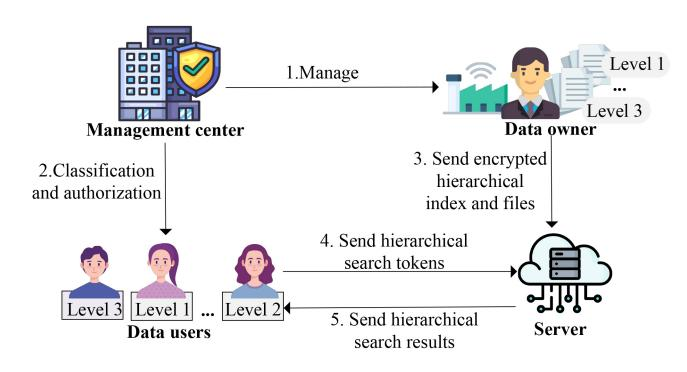
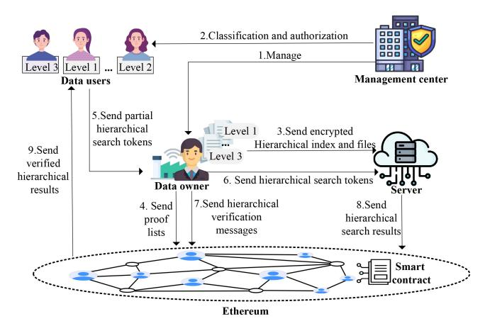
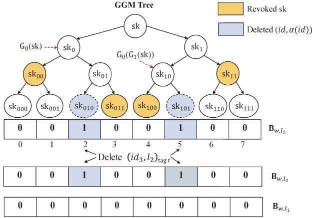
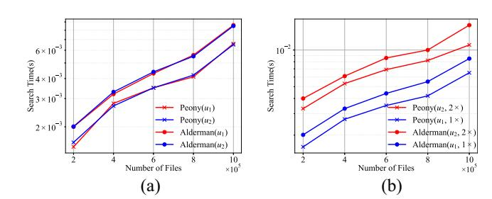
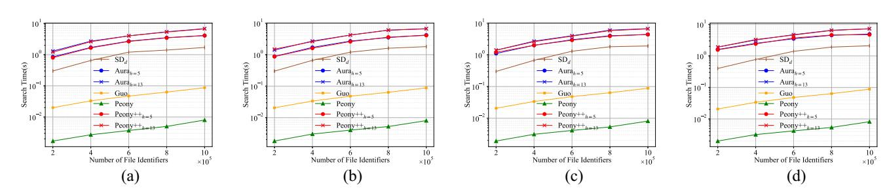
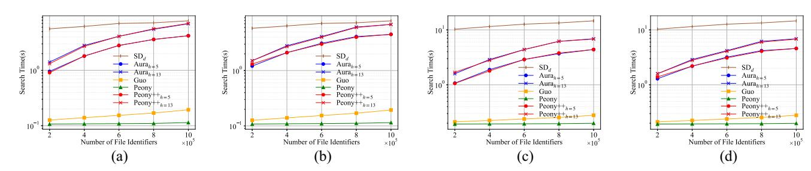
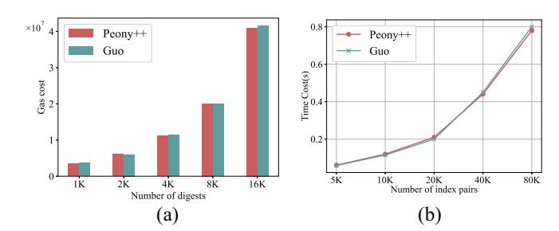
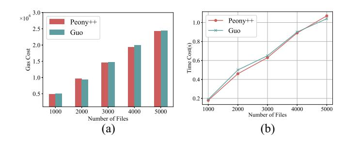

# Verifiable Multilevel Dynamic Searchable Encryption With Forward and Backward Privacy in Cloud-Assisted IoT

Yue Ge [,](https://orcid.org/0009-0007-7351-4554) Ying Gao [,](https://orcid.org/0000-0001-8992-651X) *Member, IEEE*, Jianting Nin[g](https://orcid.org/0000-0001-7165-398X) , *Member, IEEE*, Jie Ma [,](https://orcid.org/0009-0007-6311-520X) and Xiaofeng Che[n](https://orcid.org/0009-0001-7227-7725)

*Abstract***—The Internet of Things (IoT) boom has enabled massive data collection in cloud servers. Therefore, access efficiency and data privacy in cloud storage services have become a significant concern. Data and users are hierarchical in IoT applications, which require fine-grained multilevel access control. Additionally, achieving public verification to resist the malicious server and clients is indispensable. Aiming at the challenge above, we propose a new forward private multilevel dynamic searchable symmetric encryption (MLDSSE) scheme called Peony, employing multilevel linked lists and constrained pseudorandom function, which is more efficient and secure. Then, we introduce a cryptographic primitive named multilevel symmetric revocable encryption (MSRE), and we give a general method for constructing a novel forward and Type-II backward-private MLDSSE scheme Peony++ based on MSRE. Further, we design the multilevel digests and utilize the smart contract as a trusted platform to support public verification for Peony++. Theoretical analysis and experimental evaluations show that Peony achieves higher security and reduces search time by an average of 35.81% compared to the state-of-the-art MLDSSE scheme. To the best of our knowledge, Peony++ is the only multilevel searchable encryption currently available that can achieve forward and Type-II backward privacy, all while balancing efficiency and functionality.**

*Index Terms***—Access control, dynamic searchable symmetric encryption (DSSE), forward and backward privacy, smart contract, verification.**

### I. INTRODUCTION

### *A. Background and Motivation*

**T** HE EMERGENCE of the Internet of Things (IoT) has led to a dramatic increase in the number and penetration of physical devices worldwide [\[1\]](#page-12-0). The resulting massive amount of data has triggered much attention to the management and security of IoT data. In 2016, GDPR [\[2\]](#page-12-1) classified data into

Manuscript received 28 May 2024; revised 7 August 2024 and 28 August 2024; accepted 3 September 2024. Date of publication 10 September 2024; date of current version 6 December 2024. This work was supported by the National Key Research and Development Program of China under Grant

2022YFB2701600. *(Corresponding authors: Ying Gao.)* Ying Gao is with the School of Cyber Science and Technology, Beihang University, Beijing 100191, China (e-mail: gaoying@buaa.edu.cn).

Yue Ge, Jie Ma, and Xiaofeng Chen are with the School of Cyber Science and Technology, Beihang University, Beijing 100191, China (e-mail: geyue1231@buaa.edu.cn; majie2023@buaa.edu.cn; cryptocxf@buaa.edu.cn).

Jianting Ning is with the College of Computer and Cyberspace Security, Fujian Normal University, Fuzhou 350000, China (e-mail: jtning88@

gmail.com). This article has supplementary downloadable material available at https://doi.org/10.1109/JIOT.2024.3457270, provided by the authors.

Digital Object Identifier 10.1109/JIOT.2024.3457270

four types by level of sensitivity: public, internal, confidential, and restricted data. The regulation requires data user classification by defining roles and mandating security measures for data controllers and processors. For instance, classifying data and users is critical for electronic healthcare (eHealth) applications, as it protects sensitive health information and complies with legal standards [\[3\]](#page-12-2). In order to reduce local storage costs and enjoy the convenient services of cloud server providers, more and more enterprises choose to store vast amounts of data on the cloud servers. However, cloud servers are vulnerable to attacks from external adversaries and potential sabotage by internal managers. Thus, ensuring data confidentiality, availability, and hierarchical management within the cloud-assisted IoT systems remains a critical issue.

Dynamic searchable encryption (DSE) enables data owners to encrypt files and outsource them to untrusted servers while providing efficient ciphertext search and update services. The multilevel access control policy (MLA) [\[5\]](#page-12-3) organizes users and files into hierarchies with varying access rights for different user levels and protects the privacy of users' and files' access levels. Existing multilevel searchable public key encryption (PKE) schemes [\[3\]](#page-12-2), [\[4\]](#page-12-4), [\[7\]](#page-12-5), [\[14\]](#page-13-0) exhibit search overheads that are linearly related to the size of the encrypted database. Moreover, these schemes require numerous time-consuming pairing operations, resulting in significant computational burdens. In contrast, multilevel dynamic searchable symmetric encryption (MLDSSE) schemes achieve sublinear search efficiency and utilize lighter symmetric encryption, making them more suitable for clients in resource-constrained IoT systems.

Recently, most work has focused on improving the security of DSSE. The data update operation of DSSE [\[23\]](#page-13-1) supports users to add and delete files arbitrarily. However, data addition exposes connections between newly added files and previously queried keywords. The file injection attack [\[40\]](#page-13-2) demonstrated that the information learned during data addition could be leveraged to breach query privacy. Forward privacy [\[18\]](#page-13-3) ensures that previous search queries cannot be associated with future updates; thus, it has been widely studied for its ability to mitigate powerful file injection attacks.

Backward privacy can hide the file identifier containing *w* that was deleted before the search for *w*, i.e., the deleted file will not be searched again. Bost et al. [\[12\]](#page-13-4) formalized Types I, II, and III backward privacy with sequentially reduced security. Type-I backward privacy allows the leakage of files matching keyword *w*, the insertion timestamps of these files, and the total number of updates on keyword *w*. Type-II backward privacy, apart from the information revealed in Type-I, also leaks the timestamps of all updates on *w*. Type-III backward privacy, in addition to the information leaked in Type-II, discloses which delete operation precisely canceled which add operation.

Most current backward-private DSSE schemes involve tradeoffs between computation/communication costs and security. Type-I backward-private DSSE schemes are either ORAM-based or rely heavily on Intel SGX. However, ORAMbased schemes [\[12\]](#page-13-4), [\[25\]](#page-13-5) are computationally overburdened, and SGX-based schemes [\[34\]](#page-13-6) may suffer from potential sidechannel attacks [\[35\]](#page-13-7). Type-III backward privacy reveals which documents are deleted at what time, potentially allowing attackers to correlate subsequent query information or launch statistical inference attacks. Most Type-II backward-private DSSE schemes require two rounds of communication and do not support MLA control.

In addition, public verification is essential for DSSE schemes. It guarantees the correctness and completeness of the search results and resists malicious servers and users. Recently, some works [\[32\]](#page-13-8), [\[36\]](#page-13-9), [\[37\]](#page-13-10) explore the potential of Ethereum smart contracts to enable public verifiable. The Ethereum smart contract is a blockchain-based decentralized technology that provides a new paradigm for trusted and transparent computing. By using smart contracts, these works made a fair judge of a dispute between clients and the cloud server. However, existing public verifiable DSSE schemes can not simultaneously achieve fine-grained MLA control and forward and backward privacy. That hinders the practical deployment of data hierarchies in cloud storage. Considering the aforementioned practical needs, we have identified two pressing issues that require attention.

- 1) How can we construct a practical, noninteractive forward and Type-II backward-private MLDSSE? First, the old search token of any level data user can not be matched to the newly inserted files, or forward privacy will fail. Second, it must make the server oblivious to deleting hierarchical files. More importantly, the privacy of the users' and files' access levels can not be compromised. Finally, it is necessary to consider the resource constraints of lightweight users in IoT systems.
- 2) Is it possible to design a public verifiable MLDSSE with forward and Type-II backward privacy? One challenge is the conflict between search results verification, forward privacy updates, and backward privacy searches. Another is the collision between result verification and hierarchical privacy protection. The verifier needs to maintain the associations between various queries for results verification. Otherwise, the correctness of query results, especially after updating multilevel files, cannot be assured.

# *B. Our Contributions*

We make significant progress toward the above problems and challenges. For the first time, we designed two new MLDSSE schemes, **Peony** and **Peony**++, which hierarchize users and files and specify that users can only access files less

TABLE I FUNCTIONALITY COMPARISON WITH RELATED SEARCHABLE ENCRYPTION SCHEMES

| Schemes              | Multi-User   | Multi-level Access | Power access privacy | Backward privacy | Policy of Verifiability |
|----------------------|--------------|-----------------------|-------------------------|---------------------|----------------------------|
| Orion [25]           | $\bar{X}$    | $\bar{X}$             | $\checkmark$            | Type-I              | $\bar{X}$                  |
| SD d [15] | $\bar{X}$    | $\bar{X}$             | $\checkmark$            | Type-II             | $\bar{X}$                  |
| Aura [6]             | $\bar{X}$    | $\bar{X}$             | $\checkmark$            | Type-II             | $\bar{X}$                  |
| Bamboo [27]          | $\bar{X}$    | $\bar{X}$             | $\checkmark$            | Type-II             | $\bar{X}$                  |
| Hu [32]              | $\bar{X}$    | $\bar{X}$             | $\bar{X}$               | $\bar{X}$           | $\checkmark$               |
| Guo [37]             | $\bar{X}$    | $\bar{X}$             | $\checkmark$            | $\bar{X}$           | $\checkmark$               |
| VO- $\mu$ SE [39]    | $\checkmark$ | $\bar{X}$             | $\checkmark$            | Type-III            | $\checkmark$               |
| Alderman [5]         | $\checkmark$ | $\bar{X}$             | $\bar{X}$               | $\bar{X}$           | $\bar{X}$                  |
| Peony                | $\checkmark$ | $\bar{X}$             | $\checkmark$            | $\bar{X}$           | $\bar{X}$                  |
| Peony++              | $\checkmark$ | $\checkmark$          | $\checkmark$            | Type-II             | $\checkmark$               |

than or equal to their access level, protect the access level privacy of files and users in update and search. We performed a detailed theoretical analysis, as shown in Tables [I](#page-1-0) and [III,](#page-9-0) and a rich experimental comparison (Section [VII\)](#page-9-1).

- 1) We design a novel forward private MLDSSE scheme **Peony**. Compared to the current optimal MLDSSE scheme Alderman [\[5\]](#page-12-3), **Peony** outperforms Alderman in search efficiency and security while keeping the storage overheads the same as Alderman [\[5\]](#page-12-3).
- 2) We introduce a cryptographic primitive named *multilevel symmetric revokable encryption*. Any forward private MLDSSE scheme can be constructed as Type-II backward-privacy from MSRE. Further, we present a forward and Type-II backward-private MLDSSE scheme to support noninteractive search and update based on the proposed **Peony** and MSRE.
- 3) We construct a novel public verifiable scheme for MLDSSE by harnessing the power of blockchain. We store encrypted hierarchical indexes and files on a cloud server and verifies the hierarchical results via an Ethereum smart contract. Our public verifiable MLDSSE named **Peony**++ is forward and Type-II backward private while protecting the privacy of the users' and files' access levels.
- 4) The comprehensive evaluation shows that **Peony** exhibits the highest search efficiency among the compared schemes. Compared to Aura [\[6\]](#page-12-6), **Peony**++ offers expanded functionality and security without any loss of efficiency. Regarding public verifiability, experimental results demonstrate that our computational overhead is comparable to that of Guo [\[37\]](#page-13-10), but with stronger backward privacy guarantees.

# *C. Core Idea*

We hierarchize users and files, then construct multilevel indexes using an array `A` of linked lists and a lookup table `T`, ensuring that users can only access encrypted files at or below their access level. We utilize constrained pseudorandom functions and the state value *st* to encrypt multilevel indexes for forward privacy. Additionally, we design the cryptographic primitive MSRE to achieve noninteractive Type-II backward private MLDSSE by logically deleting the multilevel files locally at the data owner. The server actually filters out deleted encrypted files during the search phase but cannot decrypt the

file identifiers of deleted encrypted files. During the update and search phases, the access levels of ciphertexts and search tokens/results are indistinguishable, ensuring hierarchical privacy protection for data users and files.

Finally, we utilize hash functions to construct digests for encrypted files of different levels corresponding to each keyword for each update. A hash value associated with the keyword, access level, and update batch is introduced into the digests to make them indistinguishable, thereby achieving hierarchical hiding. The verification algorithm is executed by the smart contract to ensure public verifiability. In **Peony**++, the data user only needs to compute a constrained pseudorandom function, making it well-suited for IoT systems where the user's computational resources are limited.

#### II. RELATED WORK

We divide the related work into three parts. First, we discussed multilevel searchable encryption, including schemes implementing MLA control through symmetric and publickey encryption. Second, we describe the developments in forward and backward privacy for DSSE, which are essential security properties of DSSE. Finally, we review relevant public verifiable searchable symmetric encryption (SSE) schemes.

#### *A. Multilevel Searchable Encryption*

Currently, four mechanisms are employed to achieve MLA control in searchable PKE: 1) identity-based encryption (IBE) [\[3\]](#page-12-2), [\[7\]](#page-12-5), [\[28\]](#page-13-11); 2) attribute-based encryption (ABE) [\[4\]](#page-12-4); 3) predicate encryption [\[29\]](#page-13-12), [\[30\]](#page-13-13); and 4) role-based access control [\[14\]](#page-13-0). The literature [\[14\]](#page-13-0) adopted a public key tree structure and classified users into different levels based on hierarchical IBE. Later, Liu et al. [\[3\]](#page-12-2) utilized a public key tree and a subset decision mechanism to achieved hierarchical multikeyword search. Li et al. [\[4\]](#page-12-4) achieved hierarchical access control following ciphertext-policy ABE. Their scheme is forward private and supports data integrity verification.

In general, the computation performance of symmetric key encryption (SKE) is much better than PKE, so SKE is more suitable for resource-constrained IoT systems. Kissel and Wang [\[31\]](#page-13-14) presented a nonadaptively secure SKE-based scheme, providing group-level hierarchical access control over keywords, and achieved verifiability of search results under the semi-honest-but-curious model. Alderman et al. [\[5\]](#page-12-3) proposed a multilevel SSE scheme in which users have varying access privileges to the encrypted files and cannot search over or learn information about files they are not authorized. For most IoT systems, it is more practical to hierarchize the documents and control the access rights of authorized users. Mihailescu et al. [\[26\]](#page-13-15) applied multilevel SSE to earth sciences. Currently, MLDSSE schemes still need to be explored. We construct two MLDSSE schemes applicable to IoT systems, one more efficient and the other more secure than existing related schemes.

# *B. Forward and Backward Private DSSE*

Song et al. [\[17\]](#page-13-16) introduced the notion of symmetric searchable encryption. Later, numerous studies have been conducted to improve its security [\[12\]](#page-13-4), [\[18\]](#page-13-3), [\[19\]](#page-13-17), performance [\[20\]](#page-13-18), [\[21\]](#page-13-19), or functionality [\[22\]](#page-13-20), [\[23\]](#page-13-1). Kamara et al. [\[23\]](#page-13-1) constructed the first DSSE scheme using linked lists. Constructing a secure DSSE scheme is challenging because data updates leak some information to the server in exchange for acceptable efficiencies. To address the additional privacy concerns raised by updating operation, forward privacy and backward privacy for DSSE have been proposed in some works [\[12\]](#page-13-4), [\[18\]](#page-13-3), [\[19\]](#page-13-17). Bost [\[19\]](#page-13-17) formally defined forward privacy and proposed the Sophos scheme, which uses trapdoor permutations to control the valid range of search tokens for achieving forward privacy. Since then, numerous forward private DSSE schemes have been presented [\[6\]](#page-12-6), [\[8\]](#page-12-7), [\[12\]](#page-13-4), [\[15\]](#page-13-21), [\[24\]](#page-13-22), [\[25\]](#page-13-5).

The concept of backward privacy is relatively more recent. Bost et al. [\[12\]](#page-13-4) has constructed some forward and backward private SSE schemes using constrained pseudorandom functions and puncturable encryption, including a Type-I backward private scheme named Moneta, a Type-II scheme called Fides with two-round communication, and a Type-III backward private schemes Dianadel and Janus. Demertzis et al. [\[15\]](#page-13-21) proposed two forward private and Type-II backward-private schemes SD*a* and SD*d*, which do not need oblivious accesses during searches. Very recently, Sun et al. [\[6\]](#page-12-6) introduced symmetric revocable encryption cryptographic primitive and constructed the first practical and noninteractive Type-II backward-private SSE scheme that can revoke the search permission of the server for deleted data. In addition, Chamani et al. [\[27\]](#page-13-23) proposed searchable encryption with key-update and gave an instance that satisfies forward and backward privacy. Bag et al. [\[44\]](#page-13-24) presented the first dynamic multiclient SSE with forward and Type-II backward privacy supporting efficient conjunctive Boolean queries. Constructing an MLDSSE scheme that satisfies both forward and backward privacy remains an interesting open problem, which we are committed to addressing.

# *C. Public Verifiable SSE*

The public verifiability enhances the trust between the user and the cloud server, thus promoting the application of cloud-assisted IoT systems. Hu et al. [\[32\]](#page-13-8) first proposed to utilize the smart contract in Ethereum to achieve search result verification, where the client can get the correct search result without computing. Reference [\[32\]](#page-13-8) stored the whole index and large files in the smart contract, which is not scalable because extensive data will overburden the storage and computation of the smart contract. To address this problem, a prevalent approach involves utilizing a hybrid storage architecture [\[38\]](#page-13-25), where only small meta-data are stored on-chain and more data are outsourced to the cloud servers.

Cai et al. [\[36\]](#page-13-9) has investigated storing encrypted files and indexes in the cloud servers, with the blockchain only performing verification, which is a valuable and practically applicable advancement. Guo et al. [\[37\]](#page-13-10) resorted to the smart contract to store digests for public result verification while preserving forward privacy. In 2023, Bisht et al. [\[45\]](#page-13-26) proposed

**TABLE II**  
**NOTATIONS**

| Notation                      |  | Description                                       |
|-------------------------------|--|---------------------------------------------------|
| $w$                           |  | A keyword                                         |
| $\alpha$                      |  | The access level mapping function                 |
| $u$                           |  | The data user                                     |
| $q$                           |  | The multi-level search query $q = (w, \alpha(w))$ |
| $W$                           |  | Updated keyword set                               |
| $d$                           |  | Number of files deleted                           |
| $\lambda$                     |  | Security parameter                                |
| $O$                           |  | Data Owner                                        |
| $S$                           |  | The cloud server                                  |
| $R_l$                         |  | The revocation tag list for level $l$             |
| $sk_{R_l}$                    |  | The revoked secret for $R_l$                      |
| $\mathbb{A}_c$                |  | The array of the $c^{th}$ updated index           |
| $\mathbb{T}_c$                |  | The map of the $c^{th}$ updated index             |
| $\mathcal{D}_{w,l}^{add}$     |  | The inserted $l$ -level files for $w$             |
| $L_w[j], X_w[j]$              |  | The $j^{th}$ item of the list $L$ , $X$ for $w$   |
| $N_w[j]$                      |  | The $j^{th}$ item of the list $N$ for $w$         |
| $l$                           |  | The access level                                  |
| $H_i(\cdot), H(\cdot, \cdot)$ |  | The representation of hash functions              |
| $h$                           |  | Number of hash functions in the Bloom filter      |
| $prooflist$                   |  | Maps stored on the blockchain                     |
| $\perp$                       |  | Failure symbol                                    |
| $\emptyset$                   |  | Empty set                                         |

a verifiable personal-health-records sharing scheme with forward privacy, combining SSE, blockchain, and Interplanetary File System. Later, Bisht et al. [46] presented a comprehensive survey for personal health record storage and sharing using searchable encryption and blockchain. They also outlined the development for achieving verifiability using blockchain. To the best of our knowledge, no forward and backward private MLDSSE can achieve public verifiable, and we bridge this gap.

### III. PRELIMINARIES

The notations used in this article are given in Table II.

### *A. Constrained Pseudorandom Functions*

A constrained pseudorandom function [10], [11],  $F : \{0, 1\}^\lambda \times \mathcal{X} \rightarrow \mathcal{Y}$  is associated with a family of predicates  $\mathcal{P} = \{p : \mathcal{X} \rightarrow \{0, 1\}\}$ , together with two algorithms, defined as follows.

- 1)  **$\tilde{F}$ .Constrain( $k, p$ ):** A probabilistic polynomial-time (PPT) algorithm. The possessor of the master key  $k \in \{0, 1\}^\lambda$  can generate a constrained key  $k_p$  corresponding to a predicate  $p \in \mathcal{P}$ . The constrained key  $k_p$  allows PRF evaluation only for input  $x$ , where  $p(x) = 1$ .
- 2)  **$F.Eval(k_p, x)$** : A deterministic polynomial-time algorithm. Given a constrained key  $k_p$  for the predicate  $p$  and an element  $x \in \mathcal{X}$ , outputs

$$\tilde{F}.\text{Eval}(k_p, x) = \begin{cases} F(k, x), & \text{if } p(x) = 1 \\ \perp, & \text{otherwise.} \end{cases}$$

Constrained pseudorandom functions assist in constructing the forward secure update algorithms and low-communication search algorithms of our proposed **Peony** and **Peony++** schemes.

#### *B. Bloom Filter*

A bloom filter (BF) consists of a binary array  $B$  and  $h$  hash functions. For a universe  $\mathcal{X}$ , the query  $x \in \mathcal{X}$ , BF always returns 1 (“Yes”). Ideally, BF should reply to answer (“No”) for  $x \notin \mathcal{X}$ , but the succinctness of the BF leads to the possibility of an answer 1 (i.e., its false-positive probability). The false-positive probability can be adequately low through the adjustment of parameters  $b$  and  $h$ . BF consists of three polynomial-time algorithms, depicted as follows:

**BF.Gen**( $b, h$ ): Given two integers  $b, h \in \mathbb{N}$ , randomly sample  $h$  hash functions  $H = \{H_i\}_{i \in [h]}$ , where each hash function  $H_i : \mathcal{X} \rightarrow [b]$ . Finally, it outputs a hash function collection  $H$  and an array  $B = 0^b$ .

**BF.Upd**( $B, H, x$ ): Given  $B \in \{0, 1\}^b$ ,  $H = \{H_i\}_{i \in [h]}$ , and an element  $x \in \mathcal{X}$ , generates the updated array  $B$  by setting  $B[H_i(x)] \leftarrow 1$  for all  $i \in [h]$ .

**BF:Check**( $B, H, x$ ): Given  $B \in \{0, 1\}^b$ ,  $H \in \{H_i\}_{i \in [h]}$ , and  $x \in \mathcal{X}$ , and returns a bit  $b = B[H_i(x)]$ , where  $b \in \{0, 1\}$ .

BFs are a component of our proposed MSRE, which records and compresses all hierarchical entries to be revoked.

#### *C. t-Puncturable PRFs*

A  $t$ -Punc-PRF enables the puncturing of a PRF key at any collection of inputs  $E$ ,  $|E| \leq t(\lambda)$ ,  $t(\lambda)$  is a polynomial. Formally, a PRF  $F_t: \mathcal{K} \times \mathcal{X} \rightarrow \mathcal{Y}$  is a  $t$ -puncturable pseudorandom function [9] if there is an additional key space  $\mathcal{K}_p$  and three polynomial time algorithms  $F_t.\text{setup}(1^\lambda)$ ,  $F_t.\text{punc}(K, E)$ , and  $F_t.\text{eval}(K_E, x)$ :

- 

  1)  $F_t.\text{setup}(1^\lambda)$ : Given  $\lambda$ , returns a PRF key  $K \in \mathcal{K}$ .
  2)  $F_t.\text{punc}(K, S)$ : Given a PRF key  $K \in \mathcal{K}$  and  $E$
- 2)  $F_t.\text{punc}(K, S)$ : Given a PRF key  $K \in \mathcal{K}$  and  $E \subset \mathcal{X}$ , returns a  $t$ -punctured key  $K_E \in \mathcal{K}_p$ .
  3)  $E_t.\text{eval}(K_E, y)$ : Given a  $t$ -punctured key  $K_E \in \mathcal{K}_p$  and
- 3)  **$F_t$ .eval**( $K_E, x$ ): Given a  $t$ -punctured key  $K_E \in \mathcal{K}_p$  and an element  $x \in \mathcal{X}$ , outputs

$$F_t.\text{eval}(K_E, x) = \begin{cases} F_t(K, x), & \text{if } x \notin E \\ \perp, & \text{otherwise} \end{cases}$$

The  $t$ -puncturable PRF is used to construct our proposed MSRE, which assisted **Peony++** to prevent cloud servers from decrypting deleted hierarchical files.

### *D. Smart Contract in Ethereum*

Ethereum [43] serves as a prominent blockchain platform specifically designed for the execution of Turing-complete smart contracts within a decentralized network. These contracts, functioning as programs, operate on a peer-to-peer network composed of mutually untrusting nodes. The network maintains a common global state and executes code in response to requests. This shared state is stored in a blockchain, which is secured by a proof-of-work consensus mechanism.

Smart contracts [47] in Ethereum have the characteristic of openness and transparency. Each smart contract, uniquely identified by its address, comprises a script code, a currency balance, and storage space organized as a key/value store. Once created and deployed on the Ethereum blockchain, the code of the contract remains immutable indefinitely, precluding any modifications, even from its creator. When external

input data or events meet trigger conditions, smart contracts examine their corresponding rules and execute relevant actions following predefined protocols. Processed responses are recorded in the blockchain. In this work, we design a new verification algorithm based on the Ethereum smart contract to achieve public verifiability of MLDSSE.

#### IV. MULTILEVEL SYMMETRIC REVOCABLE ENCRYPTION

This section introduces a cryptographic primitive named MSRE. It is an improved form of SRE [6]. The main difference between MSRE and SRE is that SRE can only be used to construct single keyword search DSSE with strong backward-privacy, and MSRE can be used to design MLDSSE with strong backward-privacy. Subsequently, we will formalize the syntax and generic structure of the MSRE.

#### *A. Syntax of MSRE*

An MSRE scheme  $\text{MSRE} = (\text{MSRE.BGen}, \text{MSRE.KGen}, \text{MSRE.Enc}, \text{MSRE.KLRev}, \text{and MSRE.Dec})$ , with key space  $\mathcal{LSK}$ , message space  $\mathcal{M}$ , and tag space  $\mathcal{T}$ .

- $\mathcal{LSK}$ , message space  $\mathcal{M}$ , and tag space  $T$ .  
   1) *MSRE BGen*( $1^\lambda$   $b$   $h$   $\mathbb{I}$ ): Given  $\lambda$  int

*Definition 1 (Correctness):* We say MSRE is correct if for any  $\lambda, b, h \in \mathbb{N}$ , message  $m \in \mathcal{M}$ , access level  $l \in \mathbb{L}$ , tags  $T \subseteq \mathcal{T}$ , and multilevel revocation list  $R \subseteq \mathcal{T}$  s.t.  $R \cap T = \emptyset$ 

$$\text{Pr} \left[ \begin{array}{l} \text{MSRE.BGen}(1^\lambda, b, h, \mathbb{I}) \rightarrow lsk \\ \text{MSRE.Enc}(lsk, m, \alpha(m), t) \rightarrow ct \\ \text{MSRE.KLRev}(lsk, R) \rightarrow sk_R \\ \text{MSRE.Dec}(sk_{R_l}, ct, t) \rightarrow m \text{ or } \perp \end{array} \right] \approx 1 - \text{negl}(\lambda).$$

negl( $\lambda$ ) is a possibly non-negligible function, which is sufficient for our scheme. The non-negligible correctness error is from the false positive in the BF.

We define selective security of MSRE by an experiment  $\text{Exp}_{\mathcal{A}, \text{MSRE}}^{\text{IND-SLREV-CPA}}(\lambda)$  as shown in Fig. 1. Before the experiment, the adversary  $\mathcal{A}$  publishes the tag list  $T^*$ . In the experiment,  $\mathcal{A}$  can access the encryption oracle and obtain the ciphertext  $ct$  of any message  $m$  under a given tag  $t$ , and the multilevel key revocation oracle, where  $\mathcal{A}$  can obtain a multilevel revoked secret key  $sk_R$  generated based on a multilevel revocation list  $R$  provided by him.

*Definition 2 (Selective Security):* An MSRE scheme is said to be IND-sLREV-CPA secure if for any sufficiently large security parameter  $\lambda \in \mathbb{N}$  and PPT adversary  $\mathcal{A}$  such that

$$\mathbf{Adv}_{\text{MSRE},\mathcal{A}}^{\text{IND-sLREV-CPA}}(\lambda) = \left| \Pr \left[ \mathbf{Exp}_{\text{MSRE},\mathcal{A}}^{\text{IND-sLREV-CPA}}(\lambda) \right] - 1/2 \right|$$

is at most  $\text{negl}(\lambda)$ , where  $\text{negl}(\lambda)$  is negligible.

#### *B. Construction of MSRE*

Our MSRE scheme comprises a  $t$ -Punc-PRF  $F_t$ , a  $(b, h, n)$  BF with  $|\mathbb{L}|$  arrays, and a standard searchable encryption algorithm, denoted as  $\text{SE} = (\text{SE.Gen}, \text{SE.Enc}, \text{and SE.Dec})$ . Here,  $h$  and  $b$ , respectively, denote the numbers of hash functions and entries in an array of the BF, and  $n$  represents the maximum number of elements that can be inserted. The MSRE scheme  $\text{MSRE} = (\text{MSRE.BGen}, \text{MSRE.Enc}, \text{MSRE.KLRev}, \text{and MSRE.Dec})$  is described as follows:

MSRE.BGen(1λ, b, h, L): Given a security parameter λ, integers b, h ∈ N and the access level set L, and generates the multilevel system secret key *lsk*.

- 1)  $sk \leftarrow F_t.\text{Setup}(1^\lambda).$
- 2) Runs  $(H, B) \leftarrow \text{BF.Gen}(b, h)$ , where  $H = H_{i \in [h]}$  and  $B = 0^b$ . In addition, makes  $|\mathbb{L}|$ -1 additional copies of  $B$  to form  $\mathbb{B}$ .

MSRE.Enc( $lsk, m, \alpha(m), t$ ): Given a multilevel system secret key  $lsk$  and a message  $m \in \mathbb{M}$  of access level  $\alpha(m)$  with tag  $t \in \mathcal{T}$ , and returns ciphertext  $ct$  as

- tag  $t \in \mathcal{T}$ , and returns ciphertext  $ct$  as 1) Calculates  $i = H(t) \in [b]$  and

**MSRE.KLRev(*lsk*, *R*, *L**R*):** It takes *lsk*, a revocation tag *list R*, and the access level *list L**R* as input, then generates the revoked secret key *skR* for *R*.

- 1) *MSRE.Comp:* Classify  $R$  according to  $\mathbb{L}_R$  as  $R = \{R_1, R_2, \dots, R_{l_{max}}\}$ , where  $l_{max}$  is the highest level about tag  $t$  in  $R$ . Computes  $B_{R_l} \leftarrow \text{BF.Upd}(H, B_l, R_l)$  for all  $l \in \{1, 2, \dots, l_{max}\}$ , by which the entries of  $B_{R_l}$  indexed by  $H_i(t_j)_{t_j \in R_l, i \in [h]}$  are set to 1 (i.e.,  $B_{R_l}[H_i(t_j)] \leftarrow 1$ ) for all  $t_j \in R_l$ . In addition, the entries of  $B_{R_\xi}$  (level  $\xi$  > level  $l$ ) indexed by  $H_i(t_j)_{t_j \in R_l, i \in [h]}$  are also need to be set to 1.  $\mathbb{B} = \{B_{R_l}\}_{l \in \mathbb{L}}$ .
- 2) *MSRE.CKLRev:* Locates the index set  $I_l = \{' \in [b] : B_{R_l}['] = 1\}$  from  $B_{R_l}$ , then runs  $sk_{I_l} \leftarrow F_t.\text{punc}(sk, I_l)$  and sets  $sk_{R_l} = (sk_{I_l}, H, B_{R_l})$ .  $sk_R = \{sk_{R_1}, sk_{R_2}, \dots, sk_{R_{lmax}}\}$

MSRE.Dec( $sk_{R_l}, ct, t$ ): Given a revoked secret key  $sk_{R_l}$  corresponding to level  $l$  and a ciphertext  $ct = \{ct_1, ct_2, \dots, ct_h\}$  encrypted under the tag  $t$ , the decryption process reconstructs the original message as follows

- the original message as follows.

| $\overline{\text{Expt}}_{\mathcal{A},\text{MSRE}}^{\text{IND}-\text{sLREV}-\text{CPA}}(\lambda) :$                                                            | $\overline{\text{O}}_{lsk}^{\text{KLRev}}(R, \mathbb{L}_R) :$ | $\overline{\text{O}}_{lsk}^{\text{Enc}}(m, T) :$ |
|---------------------------------------------------------------------------------------------------------------------------------------------------------------|---------------------------------------------------------------|--------------------------------------------------|
| $T^* \leftarrow \mathcal{A}(1^\lambda) \text{ s.t. } T^* \subseteq \mathcal{T}; \mathcal{Q} \leftarrow \emptyset;$                                            | $sk_R \leftarrow \text{KLRev}(lsk, R, \mathbb{L}_R)$          | $If R \in Q \wedge (T^* \cap R = \emptyset),$    |
| $lsk \leftarrow \text{BGen}(1^\lambda, b, h, \mathbb{L})$                                                                                                     | adds $R$ to $Q$                                               | Reject the query                                 |
| $(ct, sk_R) \leftarrow \mathcal{A}_{lsk}^{O_{lsk}^{\text{Enc}}(\cdot, \cdot), O_{lsk}^{\text{KLRev}}(\cdot, \cdot)}(m, T, R); \text{ add } R \text{ to } Q;$  | Return $sk_R$ .                                               | Else                                             |
| $b \xrightarrow{S} \{0, 1\}; ct^* \leftarrow \text{Enc}(lsk, m_b, T^*)$                                                                                       |                                                               | $ct \leftarrow \text{Enc}(lsk, m, T)$            |
| $b' \leftarrow \mathcal{A}_{lsk}^{O_{lsk}^{\text{Enc}}(\cdot, \cdot), O_{lsk}^{\text{KLRev}}(\cdot, \cdot)}(ct^*, R) \text{ s.t. } R \cap T^* \neq \emptyset$ |                                                               | Return $ct$ .                                    |
| Return $(b' = b)$ .                                                                                                                                           |                                                               |                                                  |

Fig. 1. Selective security of MSRE.

#### *C. Correctness and Security Analysis of MSRE*

*Correctness:* In our MSRE, the tag  $t$  and the revocation list  $R$  are independent of the construction of the BF. A ciphertext  $ct = \{ct_1, ct_2, \dots, ct_h\}$  is encrypted based on the tag  $t$ , and given a revocation tag list  $R_l$  for level  $l$ ,  $t \notin R_l$ . Given the revoked secret key  $sk_{R_l}$  with level  $l$ , if BF.Check( $H, B_{R_l}, t$ ) = 0, then compute  $sk_{j*}$  and recover  $m = \text{SE.Dec}(sk_{j*}, ct_{j*})$ . The correctness of MSRE depends on the correctness of  $t$ -punct-PRF and SE algorithms. If BF.Check( $H, B_{R_l}, t$ ) = 1, which implies that  $B_{R_l}[H_i(t)] = 1$  for all  $H_i \in H$ , the decryption fails. The correctness error of MSRE is only related to the false positive of the BF.

*Security:* In MSRE, for different level  $t$ , the revoked secret key  $sk_{R_t}$  and array  $B_{R_t}$  are indistinguishable under the security of  $t$ -punc-PRF and the BF; thus, MSRE does not reveal the access level information.

**Theorem 1:** The MSRE scheme is IND-sLREV-CPA secure, if  $F : K \times X \rightarrow Y$  is a secure  $t$ -Punc-PRF, BF is a  $(b, h, n)$ -Bloom-filter, and the SE algorithm is IND-CPA secure.

*Proof:* The detailed security proof is given in Appendix A-A in the supplementary material. ■

### V. FORWARD-PRIVATE MULTILEVEL DSSE

Multilevel searchable encryption provides searching over encrypted hierarchical files for multiple users with hierarchical access levels. This section presents a new MLDSSE with forward privacy named **Peony**. **Peony** is suitable for a cloud-assisted IoT system that requires hierarchical management of files and users, and is particularly friendly to resource-constrained data users.

The system framework of **Peony** is shown as Fig. 2. **Peony** consists of four entities: 1) the management center; 2) the data owner; 3) the cloud server; and 4) the data users. The management center hierarchizes the files and users. The data owner uploads his encrypted hierarchical files and indexes to the cloud server. The data user can generate a search token corresponding to his access level and then send the search token to the server to get the corresponding search results.

# *A. MLDSSE Syntax*

*Multilevel Access:* Our MLA policy requires that a user with access level  $\alpha(u)$  is authorized to get only for files with level  $\alpha(id) \leq \alpha(u)$ , where  $\alpha$  is an access level mapping function.

Fig. 2. System framework of **Peony**.

MLA control effectively regulates the access permissions of different users, preventing lower-level users from accessing higher-level files.

**Definition 3** (*MLDSSE*): An MLDSSE scheme is composed of four polynomial time algorithms *KeyGen*, *ListGen*, *Update*, and *Search* defined as follows.

- 1) *KeyGen* ( $1^\lambda$ ): Given  $\lambda$ , outputs the secret key  $K_0$ .
- 2) *ListGen* ( $\mathcal{D}_w, c, op$ ): It takes as input the update data set  $\mathcal{D}_w$  for keyword  $w$ , update times  $c$ , and update operation op, outputs the lists  $L_w, X_w, N_w$ .
- 3) *Update*  $(\mathcal{D}, c, K_O)$ : It takes the update data set  $\mathcal{D}$ , update times  $c$ , and the secret key  $K_O$  as input, and generates the update index  $\mathcal{I}_c$  and adds  $\mathcal{I}_c$  into the encrypted database  $\mathcal{I}$ .
  4) *Search*  $(K_{c,c}, w, c, \mathcal{T})$ : It takes the secret key  $k_{c,c}$  and
- 4) *Search  $(K_{\alpha(u)}, w, ; \mathcal{I})$ :* It takes the secret key  $k_{\alpha(u)}$  and keyword  $w$  from the data user as input, and initiates a query to the server. The server executes the search algorithm over  $\mathcal{I}$  to get the search results  $\mathcal{R}_{w, \alpha(u)}$ , then, sends  $\mathcal{R}_{w, \alpha(u)}$  to the data user.

Sends  $\mathcal{R}_{w,\alpha(w)}$  to the data user. Correctness: An MLDSSE scheme is correct if for any  $poly(\lambda)$  executions of  $KeyGen(1^\lambda)$ ,  $ListGen(\mathcal{D}_w, c, op)$ ,  $Update(\mathcal{D}, c, K_O)$ ,  $Search(k_{\alpha(w)}, w, c; \mathcal{I})$ , the  $Search$  algorithm always returns the files for the specific keyword  $w$  that have inserted into  $\mathcal{I}$  by executing  $Update(\mathcal{D}, c, op=add, K_O)$  and not yet deleted by executing  $Update(\mathcal{D}, c, op=del, K_O)$ .

### *B. Threat Model*

We assume the data owner and data users are trusted entities. The adversary is the honest-but-curious server [41]. The server in **Peony** has access to public parameters, encrypted hierarchical data, added/deleted ciphertexts, and obtains the data user's

search token to perform a search. As shown in Definition 4, if **Peony** is  $\mathcal{L}$ -adaptively secure, the confidentiality of the encrypted database can be guaranteed, and the user's query privacy and access level privacy can be protected.

The information leakage during the search phase in **Peony** includes the search pattern  $\text{sp}(q)$  and the update timestamp list  $\text{UpHist}(q)$ . For any multilevel query  $q = (w, \alpha(u))$  (i.e., single keyword queries issued by data user  $u$  with access level  $\alpha(u)$ ), the function  $\text{sp}(q) = \{e : (e, q) \in \mathcal{Q}\}$ , which records the list  $\mathcal{Q}$  of every search query, in the form  $(e, q)$ , where  $e$  is the timestamp. The function  $\text{UpHist}(q)$  generates a list detailing all updates on query  $q$ . Each item in the list is a tuple  $(e, \text{op}, id)$ , where  $\text{op}$  denotes the update operation, and  $id$  denotes the updated file identifier. The update phase of **Peony** does not incur any information leakage. The forward privacy of MLDSSE imposes specific restrictions on the update leakage function, as shown in Definition 5.

#### *C. Security Model*

The security of **Peony** is defined as the indistinguishability between a real game and an ideal game. We have the formal definition that follows.

**Definition 4 (Adaptive Security of Peony):** Given leakage functions  $\mathcal{L}_{\text{Peony}} = (\mathcal{L}_{\text{KGen}}, \mathcal{L}_{\text{LGen}}, \mathcal{L}_{\text{Updt}}, \mathcal{L}_{\text{Srch}})$  and an MLDSSE scheme  $\prod = (\text{KeyGen}, \text{ListGen}, \text{Update}, \text{Search})$  is  $\mathcal{L}$ -adaptively secure, if for any PPT adversary  $\mathcal{A}$ , there exists an efficient simulator  $\mathcal{S}$  such that

$$\left| \Pr \left[ \text{Real}_{\mathcal{A}}^{\prod}(\lambda) = 1 \right] - \Pr \left[ \text{Ideal}_{\mathcal{A}, \mathcal{S}, \mathcal{L}_{\text{Peony}}}^{\prod}(\lambda) = 1 \right] \right|$$
  
 $\leq \text{negl}(\lambda)$ 

where  $\text{Real} \prod_A (\lambda)$  and  $\text{Ideal} \prod_{A,S,\mathcal{L}_{\text{Peony}}} (\lambda)$  are defined as follows.

- 1)  $\text{Real}_A^\Pi(\lambda)$ : This game implements all real algorithms. An adaptively issues *KeyGen*, *ListGen*, *Update*, and *Search* queries, then observes real transcripts of all operations and returns one bit.
- 2) Ideal  $\prod_{\mathcal{A}, \mathcal{S}, \mathcal{L}_{\text{Peony}}} (\lambda)$ :  $\mathcal{A}$  adaptively publishes the same queries as in the real game, and gets the corresponding transcripts generated by running  $\mathcal{S}.\text{KeyGen}$ ,  $\mathcal{S}.\text{ListGen}$ ,  $\mathcal{S}.\text{Update}$ ,  $\mathcal{S}.\text{Search}$  with leakage functions  $\mathcal{L}_{\text{KGen}}$ ,  $\mathcal{L}_{\text{LGen}}$ ,  $\mathcal{L}_{\text{Updt}}$ , and  $\mathcal{L}_{\text{Srch}}$ , respectively. In the end,  $\mathcal{A}$  observes all simulated transcripts and returns one bit

A observes all simulated transcripts and returns one bit. According to the formal definition introduced by Bost et al. [12], we give the forward security definition for the MLDSSE scheme as follows.

*Definition 5 (Forward Privacy of MLDSSE):* An  $\mathcal{L}$ -adaptively secure MLDSSE scheme is forward-private iff the update leakage function  $\mathcal{L}^{\text{Upd}}$  can be written as

$$\mathcal{L}^{\text{Upd}}(\text{op}, (w, id, \alpha(id))) = \mathcal{L}'(\text{op}, id)$$

where  $\mathcal{L}'$  is stateless.

### *D. Construction of Peony*

*KeyGen Algorithm:* The management center generates a symmetric key  $K_O$ , including the hierarchical key  $k_l$  for all  $l \in \mathbb{L}$  and the set of update state  $st$ . The management center hierarchizes files and data users. The data owner possesses

the secret key  $K_O$ . The data user obtains a secret key  $k$  corresponding to his access level and the set of update state  $s$ .

*ListGen Algorithm:* Given  $\mathcal{D}_w$  and an empty array  $\mathbb{A}$ , construct lists  $L_w, X_w, N_w$  corresponding to the keyword  $w$ . The file identifiers in  $\mathcal{D}_w$  are stored in list  $L_w$  in descending order of their access levels. List  $X_w$  contains the starting identifier indexes for each access level in  $L_w$ . List  $N_w$  contains  $|L_w|$  address chosen randomly from  $\mathbb{A}$ . If we have an  $\mathcal{D}_{w_1}$  address  $\{id_1, id_2, id_3, id_4\}$ ,  $l_1 = \alpha(id_1)$ ,  $l_2 = \alpha(id_2) = \alpha(id_3)$ ,  $l_3 = \alpha(id_4)$ , and access level  $l_1 < l_2 < l_3$ , the constructed list of  $L, X$ , and  $N$  are as follows.

The ListGen algorithm is only used to assist in constructing the Update algorithm in **Peony**.

*Update Algorithm:* Given the  $c$ th updated file set  $\mathcal{D}_W$ , construct the encrypted index  $\mathcal{I}_c$  containing an array  $\mathbb{A}_c$  and a table  $\mathbb{T}_c$ . For each keyword  $w \in \mathcal{W}$ , the list  $L_w, X_w, N_w$  is generated using the ListGen algorithm. Each list  $L_w$  is encrypted and stored as a linked list in  $\mathbb{A}_c$ . Each item in array  $\mathbb{A}_c$  contains a file identifier  $id \in L_w$ , the address of the next node, and the decryption key employed for the next node in array  $\mathbb{A}_c$ . User  $u_3$  with access level  $l_3$  has the key to decrypt the first node corresponding to level  $l_3$  in array  $\mathbb{A}_c$ . Therefore, user  $u_3$  can access all data less than or equal to level  $l_3$  by traversing the linked list in  $\mathbb{A}_c$ . The entries in Table  $\mathbb{T}_c$  contain the encrypted address of the first node of each access level for each  $L_w$  in array  $\mathbb{A}_c$ , and the encrypted address can be decrypted by an authorized user with a specified access level. If an access level is not authorized to review anything of the linked list, then the  $\mathbb{T}_c$  value is set to  $\perp$ . Finally, the data owner  $O$  sends the updated encrypted index  $\mathcal{I}_c \leftarrow (\mathbb{A}_c, \mathbb{T}_c)$  to the server. Note, as shown in Algorithm 1, the update state  $st$  guarantees the forward privacy of **Peony**, because an adversary with only  $\{st_i\}_{i \in [c]}$  cannot access the data of the  $(c+1)$ th update, i.e., the link between the old search token and the newly updated data is severed.

*Search Algorithm:* The authorized user generates a search token for a keyword  $w$  and sends it to the server. The search token consists of two parts,  $t_{k_w, \alpha(u)}$  and ST. ST is the set of update state  $st$  for  $c$  times update. We implement batch updating; thus,  $c$  is relatively small.  $t_{k_w, \alpha(u)}$  is the outputs of the prefix-constrained PRF  $\tilde{F}$ . Cons applied to the keyword  $w$ , keyed with the secret key associated with the user's access level  $\alpha(u)$ . In this way, the data user of resource-limited needs only to send a constrained key  $t_{k_w, \alpha(u)}$  per key, with which the server can derive all  $3c$  PRF values associated with  $t_{k_w, \alpha(u)}$ . The server takes  $t_{k_w, \alpha(u)}$  and the random number  $st_j, j \in [1, c]$  as inputs and output  $\tau_1^j, \tau_2^j, \tau_3^j, j \in [1, c]$  using the constrained PRF  $\tilde{F}$ . Eval.  $\tau_1^c$  is used to locate the relevant entry in  $\mathbb{T}_c$ ,  $\tau_2^c$  is applied to decrypt  $\mathbb{T}_c[\tau_1^c]$  to get the starting position corresponding to  $(w, \alpha(u))$  in  $\mathbb{A}_c$ , and  $\tau_3^c$  is used to decrypt the relevant node in  $\mathbb{A}_c$ .

### *E. Correctness Analysis and Security Proof*

*Correctness:* The correctness of **Peony** comes from the collision-resistance of hash function  $H$  and the correctness of the constrained pseudorandom function. Specifically, when executing *Update* and *ListGen* with a given entry

#### **Algorithm 1 Peony**.KeyGen, **Peony**.ListGen, **Peony**.Update, and **Peony**.Search

### KeyGen(1λ)

Management Center:

- **for**  $l \in \mathbb{N}$  **do**
- $k_l \in \{0, 1\}^\lambda$
- **end for**
- **for**  $n = 1, 2, \dots$  until stops **do**
- $s_{tn} \in \{0, 1\}^\lambda$
- **end for**
- **return**  $K_O = (\{k_l\}_{l \in [|\mathbb{N}|]}, s_1, s_2, \dots, s_n)$

ListGen( $\mathcal{D}_w, c, \text{op}$ )  
Data Owner:

Data Owner:

| 1.  | Initialize $Li_W, X_W, \mathbf{n}$ and $N_W$ to empty lists                        |
|-----|------------------------------------------------------------------------------------|
| 2.  | Initialize $l$ to 1, $loc$ to 0                                                    |
| 3.  | Sort $id_j \in \mathcal{D}_w$ in descending order using $\alpha(id_j)$             |
| 4.  | <b>for</b> each $id_j \in \mathcal{D}_w$ <b>do</b>                                 |
| 5.  | $loc = loc + 1, L_w = L_w \cup (id_j  op)$                                         |
| 6.  | <b>if</b> $\alpha(id_j) = l$ <b>then</b>                                           |
| 7.  | $X_w = X_w \cup loc$                                                               |
| 8.  | $l = l + 1$                                                                        |
| 9.  | <b>end if</b>                                                                      |
| 10. | Randomly select the non-repeating $addr_j$ ( $1 \leq addr_j \leq  \mathbb{A}_c $ ) |
| 11. | $N_w = N_w \cup \{addr_j\}$                                                        |
| 12. | <b>end for</b>                                                                     |
| 13. | <b>return</b> $L_w, X_w, N_w$                                                      |

 Update( $\mathcal{D}_{\mathcal{W}}, c, K_O$ )  
 Data Owner:
 

Expense vy Data Owner:

Table with 3 columns: Level,  $|\mathcal{V}|$ , and  $|\mathcal{V}|$ . Rows 1-5 contain expressions for  $|\mathcal{V}|$  domains in  $\mathbb{R}^3$  and  $\mathbb{R}^2$ .

| <b>1:</b> | $X_{w_i}   \neq \perp$ <b>then</b>                                                              |
|-----------|-------------------------------------------------------------------------------------------------|
| <b>2:</b> | $\mathbb{T}_c[F_{k_j}^1(w_i  stc)] \leftarrow (N_{w_i}[X_{w_i}[l]] \oplus F_{k_j}^2(w_i  stc))$ |
| <b>3:</b> | <b>else</b>                                                                                     |
| <b>4:</b> | $\mathbb{T}_c[F_{k_j}^1(w_i  stc)] \leftarrow \perp$                                            |
| <b>5:</b> | <b>end if</b>                                                                                   |
| <b>6:</b> | <b>end for</b>                                                                                  |
| <b>7:</b> | <b>end for</b>                                                                                  |
| <b>8:</b> | <b>Send</b> $\mathcal{I}_c \leftarrow (\mathbb{A}_c, \mathbb{T}_c)$ to the server               |
| <b>9:</b> | Server:                                                                                         |

1: Store the received encrypted index by setting  $\mathcal{I} = \mathcal{I} \cup \mathcal{I}_c$  Search( $k, \dots, w, c, \mathcal{I}$ )

## P. Store the receiver

Search( $k_{\alpha(u)}, w, c; \mathcal{I}$ )  
Data User

Data User: 1: tk

| 1: $tk_{w,\alpha(u)} \leftarrow \bar{F}.Cons(k_{\alpha(u)}, w)$ |
|-----------------------------------------------------------------|
| 2: $ST = \{st_1, st_2, \dots, st_C\}$                           |
| 3: <b>Send</b> $\{tk_{w,\alpha(u)}, ST\}$ to the server         |

Server:

- | 1:  | $\mathcal{R}_{w,\alpha(u)} \rightarrow \emptyset$                                                          |
  |-----|------------------------------------------------------------------------------------------------------------|
  | 2:  | <b>for</b> $j = c \rightarrow 1 \rightarrow \mathbf{do}$                                                   |
  | 3:  | $t_1^j = P_{k_{\alpha(u)}}^j(w st_j) \leftarrow \tilde{\mathcal{F}}.\text{Eval}(tk_{w,\alpha(u)}, st_j l)$ |
  | 4:  | $t_2^j = P_{k_{\alpha(u)}}^j(w st_j) \leftarrow \tilde{\mathcal{F}}.\text{Eval}(tk_{w,\alpha(u)}, st_j l)$ |
  | 5:  | $t_3^j = P_{k_{\alpha(u)}}^j(w st_j) \leftarrow \tilde{\mathcal{F}}.\text{Eval}(tk_{w,\alpha(u)}, st_j l)$ |
  | 6:  | <b>if</b> $\mathbb{T}_j[t_1^j] = \perp$ <b>then</b>                                                        |
  | 7:  | <b>return</b> $\perp$                                                                                      |
  | 8:  | <b>end if</b>                                                                                              |
  | 9:  | Parse $\mathbb{T}_j[t_1^j] \oplus t_2^j$ as $v_2$                                                          |
  | 10: | <b>while</b> $v_2 \neq 0$ <b>do</b>                                                                        |
  | 11: | Parse $\mathbb{A}_j[v_2]$ as $(z_1, z_2)$                                                                  |
  | 12: | Parse $(z_1 \oplus H(t_3^j, z_2))$ as $((id, \text{op}), v_2, z_3)$                                        |
  | 13: | if $z_3 \neq 0$ <b>then</b>                                                                                |
- | 12: | $\text{Parset } (z_1 \oplus H(v, z_2))$ as $(id, \text{op}, v_2, v_3')$         |
  |-----|---------------------------------------------------------------------------------|
  | 13: | if op = add then                                                                |
  | 14: | $\mathcal{R}_{w, \alpha(u)} \leftarrow \mathcal{R}_{w, \alpha(u)} \cup id$      |
  | 15: | else if op = del then                                                           |
  | 16: | $\mathcal{R}_{w, \alpha(u)} \leftarrow \mathcal{R}_{w, \alpha(u)} \setminus id$ |
  | 17: | end if                                                                          |
  | 18: | end while                                                                       |
  | 19: | end for                                                                         |

20: Send  $\mathcal{R}_{w,\alpha(u)}$  to the data user

(op, (w, id),  $\alpha(id)$ ), both the collision-resistance of  $H$  and the correctness of  $\tilde{F}$  guarantee that the generated encrypted index  $\mathcal{I}$  and search token  $t_{w, \alpha(id)}$  in correctly.

 $\mathcal{I}$  and search token  $t_{k_w, \alpha(u)}$  in correctly. When executing *Search* algorithm with a given query  $q$ ,  $\{\tau_i\}_{i \in [1, 3]}$  can be computed using the constrained pseudorandom function  $\tilde{F}$ . The server uses  $\tau_1$  to locate the entry in table  $\mathbb{T}$ , uses  $\tau_2$  to decrypt the entry, and correctly obtains the address of the starting node corresponding to access level  $\alpha(u)$  in the array  $\mathbb{A}$ . The server uses  $\tau_3$  to successively decrypt the remaining elements of the list stored in  $\mathbb{A}$  until reaching a node where the address, stored in that node for the following item in the linked list, is 0. If the current encrypted index has been updated  $c$  times, then the above search process will be executed  $c$  times. In this way, the server can precisely find all matching results and return the correct files whose access levels are less than or equal to  $\alpha(u)$  that have been inserted but not deleted.

*Security:* We analyze in detail the information leakage and the access level hiding properties of **Peony**, formally describes the leakage function  $\mathcal{L}_{\text{Peony}}$ , and proves the forward privacy of **Peony**. See Appendix A-B in the supplementary material for details.

### VI. VERIFIABLE FORWARD AND BACKWARD PRIVATE MULTILEVEL DSSE FROM MSRE

We propose a generic construction for noninteractive forward and Type-II backward-private MLDSSE from MSRE

Fig. 3. System framework of **Peony++**.

called **Peony++** and realize the public verifiable functionality. **Peony++** is designed for hierarchically managed cloud-assisted IoT systems with high security requirements (e.g., eHealth), where data users have limited resources (e.g., handheld terminals or diagnostic equipment) and computing resources of data owners (e.g., hospitals) are available.

Fig. 3 shows the system overview of **Peony++**, consisting of four entities: the data owner *O*, the authorized data user set *U*, the management center, and the cloud server *S*. The smart contract is deployed by *O* in an Ethereum platform. First, management centers (e.g., hospital database administrators) hierarchize the files of the data owner and assign access rights

Authorized licensed use limited to: Thammasat University. Downloaded on August 28, 2026 at 13:38:22 UTC from IEEE Xplore. Restrictions apply.

to data users (e.g., patients and doctors). The data owner  $O$  outsources encrypted files and indexes to the cloud server. Meanwhile,  $O$  publishes the *prooflist* to the smart contract, and the process is shown as a transaction broadcasted to the underlying Ethereum network. When a resource-limited data user  $u \in \mathcal{U}$  enjoys the search service, a partial search token is generated and sent to  $O$ .  $O$  generates the final search token, sends it to the server, and publishes a verification message to the smart contract. Then, the cloud server performs the search algorithm and publishes the search results to the smart contract. Once the results are verified successfully by the smart contract, the smart contract sends the verified search results to the user.

#### *A. Construction of Peony*++

Any forward private MLDSSE scheme can use the MSRE primitive proposed in this article to construct schemes that satisfy backward privacy. **Peony++** is based on **Peony** and composed of four algorithms *Setup*, *ListGen*, *Add*, *Delete*, and *Search*. Next, we provide a core description. More details are shown in Algorithm 2 in the Appendix in the supplementary material.

 $Setup(1^\lambda, \mathcal{D}, \mathcal{U}) \rightarrow (K_{\mathbb{L}}, \mathcal{D}_{\mathbb{L}}, \mathcal{U}_{\mathbb{L}})$ : The manager center generates the hierarchical key  $k_l$  for all  $l \in \mathbb{L}$ , hierarchizes the files, and assigns access rights to data users.  $proof_{\mathcal{F}.Cons(k_l, w_i)}^{del}$  initialized to 0 for each  $w$  and all  $l \in \mathbb{L}$ .

*ListGen*( $\mathcal{D}_w, c$ )  $\rightarrow$  ( $L_w, X_w, N_w$ ): The main difference between the Peony++'s ListGen algorithm and Peony's is that Peony++ needs to compute the label  $t$  for the inserted data ( $w, id_j$ ). When adding a new entry ( $w, id_j$ ), the data owner  $O$  uses the key *lsk* from LSK[ $w$ ] to construct the ciphertext  $ct \leftarrow \text{MSRE.Enc}(lsk, id_j, \alpha(id_j), t)$  under  $t \leftarrow F_{K_t}(w, id_j)$ ,  $K_t$  is a secret key generated by  $O$ . The *ListGen* algorithm is only used to assist in constructing the *Add* algorithm in **Peony++**.

 $Add(\mathcal{D}_{add}, c, K_{\mathbb{L}}) \rightarrow (\mathcal{A}_c, \mathbb{T}_c, prooflist)$ : The **Peony++**  $Add$  algorithm follows the **Peony**.  $Update$ , the main distinction is that **Peony**.  $Update$  algorithm can add and delete data, and **Peony++**.  $Add$  only adds data. In addition, to achieve public verification, **Peony++** generates *prooflist* for the newly added encrypted files using hash functions and deploys the *prooflist* at the smart contract.

We construct a *prooflist* corresponding to every keyword  $w$  for each  $l \in \mathbb{L}$ . The *prooflist* contains the label  $pt$ , the digest  $H(1, C_{id})$ , and a hash value  $r_{w_{i,l}}^c = H(\widetilde{F}.\text{Cons}(k_l, w_i), c || 2)$ , where  $c$  is the number of updates.  $C_{id}$  represents a file encrypted using the AES algorithm. Importantly, for identical plaintext files, the resulting ciphertext varies. For instance, given  $\mathcal{D}_{w_1, l_1}^{\text{add}} = \emptyset$ ,  $\mathcal{D}_{w_1, l_2}^{\text{add}} = \{id_1, id_2, id_3\}$ ,  $\mathcal{D}_{w_1, l_3}^{\text{add}} = \{id_4, id_5\}$ , we have the following:

$$\text{prooflist}\left[pt_{w_1,l_1}^c\right] = H\left(0, r_{w_1,l_1}^c\right)$$

$$\text{prooflist}\left[pt_{w_1, l_2}^c\right] = H\left(0, r_{w_1, l_2}^c\right) \oplus \left(\bigoplus_{j \in [1, 3]} H(1, C_{idj})\right)$$

$$proofist \left[ pt_{w_1, l_3}^c \right] = H(0, r_{w_1, l_3}^c) \oplus \left( \bigoplus_{j \in [1, 5]} H(1, C_{id_j}) \right).$$

Access level  $l_3$  is the highest level. The user of level  $l_3$  can access all files of level  $l_1$ ,  $l_2$ , and  $l_3$ , so *prooflist* of level  $l_3$  contains all file hashes.  $\mathcal{D}_{w_1, l_1}^{\text{add}}$  is empty, so its *prooflist* digest only contains the hash value  $r_{w_1, l_1}^c$ . The label  $pt$  and the hash value  $r$  are updated during each data addition, which cuts off the relations between the previous *prooflist* and the newly added one.

---

 $\mathcal{D}_{del}(\text{LSK}, \mathcal{W}_{del}, \mathcal{D}_{del}, R, \mathbb{L}_R) \rightarrow (\mathbb{B}_{\mathcal{W}_{del}}, proof_{\mathcal{F}, \text{Cons}}^{del})$   
 Different from **Peony**, **Peony**++ utilizes MSRE to implement data deletion. To delete some keyword-file entries, the Data Owner inserts the corresponding tag set  $R_w$  to the compressed deletion list  $\mathbb{B}_w$ . For  $\mathcal{D}_{del}(w)$ , the data owner computes the compressed result set  $proof_{\mathcal{F}, \text{Cons}(k_l, w)}^{del}$  by using hash functions for subsequent verification.  $\mathbb{B}_w$  and all digests  $proof_{\mathcal{F}, \text{Cons}(k_l, w)}^{del}$  are kept by the data owner. Note that if no deletion occurs on keyword  $w$ , we only need to delete a dummy  $id^*$ .
 

---

*Search*( $K_u, w, \mathcal{I}$ )  $\rightarrow \mathcal{R}_{w, \alpha(u)}$ : To satisfy Type-II backward privacy while the search and verification can be completed in a single roundtrip, the data owner  $O$  assists the data user  $t$  in generating a complete search token.  $O$  sends the deletion list  $B_{w, \alpha(u)}$ , the update state  $st$ , and the query request  $tk_{w, \alpha(u)}$  from the data user to the server to complete the multilevel keyword search. In addition,  $O$  compresses the deletion digest  $proof_{tk_{w, \alpha(u)}}^{del}$  with hash values  $H(0, r_{w, \alpha(u)}^i)$  for all  $i \in [1, c]$  into a single digest  $proof_{tk_{w, \alpha(u)}}^{del}$ . Then,  $O$  publishes  $pt_{w, \alpha(u)}^i$  for all  $i \in [1, c]$  and  $proof_{tk_{w, \alpha(u)}}^{del}$  to the smart contract. The search process performed by the server in the **Peony++** scheme is almost identical to that of **Peony**, with the only difference being that the MSRE decryption algorithm is used. Finally, the server includes the search results and the smart contract address in a transaction and broadcasts it to the blockchain network to perform the verification algorithm.

*Verify*( $\mathcal{R}_{w,\alpha(u)}, \text{prooflist}, \text{proof}_{\text{ik}_{w,\alpha(u)}}^{\text{del}}$ )  $\rightarrow$  ( $\mathcal{R}_{w,\alpha(u)}$  or  $\perp$ ): The smart contract uses  $pi_{w,\alpha(u)}^i$  for all  $i \in [1, c]$  to obtain the corresponding  $\text{prooflist}[pi_{w,\alpha(u)}^i]$  and combines them with the deletion digest  $\text{proof}_{\text{ik}_{w,\alpha(u)}}^{\text{del}}$  by through XOR operations to get  $\text{proof}'$ . Then, the compressed result set  $\text{hash}_{\mathcal{R}_{w,\alpha(u)}}$   $\in \bigoplus_{i \in \mathcal{C}_{id_j} \in \mathcal{R}_{w,\alpha(u)}} H(1, C_{id_j})$  is computed and determines whether it equals  $\text{proof}'$ . If equal, the verification is successful. The data user can retrieve verified search results from the blockchain, and the server receives the service fee. Otherwise, the deposit is deducted from the server account. Public verifiability ensures the correctness and integrity of search results for cloud-assisted multilevel IoT systems and prevents data users from intentionally refusing to pay for services, facilitating the secure sharing and use of IoT data.

### *B. Instantiation*

We use the inserted data  $\mathcal{D}_{w_1}$  from the *ListGen* algorithm in Section IV-C to give a concrete example of **Peony++**. **Peony++** is constructed through the integration of a concrete MSRE scheme with any forward-private MLDSSE scheme; in our instantiation, we employ **Peony**. As in Fig. 4, we use the GGM-tree PRF to implement the  $t$ -punc-PRF and, combined with a BF containing  $l$  b-bit arrays, construct  $l$  revocation lists. In this section, we set  $l$  to 3, and the number of hash

Fig. 4. Example of compressed MSRE.

functions contained in the BF is 2. When inserting a  $(w, id)$  pair, we follow the MSRE.Enc algorithm. In detail, the tag  $t$  of file  $id$  is first mapped to  $h$  entries of  $B_{w,\alpha(id)}$  by computing  $j_i = H_i(t)_{i \in [h]}$ . Here,  $h$  is 2. For each  $j_i \in [0, b - 1]$ , its associated leaf node  $F_{sk_w}(j_i)$  is computed based on the GGM tree’s master secret key  $sk_w$ , where each keyword has a unique GGM PRF key  $sk_w$ . Then, the file identifier  $id$  is encrypted using each leaf node  $F_{sk_w}(j_i)$ .

To ensure the correctness and completeness of the search results, the data owner generates the *prooflist* for the added data using hashing functions and uploads it to the smart contract. After that, if the data owner deletes a  $(w, id)$  pair, the tag  $t$  of file  $id$  is mapping to  $B_{w,\alpha(id)}$ . Note that, the data owner deletes a file identifier of level  $l_2$ ,  $B_{w,l_2}$ , and  $B_{w,l_3}$  need to update because  $l_3$  is at a higher level than  $l_2$ . The corresponding digest  $proof_{F.Cons(k_{l_2}, w)}^{del}$  and  $proof_{F.Cons(k_{l_3}, w)}^{del}$  are also generated and preserved by the data owner when  $(id, l_2)$  is deleted.

When the data user with level  $l_3$  initiates a search query for the keyword  $w_1$ , he generates a search token  $tk_{w_1,l_3}$ . The data owner generates the level  $l_3$  revoked secret key  $sk_{R_{l_3}}$  according to the minimum covering subset of undeleted leaf nodes to assist the data user in initiating the search query. Then, the data owner sends  $tk_{w_1,l_3}$ ,  $sk_{R_{l_3}}$ , and  $\{st_i\}_{i \in [c]}$  to the server,  $pt_{w_1,l_3}^1$  and  $proof_{F.Cons(k_{l_3}, w_1)}^{del}$  to the smart contract. The server obtains the matched ciphertext by  $tk_{w_1,\alpha(u)}$ . In the meantime, it expands  $sk_{R_{l_3}}$  to encompass all leaf nodes of the GGM tree, excluding those that have been revoked. The server compares the  $H(t)$  of the tag  $t$  of each ciphertext with  $B_{w_1,l_3}$ , if  $B_{w_1,l_3}[H(t)] = 1$ , then the ciphertext has been deleted. If  $B_{w_1,l_3}[H(t)] = 0$ , the ciphertext can be decrypted using the GMM leaf node as the decryption key. The server gets all the undeleted files and sends them to the smart contract for verification. Finally, the data owner can obtain the verified search results from the smart contract.

### C. Theoretical Evaluation

As shown in Table III, our proposed scheme is theoretically compared with related searchable encryption schemes. bf Peony++ implements fine-grained MLA control, and the

TABLE III  
THEORETICAL COMPARISON WITH RELATED SCHEMES

| Schemes              | Communication |                     |               | Computation            |               |
|----------------------|---------------|---------------------|---------------|------------------------|---------------|
|                      | #Rounds       | Search              | Update        | Search                 | Update        |
| Orion [25]           | $O(\log N)$   | $O(n_w \log^2 N)$   | $O(\log^2 N)$ | $O(n_w \log^2 N)$      | $O(\log^2 N)$ |
| SD d [15] | 2             | $O(a_w + \log N)$   | $O(\log^3 N)$ | $O(a_w + \log N)$      | $O(\log^3 N)$ |
| Aura [6]             | 1             | $O(n_w)$            | $O(k)$        | $O(n_w)$               | $O(k)$        |
| Bamboo [27]          | 2             | $O(a_w)$            | $O(k)$        | $O(a_{\max})$          | $O(k)$        |
| Hu [32]              | 1             | $O(n_w)$            | $O(k)$        | $O(a_w)$               | $O(k)$        |
| Guo [37]             | 1             | $O(a_w)$            | $O(k)$        | $O(a_w)$               | $O(k)$        |
| VO-μSE [39]          | 1             | $O(a_w + \log^2 W)$ | $O(k)$        | $O(a_w + \log^2 W)$    | $O(k)$        |
| Alderman [5]         | 1             | $O(n_{w_1})$        | $O(k)$        | $O(a_{w_1} + d_{w_1})$ | $O(k)$        |
| Peony                | 1             | $O(n_{w_1})$        | $O(k)$        | $O(a_{w_1} + d_{w_1})$ | $O(k)$        |
| Peony++              | 1             | $O(n_{w_1})$        | $O(k)$        | $O(n_{w_1})$           | $O(k)$        |

 $W, N, k$  denote the total number of distinct keywords, the total number of keyword/file pairs, the total number of updated keyword/file pairs one time.  $n_w$  is the size of the search result set for keyword  $w$ ,  $a_w$  is the number of entries matching  $w$  inserted in total,  $d_w$  is the number of deleted entries matching  $w$  and  $n_w = a_w - d_w$ .  $n_{w_1}$  is the size of the level  $l$  search result set for keyword  $w$ ,  $a_{w_1}$  is the number of level  $l$  entries matching  $w$  inserted in total,  $d_{w_1}$  is the number of level  $l$  deleted entries matching  $w$  and  $n_{w_1} = a_{w_1} - d_{w_1}$ . For keyword  $w$ ,  $a_{\max}$  is the padding constant used for hiding the real search result size. The #Rounds indicates the rounds of communication required for the server to receive file identifiers.

encrypted index does not contain entries representing delete operations. Therefore, its search computation complexity is  $O(n_{w_1})$ , which reaches the optimal level in the comparison scheme. Both **Peony++** and **Peony** have an update complexity of  $O(k)$ , which aligns with the current best. Their update algorithms include both addition and deletion processes.

Aura [6] is the state-of-the-art, noninteractive, forward and Type-II backward-private DSSE scheme, which does not support MLA control. The MLDSSE scheme **Peony++** achieves the same level of security, computation complexity, and communication complexity as Aura. Furthermore, the computation complexity of the ListGen algorithm for both **Peony** and **Peony++** is  $O(a_w)$ . The addition, deletion, and verification computation complexities of **Peony++** are  $O(N_a)$ ,  $O(N_d)$ , and  $O(n_{w_1})$ , respectively.  $N_a$  represents the total number of keywords or file identifiers added, and  $N_d$  represents the total number of keywords or file identifiers deleted.

### D. Security Proof

**Peony++** achieves Type-II backward privacy and inherits the forward security of **Peony**. Additionally, we design a verification algorithm for MLDSSE based on the smart contract to ensure that search results are publicly verifiable in a privacy-preserving manner. In **Peony++**, the data owner is honest, and the server and data user are malicious. See Appendix A-C in the supplementary material for details.

## VII. EXPERIMENTAL EVALUATION

### A. Implementation Settings

We implemented **Peony**, **Peony++**, and comparison schemes Aura [6], SDd [15], Alderman [5], and Guo [37] in C++ with G++11.4.0 compiler. All the evaluated schemes were developed using OpenSSL1 (which provides HMAC, SHA-256, and keccak256 cryptographic hash functions) cryptography library, Apache Thrift.2 We used AES to implement

1<https://www.openssl.org/>

2<https://thrift.apache.org/>

TABLE IV HARDWARE AND SOFTWARE CONFIGURATION

|  |                      |                          |  |
|---------------|----------------------|--------------------------|--|
|               |                      |                          |  |
|               | Apolog               | AllCloud server          |  |
| CPU           | Intel Core i7-13700H | Intel Xeon Platinum 82GB |  |
| RAM           | 16GB                 | 32GB                     |  |
| Disk Drive    | 512GB                | 256GB                    |  |
| OS            | Ubuntu               | 20.04 x64                |  |

TABLE V BF STORAGE COST FOR **PEONY**++

|               | 10          | 10           | 10          | 10          | 10          |
|---------------|-------------|--------------|-------------|-------------|-------------|
| h             | <i>h</i> =5 | <i>h</i> =13 | <i>h</i> =5 | <i>h</i> =5 | <i>h</i> =5 |
| Storage (KiB) | level 2     | 1.018        | 0.024       | 1.050       | 0.024       |
|               | level 2     | 0.048        | 0.070       | 0.460       | 7.080       |
|               | level 3     | 0.036        | 0.024       | 3.540       | 23.700      |

the pseudorandom generator in GGM PRF and built Ethereum smart contracts using Solidity 0.8.21 with Remix[3](#page-10-0) to implement the verification algorithm. The smart contract was deployed on the Ethereum test network Ganache[.4](#page-10-1)

We ran our experiment using three laptops for the LAN (network latency is 0.02 ms and bandwidth is 1000 Mb/s) and hiring three ecs.hfc6.4xlarge AliCloud servers for the WAN setting (bandwidth is 200 Mb/s). Refer to Table [IV](#page-10-2) for specific hardware and software configurations. We evaluated **Peony**, **Peony**++, Aura [\[6\]](#page-12-6), SD*d* [\[15\]](#page-13-21), and Guo [\[37\]](#page-13-10) in WAN. For **Peony** and **Peony**++, our laptop is the data user (located in Beijing), and the AliCloud server in Beijing acts as the data owner. For Aura [\[6\]](#page-12-6), SD*d* [\[15\]](#page-13-21), and Guo [\[37\]](#page-13-10), the AliCloud server located in Beijing acts as the client. In all schemes, the servers placed in Singapore (average round-trip delay to Beijing: 106 ms) and Silicon Valley (average round-trip delay to Beijing: 191 ms) store the encrypted indexes.

Our data set was extracted from Wikipedia.[5](#page-10-3) We preprocessed Wikipedia using Wikipedia extracto[r6](#page-10-4) and porter stemmer [\[13\]](#page-13-31). We used the identifier of each document as the file identifier. The length of a file identifier is up to 32 bytes. The processed data set contains 34 390 712 keyword/file pairs, specifically 2 208 469 files with 726 092 keywords. We classified data users and files into three levels, where level 3 is the highest and level 1 is the lowest. The false positive rate for BF is *p* = 10−4 in **Peony**++, same as Aura [\[6\]](#page-12-6). For extensive databases, in practice, missing few documents does not affect the quality of service [\[16\]](#page-13-32). When the number of files matching keyword *w* is small, e.g., less than 10 000, all search results are returned with high probability. In addition, we have designed a verification algorithm that data users can ensure the correctness of their search for scenarios where the accuracy of the search results is critical.

# *B. Evaluation and Comparison*

*Storage Cost:* This section presents the primary storage overhead of the data owner in **Peony**++, i.e., the size of BFs. Table [V](#page-10-5) presents the detailed space consumption of the BF

TABLE VI ADDITION TIME (MS/*id*) COMPARISON

| Scheme                    | $d=0$                 | $d=10$                | $d=20$                | $d=30$                |
|---------------------------|-----------------------|-----------------------|-----------------------|-----------------------|
| Peony(LAN)                | $1.45 \times 10^{-6}$ | $1.40 \times 10^{-6}$ | $1.42 \times 10^{-6}$ | $1.42 \times 10^{-6}$ |
| Peony++ $_{h=5}$ (LAN)    | 0.051                 | 0.059                 | 0.070                 | 0.089                 |
| Peony++ $_{h=13}$ (LAN)   | 0.089                 | 0.135                 | 0.181                 | 0.210                 |
| Aura $_{h=5}$             | 0.050                 | 0.060                 | 0.070                 | 0.090                 |
| Aura $_{h=13}$ (LAN)      | 0.090                 | 0.131                 | 0.180                 | 0.210                 |
| Guo(LAN)                  | $1.20 \times 10^{-4}$ | $1.23 \times 10^{-4}$ | $1.20 \times 10^{-4}$ | $1.24 \times 10^{-4}$ |
| SD $_d$ (LAN)             | 26.272                | 26.210                | 26.216                | 26.460                |
| 
                     |                       |                       |                       |                       |
| Peony (106ms)             | 53.000                | 53.000                | 53.000                | 53.000                |
| Peony++ $_{h=5}$ (106ms)  | 53.050                | 53.060                | 53.072                | 53.091                |
| Peony++ $_{h=13}$ (106ms) | 53.092                | 53.141                | 53.197                | 53.210                |
| Aura $_{h=5}$ (106ms)     | 53.049                | 53.062                | 53.075                | 53.092                |
| Aura $_{h=13}$ (106ms)    | 53.094                | 53.134                | 53.172                | 53.201                |
| Guo(106ms)                | 53.000                | 53.000                | 53.000                | 53.000                |
| SD $_d$ (106ms)           | 3317.220              | 3321.181              | 3336.670              | 3366.249              |
| 
                     |                       |                       |                       |                       |
| Peony (191ms)             | 95.500                | 95.500                | 95.500                | 95.500                |
| Peony++ $_{h=5}$ (191ms)  | 95.552                | 95.560                | 95.578                | 95.588                |
| Peony++ $_{h=13}$ (191ms) | 95.589                | 95.635                | 95.681                | 95.762                |
| Aura $_{h=5}$ (191ms)     | 95.551                | 95.560                | 95.573                | 95.587                |
| Aura $_{h=13}$ (191ms)    | 95.597                | 95.627                | 95.681                | 95.713                |
| Guo (191ms)               | 95.500                | 95.500                | 95.500                | 95.500                |
| SD $_d$ (191ms)           | 5718.820              | 5712.771              | 5728.738              | 5730.360              |

Fig. 5. Search overhead comparison between **Peony** and Alderman. (a) *u*1 and *u*2 get the same number of files. (b) *u*2 gets twice as many files as users of *u*1. {*g*×}*g*∈{1,2} means that the number of files obtained by *u* is *g* times the *x*-axis value.

for *h* = 5 and *h* = 13 when deleting "10," "100," "1000," and "10 000" files between two search queries for a certain keyword. The size of BF is given by *b* =−*dlnp*/(*ln*2)2. In our scheme, when deleting level 1 files for keyword *w*, it is necessary to simultaneously update the level 1 array *Bw*,1, the level 2 array *Bw*,2, and the level 3 array *Bw*,3. Therefore, when deleting *d* level 1 files, as illustrated in Table [V,](#page-10-5) the storage cost of the BF is maximized.

*Addition Time:* The file addition time for **Peony** and **Peony**++ is independent of the access level of the file. Table [VI](#page-10-6) presents the unit addition time under LAN and WAN settings. In the LAN environment, the unit addition time for **Peony**, Guo and SD*d* remain almost constant cost, 1.4×10−6 ms, 1.2×10−4 ms, and 26 ms, respectively. **Peony**++ and Aura have almost the same addition time. SD*d* needs to perform re-encryption and store the encrypted indexes into the oblivious map, which is time consuming. **Peony** outperforms SD*d* by 16 930 000×, **Peony**++ are 290×(*h*=5), 130×(*h*=13) faster than SD*d*. In the WAN environment, **Peony**, **Peony**++, and Guo only send the inserted new entries to the server. Thus, network latency significantly impacts insertion time. **Peony**, **Peony**++, and Guo have comparable costs and are significantly more efficient than SD*d*.

3https://remix.ethereum.org/

4https://trufflesuite.com/ganache/

5https://dumps.wikimedia.org 6 https://github.com/attardi/wikiextractor

TABLE VII DELETION TIME COST WHEN *d* = 1000

|           | Peony++     |         | Peony   |              | Guo     |         | SD d |        |        |     |       |        |        |           |           |
|-----------|-------------|---------|---------|--------------|---------|---------|-----------------|--------|--------|-----|-------|--------|--------|-----------|-----------|
| scheme    | <i>h</i> =5 |         |         | <i>h</i> =13 |         |         | LAN             | 106ms  | 191ms  | LAN | 106ms | 191ms  |        |           |           |
|           | level 3     | level 2 | level 1 | level 3      | level 2 | level 1 |                 |        |        |     |       |        |        |           |           |
| cost (µs) | 0.84        | 1.2     | 2.2     | 2.1          | 3.2     | 5.1     | 1.4             | 53.002 | 95.502 | 1.0 | 53001 | 95.501 | 2.6210 | 3.324,000 | 5.716,000 |

Fig. 6. Search time comparison in LAN. (a) *d* = 10. (b) *d* = 100. (c) *d* = 1000. (d) *d* = 10 000.

Fig. 7. Search time comparison in WAN when *d*=100 and 1000. (a) and (b) 106 ms delay. (c) and (d) 191 ms delay. (a) *d* = 100. (b) *d* = 1000. (c) *d* = 100. (d) *d* = 1000.

Fig. 8. Evaluation for uploading digests. (a) Gas cost. (b) Time cost.

*Deletion Time:* The time consumed to delete 1000 files is shown in Table [VII.](#page-11-0) The deletion operation for **Peony**++ only needs to insert the file identifier tag into the local BF. In **Peony**++, we tested the time cost to delete 1000 files with levels 1, 2, and 3, respectively. When 1000 files of level 1 are deleted, *Bl*1 , *Bl*2 , and *Bl*3 must be updated simultaneously. However, when deleting level 3 files, only *Bl*3 needs to be updated. Therefore, it can be seen that it takes the least time when only level 3 files are deleted; when level 1 files are deleted, it takes the most time. The time cost by Aura to delete 1000 files is comparable to **Peony**++ deleting 1000 files of level 3. The deletion operation for **Peony**, Guo, and SD*d* incurs an additional communication cost. The deletion time of **Peony** is independent of the access level, slightly higher than that of Guo and significantly lower than that of SD*d*.

*Search Time:* We have implemented the multilevel SSE scheme proposed in [\[5\]](#page-12-3) and compared it with ours. As shown in Fig. [5,](#page-10-7) we report the search cost for user *u*1 (level 1) querying keyword *w*1 and user *u*2 (level 2) querying keyword *w*2. As shown in Fig. [5\(](#page-10-7)a), for **Peony** and Alderman [\[5\]](#page-12-3), the search cost is comparable when users *u*1 and *u*2 obtain the same number of files, which indicates that the search time is independent of the user's access level. As shown in Fig. [5\(](#page-10-7)b), when user *u*2 obtains twice as many files as user *u*1, the search time for *u*2 is also approximately twice as long as that for *u*1. That shows that the search time is related to the number of files in the search result. **Peony**'s search cost is, on average, 35.81% less than Alderman's because data users in **Peony** have lower computation costs.

As shown in Figs. [6](#page-11-1) and [7,](#page-11-2) we evaluated the search time with deletions in both LAN and WAN settings. The servers in **Peony**, **Peony**++, Aura, Alderman, and Guo can obtain file identifiers without incurring additional communication costs after receiving search tokens. In contrast, SD*d* requires two rounds of communication. SD*d* is faster than **Peony**++ in the WAN environment. However, **Peony**++ is 1.1× to 5.6× faster than SD*d* at a network latency of 106 ms, and **Peony**++ is 2.1× to 10× faster than SD*d* at a network latency of 191 ms. In addition, **Peony**++ and Aura have almost the same search time. **Peony** has higher security than Guo and better search cost. The search time for the data users in both **Peony** and **Peony**++ remains constant at 0.95μs, making it suitable for

lightweight client scenarios. *Verification Storage Costs of the Ethereum Smart Contract:* Data users do not have any verification storage cost in **Peony**++. For each batch of added data, the on-chain storage

Fig. 9. On-chain verification cost comparison. (a) Gas cost. (b) Time cost.

is increased by 144B (the size of a *prooflist* entry). When the data deletion operation occurs, the data owner *O* must store a deletion digest compressed from the deleted files. The size of the deletion digest is independent of *d*. However, it is related to access levels of the deleted files. Deleting only level 3 files, *O* needs to store only one digest of 32B, but deleting some level 1 files, *O* needs to store three digests, spending 32B×3=96B.

*Verification Computation Costs of the Ethereum Smart Contract:* Fig. [8](#page-11-3) shows the gas and time cost of **Peony**++ and Guo to deploy digests to the Ethereum platform. 1Gwei is 10−9 ether, and we set gas price to 2Gwei. As seen in Fig. [8\(](#page-11-3)a), the cost of uploading digests is acceptable according to the Ethereum gas rule: gasCost × gasPrice. The time cost to upload the digests in Fig. [8\(](#page-11-3)b), including the time to generate the digests, increases linearly with the number of keyword-file pairs. Uploading the digests of 40K keywordfile pairs to the Ethereum platform takes 0.44 s in **Peony**++, making it suitable for practical applications. The verification cost of **Peony**++ is independent of *h*. Fig. [9](#page-12-11) illustrates the gas and time consumption of **Peony**++ and Guo [\[37\]](#page-13-10) for onchain verification on Ethereum. As shown in Fig. [9,](#page-12-11) **Peony**++ and Guo [\[37\]](#page-13-10) take comparable costs for verifying the newly inserted files. However, Guo [\[37\]](#page-13-10) only satisfies forward security, and **Peony**++ also satisfies Type-II backward privacy.

*Search Communication Cost:* We inserted 1 000 000 files for keyword *w* and then deleted *d* files, testing the search communication costs for **Peony**, **Peony**++, and SD*d* when *d* is 10, 100, 1000, and 10 000. The search communication cost of **Peony** remains at 96 B, which includes only one PRF value and two random strings *st* (the number of *st* corresponds to the number of data updates). The cost of **Peony**++ is related to *d*, not the user's or files' access level. The size of the BF contained in the search token increases as *d* increases. When *h* = 5, the search communication costs of **Peony**++ for *d* = 10, 100, 1000, and 10 000 are 132 B, 446 B, 3.636 KB, and 35.466 KB, respectively. When *h* = 13, the search communication costs of **Peony**++ are 120 B, 266 B, 2.436 KB, and 23.496 KB, respectively. SD*d* incurs a 8.5 MB communication cost. As an iterative scheme, it must retrieve all encrypted entries corresponding to the query keyword *w* and then remove the deleted ones on the client side.

# VIII. CONCLUSION

We proposed a new forward private MLDSSE scheme **Peony**, then constructed a cryptographic primitive named MSRE. Further, we presented a novel noniterative, forward, and Type-II backward private MLDSSE scheme based on **Peony** and MSRE. We designed the multilevel digests by multiset hashing and used the smart contract to realize public verifiability. We provided detailed security proof and extensive experimental evaluation. The results demonstrated that **Peony** outperforms the previous most advanced multilevel SSE solution regarding search overhead while ensuring higher security. Compared to the state-of-the-art forward and Type-II backward private single-keyword DSSE, **Peony**++ was more robust and achieved a comparable search performance. In addition, **Peony** and **Peony**++ achieved constant-time computation cost and constant storage for data users, making them suitable for application systems with resource-limited users.

#### IX. FUTURE WORKS

Regarding performance, the communication cost and search overhead of **Peony**++ can be further optimized by completing searches without the assistance of the data owner. In terms of security, constructing forward private and Type-I backward private MLDSSE schemes is a worthwhile research endeavor. From an expression standpoint, extending **Peony** and **Peony**++ to handle multidimensional queries can enhance search accuracy and offer broad applicability. Additionally, in application scenarios, expanding **Peony** and **Peony**++ into multisource, multiclient schemes, or the cloud-based distributed storage systems remains a hot topic.

#### REFERENCES

[\[1\]](#page-0-0) K. Shafique, B. A. Khawaja, F. Sabir, S. Qazi, and M. Mustaqim, "Internet of Things (IoT) for next-generation smart systems: A review of current challenges, future trends and prospects for emerging 5G-IoT scenarios," *IEEE Access*, vol. 8, pp. 23022–23040, 2020. [\[2\]](#page-0-1) E. Parliament, (Eur. Union, Brussels, Belgium). *Council: On the Protection of Natural Persons with Regard to the Processing of Personal Data and on the Free Movement of Such Data, and Repealing Directive 95/46/EC (General Data Protection Regulation)*. (2016). Accessed: Jan. 16, 2020. [Online]. Available: https://eurlex.europa.eu/eli/reg/2016/679/oj [\[3\]](#page-0-2) T. Liu et al., "Time-controlled hierarchical multikeyword search over encrypted data in cloud-assisted IoT," *IEEE Internet Things J.*, vol. 9, no. 13, pp. 11017–11029, Jul. 2022. [\[4\]](#page-0-3) T. Li, J. Zhang, Y. Shen, and J. Ma, "Hierarchical and multi-group data sharing for cloud-assisted industrial Internet of Things," *IEEE Trans. Services Comput.*, vol. 16, no. 5, pp. 3425–3438, Sep./Oct. 2023. [\[5\]](#page-0-4) J. Alderman, K. M. Martin, and S. L. Renwick, "Multi-level access in searchable symmetric encryption," in *Proc. Int. Workshops, Financ. Cryptogr. Data Secur.*, 2017, pp. 35–52. [\[6\]](#page-1-1) S. Sun et al., "Practical non-interactive searchable encryption with forward and backward privacy," in *Proc. 28st Annu. Netw. Distrib. Syst. Secur. Symp.*, 2021, pp. 23–26. [\[7\]](#page-0-3) H. Li, Q. Huang, and W. Susilo, "A secure cloud data sharing protocol for enterprise supporting hierarchical keyword search," *IEEE Trans. Dependable Secure Comput.*, vol. 19, no. 3, pp. 1532–1543, May/Jun. 2022. [\[8\]](#page-2-0) D. Derler, T. Jager, D. Slamanig, and C. Striecks, "Bloom filter encryption and applications to efficient forward-secret 0-RTT key exchange," in *Proc. 27th EUROCRYPT*, 2018, pp. 425–455. [\[9\]](#page-3-1) S. Hohenberger, V. Koppula, and B. Waters, "Adaptively secure puncturable pseudorandom functions in the standard model," in *Proc. 21st ASIACRYPT*, 2016, pp. 79–102. [\[10\]](#page-3-2) D. Boneh and B. Waters, "Constrained pseudorandom functions and their applications," in *Proc. 19th ASIACRYPT*, 2013, pp. 280–300. [\[11\]](#page-3-2) E. Boyle, S. Goldwasser, and I. Ivan, "Functional signatures and pseudorandom functions," in *Proc. Public Key Cryptogr.*, 2014, pp. 501–519.

[\[12\]](#page-0-5) R. Bost, B. Minaud, and O. Ohrimenko, "Forward and backward private searchable encryption from constrained cryptographic primitives," in *Proc. 24th ACM SIGSAC Conf. Comput. Commun. Secur.*, 2017, pp. 1465–1482. [\[13\]](#page-10-8) M. F. Porter, "An algorithm for suffix stripping," *Program*, vol. 14, no. 3, pp. 130–137, Mar. 1980. [\[14\]](#page-0-3) N. H. Sultan, V. Varadharajan, S. Camtepe, and S. Nepal, "An accountable access control scheme for hierarchical content in named data networks with revocation," in *Proc. 25th Eur. Symp. Res. Comput. Secur.*, 2020, pp. 569–590. [\[15\]](#page-2-0) I. Demertzis, J. G. Chamani, D. Papadopoulos, and C. Papamanthou, "Dynamic searchable encryption with small client storage," in *Proc. 28st Annu. Netw. Distrib. Syst. Secur. Symp.*, 2020, pp. 1–18. [\[16\]](#page-10-9) C. Xiao, W. Wang, X. Lin, J. X. Yu, and G. Wang, "Efficient similarity joins for near-duplicate detection," *ACM Trans. Database Syst.*, vol. 36, no. 15, pp. 1–41, Aug. 2011. [\[17\]](#page-2-1) D. X. Song, D. A. Wagner, and A. Perrig, "Practical techniques for searches on encrypted data," in *Proc. 21st IEEE Symp. Secur. Privacy*, 2000, pp. 44–55. [\[18\]](#page-0-6) Y. Chang and M. Mitzenmacher, "Privacy preserving keyword searches on remote encrypted data," in *Proc. 3rd Appl. Cryptogr. Netw. Secur.*, 2005, pp. 442–455. [\[19\]](#page-2-2) R. Bost, "oφoς: Forward secure searchable encryption," in *Proc. 23rd ACM SIGSAC Conf. Comput. Commun. Secur.*, 2016, pp. 1143–1154. [20] D. Cash, S. Jarecki, C. S. Jutla, H. Krawczyk, M. Rosu, and M. Steiner, "Highly-scalable searchable symmetric encryption with support for boolean queries," in *Proc. 33rd CRYPTO*, 2013, pp. 353–373. [\[21\]](#page-2-3) I. Demertzis, D. Papadopoulos, and C. Papamanthou, "Searchable encryption with optimal locality: Achieving sublogarithmic read efficiency," in *Proc. 38th CRYPTO*, 2018, pp. 371–406. [\[22\]](#page-2-3) S. Faber, S. Jarecki, H. Krawczyk, Q. Nguyen, M. Rosu, and M. Steiner, "Rich queries on encrypted data: Beyond exact matches," in *Proc. 20th Eur. Symp. Res. Comput. Secur.*, 2015, pp. 123–145. [\[23\]](#page-2-4) S. Kamara, C. Papamanthou, and T. Roeder, "Dynamic searchable symmetric encryption," in *Proc. 19th ACM SIGSAC Conf. Comput. Commun. Secur.*, 2012. pp. 965–976. [\[24\]](#page-0-7) K. S. Kim, M. Kim, D. Lee, J. H. Park, and W.-H. Kim, "Forward secure dynamic searchable symmetric encryption with efficient updates," in *Proc. 24th ACM SIGSAC Conf. Comput. Commun. Secur.*, 2017,pp. 1449–1463. [\[25\]](#page-2-0) J. G. Chamani, D. Papadopoulos, C. Papamanthou, and R. Jalili, "New constructions for forward and backward private symmetric searchable encryption," in *Proc. 25th ACM SIGSAC Conf. Comput. Commun. Secur.*, 2018, pp. 1038–1055. [\[26\]](#page-1-2) M. I. Mihailescu, S. L. Nita, and C. Racuciu, "Multi-level access using searchable symmetric encryption with applicability for earth sciences," *Sci. Bulletin Mircea cel Batran Naval Acad.*, vol. 23, no. 1, pp. 213–220, 2020. [\[27\]](#page-2-5) J. G. Chamani, D. Papadopoulos, M. Karbasforushan, and I. Demertzis, "Dynamic searchable encryption with optimal search in the presence of deletions," in *Proc. 31st USENIX Secur. Symp.*, 2022, pp. 2425–2442. [\[28\]](#page-2-6) C. Gentry and A. Silverberg, "Hierarchical ID-based cryptography," in *Proc. 8th ASIACRYPT*, 2022, pp. 548–566. [\[29\]](#page-2-7) T. Okamoto and K. Takashima, "Hierarchical predicate encryption for inner-products," in *Proc. 15th ASIACRYPT*, 2009, pp. 214–231. [\[30\]](#page-2-8) M. Li, S. Yu, N. Cao, and W. Lou, "Authorized private keyword search over encrypted data in cloud computing," in *Proc. 31st Int. Conf. Distrib. Comput. Syst.*, 2011, pp. 383–392. [\[31\]](#page-2-8) Z. A. Kissel and J. Wang, "Verifiable symmetric searchable encryption for multiple groups of users," in *Proc. Int. Conf. Secur. Manage.*, 2013, pp. 1322–1332. [\[32\]](#page-2-9) S. Hu, C. Cai, Q. Wang, C. Wang, Z. Wang, and D. Ye, "Augmenting encrypted search: A decentralized service realization with enforced execution," *IEEE Trans. Dependable Secure Comput.*, vol. 18, no. 6, pp. 2569–2581, Nov./Dec. 2021. [\[33\]](#page-1-3) V. Costan and S. Devadas, "Intel SGX Explained," Cryptol. ePrint Arch., IACR, Bellevue, WA, USA, Rep. 2016/086, 2021. [Online]. Available: https://eprint.iacr.org/2016/086.pdf [34] A. Ghous, S. Kamara, and T. Moataz. "Forward and backward private searchable encryption with SGX," in *Proc. 12th Eur. Workshop Syst. Secur.*, 2019, pp. 1–6. [\[35\]](#page-1-4) F. Brasser, U. Müller, A. Dmitrienko, K. Kostiainen, S. Capkun, and A. Sadeghi, "Software grand exposure: SGX cache attacks are practical," in *Proc. 11th USENIX Secur. Symp.*, 2017, pp. 431–443. [\[36\]](#page-1-5) C. Cai, J. Weng, X. Yuan, and C. Wang, "Enabling reliable keyword search in encrypted decentralized storage with fairness," *IEEE Trans. Dependable Secur. Comput.*, vol. 18, no. 1, pp. 131–144, Jan./Feb. 2021. [\[37\]](#page-1-3) Y. Guo, C. Zhang, C. Wang, and X. Jia, "Towards public verifiable and forward-privacy encrypted search by using blockchain," *IEEE Trans. Dependable Secure Comput.*, vol. 20, no. 3, pp. 2111–2126, May/Jun. 2023. [\[38\]](#page-1-3) B. Liu, X. L. Yu, S. Chen, X. Xu, and L. Zhu, "Blockchain based data integrity service framework for IoT data," in *Proc. ICWS*, 2017, pp. 468–475. [\[39\]](#page-2-10) J. G. Chamani, Y. Wang, D. Papadopoulos, M. Zhang, and R. Jalili, "Multi-user dynamic searchable symmetric encryption with corrupted participants," *IEEE Trans. Dependable Secure Comput.*, vol. 20, no. 1, pp. 114–130, Jan./Feb. 2023. [40] Y. Zhang, J. Katz, and C. Papamanthou, "All your queries are belong to us: The power of file-injection attacks on searchable encryption," in *Proc. 25th USENIX Secur. Symp.*, 2016, pp. 707–720. [\[41\]](#page-0-8) S. Prasad and Y. S. Rao, "Designing secure data storage and retrieval scheme in cloud-assisted Internet-of-Drones environment," *IEEE Internet Things J.*, vol. 11, no. 8, pp. 13734–13751, Nov. 2024. [\[42\]](#page-5-3) Y. S. Rao, S. Prasad, S. Bera, A. K. Das, and W. Susilo, "Boolean searchable attribute-based Signcryption with search results self-verifiability mechanism for data storage and retrieval in clouds," *IEEE Trans. Services Comput.*, vol. 17, no. 4, pp. 1382–1399, Jul./Aug. 2024. [43] G. Wood, "Ethereum: A secure decentralised generalised transaction ledger," Ethereum Project, Ethereum, Zug, Switzerland, Yellow Paper, 2014. [\[44\]](#page-3-3) A. Bag, S. Patranabis, and D. Mukhopadhyay, "Tokenised multiclient provisioning for dynamic searchable encryption with forward and backward privacy," in *Proc. 19th ASIACCS*, 2024, pp. 1691–1707. [\[45\]](#page-2-11) A. Bisht, A. K. Das, D. Niyato, and Y. Park, "Efficient personalhealth-records sharing in Internet of Medical Things using searchable symmetric encryption, blockchain and IPFS," *IEEE Open J. Commun. Soc.*, vol. 4, pp. 2225–2244, 2023. [\[46\]](#page-2-12) A. Bisht, A. K. Das, and D. Giri, "Personal health record storage and sharing using searchable encryption and blockchain: A comprehensive survey," *Secur. Privacy*, vol. 7, no. 2, pp. 34–46, Oct. 2024. [\[47\]](#page-3-4) M. D. Angelo and G. Salzer, "A survey of tools for analyzing ethereum smart contracts," in *Proc. IEEE Int. Conf. Decentralized Appl. Infrastructures*, 2019, pp. 69–78.